# RE-004 - Business Flow Model

Consolidated business flow model derived from completed Phase 4 reconstruction artifacts.

Authoritative inputs:
- `RE-001-SOURCE-BASELINE.md`
- `RE-002-CAPABILITY-CATALOGUE.md`
- `RE-003-FLOW-CATALOGUE.md`
- Phase 4 individual flow artifacts under `flows/`
- Phase 4 journey artifacts under `journeys/`

Phase 4 completion baseline preserved:
- Phase 3 flows: 70
- Phase 4 reconstructed: 70
- Missing flow identities: 0
- Duplicate flow identities: 0
- Orphan rule identities: 0
- Orphan uncertainty IDs: 0
- Lineage integrity: CONFIRMED

RE-004 is a consolidation artifact. It does not promote candidate rules into authoritative rules, resolve uncertainties, redefine capabilities, or replace FLOW identifiers.

## Flow-to-Journey Index

| Journey | Purpose | Flow IDs | Participating Capabilities |
|---|---|---|---|
| Identity & Session | Tenant-scoped login, user identity, sessions, invite placeholders, and user type maintenance. | FLOW-001, FLOW-002, FLOW-003, FLOW-004, FLOW-005, FLOW-006, FLOW-007, FLOW-008 | CAP-001, CAP-004, CAP-007, CAP-015 |
| Tenant & Branch Administration | Tenant branding/context and branch setup/exposure, including timezone lineage. | FLOW-011, FLOW-012, FLOW-013, FLOW-014, FLOW-015, FLOW-016, FLOW-017, FLOW-018 | CAP-002, CAP-003, CAP-015, CAP-017 |
| Role & Admin Access Context | Role assignment and executable role/branch access context. | FLOW-009, FLOW-010 | CAP-004, CAP-002, CAP-003 |
| Resource Configuration | Resource pool and physical resource setup. | FLOW-019, FLOW-020, FLOW-021, FLOW-022 | CAP-005, CAP-003 |
| Availability Management | Manual and generated availability, patterns, overrides, blocks, and browse availability. | FLOW-023, FLOW-024, FLOW-025, FLOW-026, FLOW-027, FLOW-028 | CAP-006, CAP-005, CAP-007, CAP-014 |
| Guest Booking | Standard user booking, visibility, confirmation, check-in, cancellation boundary, and refund boundary. | FLOW-029, FLOW-031, FLOW-032, FLOW-033, FLOW-034, FLOW-035, FLOW-036, FLOW-037 | CAP-007, CAP-006, CAP-011, CAP-012 |
| Negotiated Booking | Admin/browser negotiated booking orchestration through Payment service and internal Slot Engine booking. | FLOW-030, FLOW-056, FLOW-057 | CAP-007, CAP-011, CAP-004 |
| Member Assignment & Attendance | Recurring member assignment, assignment visibility, member self-confirmation, attendance, and release/no-show boundaries. | FLOW-040, FLOW-041, FLOW-042, FLOW-043, FLOW-044, FLOW-046 | CAP-009, CAP-010, CAP-003 |
| Capacity & Occupancy | Occupancy reporting, release semantics, and operational booking sweep effects. | FLOW-045, FLOW-047, FLOW-048, FLOW-049 | CAP-010, CAP-006, CAP-007, CAP-009, CAP-013, CAP-014 |
| Payment | Payment intent/order/verification/webhook, simulation, and capture confirmation boundary. | FLOW-050, FLOW-051, FLOW-052, FLOW-054, FLOW-058 | CAP-011, CAP-007, CAP-013 |
| Subscription / Autopay | Subscription creation and Razorpay autopay webhook handling. | FLOW-053, FLOW-055 | CAP-011, CAP-013 |
| Cancellation & Refund | Cancellation preview, cancellation, refund creation, and refund override. | FLOW-059, FLOW-060 | CAP-012, CAP-011, CAP-004 |
| Notification | Notification send, template storage, device tokens, history, and queue processing. | FLOW-061, FLOW-062, FLOW-063, FLOW-064, FLOW-065 | CAP-013, CAP-001, CAP-014 |
| Scheduled Operations & Platform Health | Scheduler package operations, dispatch dedupe/outcomes, and service/deploy health. | FLOW-066, FLOW-067, FLOW-068, FLOW-069, FLOW-070 | CAP-014, CAP-001, CAP-002, CAP-005, CAP-011, CAP-013, CAP-016 |

Journey classification:
- BUSINESS JOURNEY: Identity & Session; Tenant & Branch Administration; Role & Admin Access Context; Resource Configuration; Availability Management; Guest Booking; Negotiated Booking; Member Assignment & Attendance; Capacity & Occupancy; Payment; Subscription / Autopay; Cancellation & Refund.
- SUPPORTING BUSINESS JOURNEY: Notification.
- TECHNICAL / OPERATIONAL JOURNEY: Scheduled Operations & Platform Health.

## Identity & Session

Journey purpose: reconstructs current executable identity creation, authentication, refresh, logout, lookup, invite placeholder, and user-type maintenance.

Primary actors: Guest, Member, Admin, Platform.

Participating capabilities: CAP-001, CAP-004, CAP-007, CAP-015.

Participating flows: FLOW-001, FLOW-002, FLOW-003, FLOW-004, FLOW-005, FLOW-006, FLOW-007, FLOW-008.

Entry conditions: tenant id is available from FLOW-013 for frontend auth; OTP or Google login input exists; internal key is required only for user type update.

Main journey:

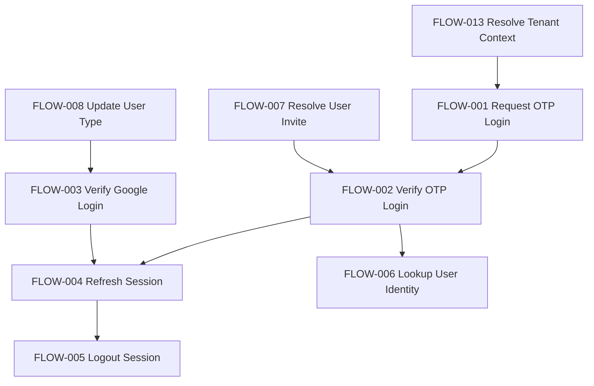

Alternate paths: Google login through FLOW-003 authenticates existing non-GUEST users; OTP verification through FLOW-002 can create a new GUEST user.

Failure / exception boundaries: OTP cooldown/rate limit in FLOW-001; OTP expiry/attempt exhaustion in FLOW-002; Google GUEST rejection in FLOW-003; invalid refresh in FLOW-004; unguarded direct user lookup uncertainty in FLOW-006.

Journey exit / outcome: current executable behavior yields user identity, short-lived JWT, httpOnly refresh session, or revoked/expired session.

Rule traceability: FLOW-001-RULE-*, FLOW-002-RULE-*, FLOW-003-RULE-*, FLOW-004-RULE-*, FLOW-005-RULE-*, FLOW-006-RULE-*, FLOW-007-RULE-*, FLOW-008-RULE-*.

Uncertainty traceability: FLOW-001-UNCERTAINTY-*, FLOW-002-UNCERTAINTY-*, FLOW-003-UNCERTAINTY-*, FLOW-004-UNCERTAINTY-*, FLOW-005-UNCERTAINTY-*, FLOW-006-UNCERTAINTY-*, FLOW-007-UNCERTAINTY-*, FLOW-008-UNCERTAINTY-*.

## Tenant & Branch Administration

Journey purpose: reconstructs tenant white-label context, manifest, branch setup, branch status exposure, branch about data, and timezone lineage.

Primary actors: Admin, Platform, Guest, Member.

Participating capabilities: CAP-002, CAP-003, CAP-015, CAP-017.

Participating flows: FLOW-011, FLOW-012, FLOW-013, FLOW-014, FLOW-015, FLOW-016, FLOW-017, FLOW-018.

Entry conditions: internal key or owner JWT for mutation; public access for tenant context, manifest, active branch list, and branch about.

Main journey:

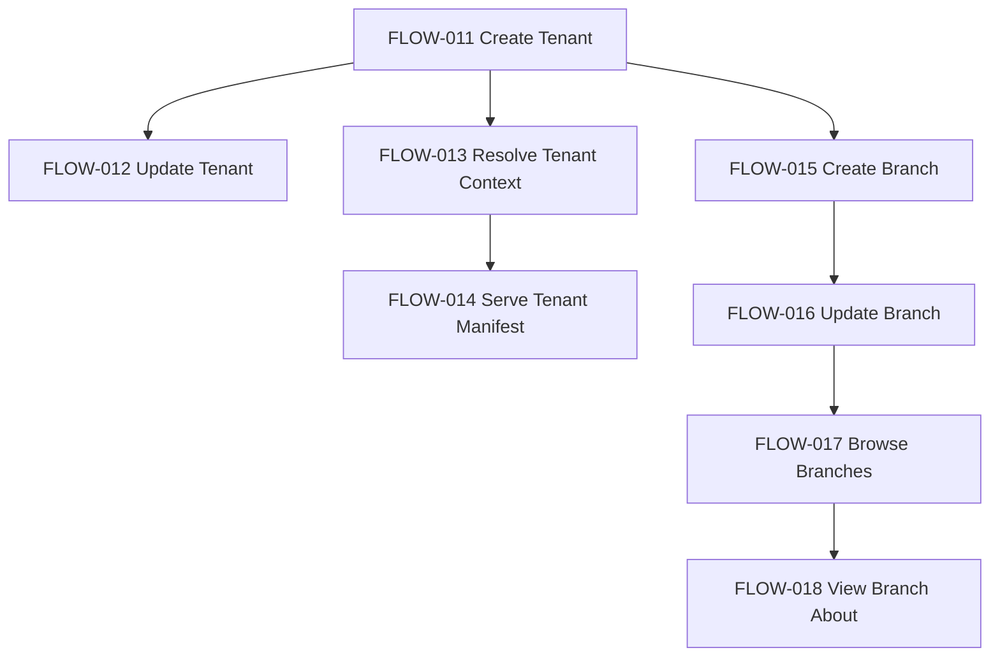

Alternate paths: FLOW-017 returns ACTIVE branches publicly; owner/internal callers may include draft/inactive rows.

Failure / exception boundaries: tenant not found in FLOW-013/FLOW-014; branch not found in FLOW-016/FLOW-018; branch timezone stored without validation in FLOW-015/FLOW-016.

Journey exit / outcome: tenant and branch configuration exists and is publicly consumable by auth, branch selection, scheduling, and booking journeys.

Rule traceability: FLOW-011-RULE-*, FLOW-012-RULE-*, FLOW-013-RULE-*, FLOW-014-RULE-*, FLOW-015-RULE-*, FLOW-016-RULE-*, FLOW-017-RULE-*, FLOW-018-RULE-*.

Uncertainty traceability: FLOW-011-UNCERTAINTY-*, FLOW-012-UNCERTAINTY-*, FLOW-013-UNCERTAINTY-*, FLOW-014-UNCERTAINTY-*, FLOW-015-UNCERTAINTY-*, FLOW-016-UNCERTAINTY-*, FLOW-017-UNCERTAINTY-*, FLOW-018-UNCERTAINTY-*.

## Role & Admin Access Context

Journey purpose: reconstructs administrative role assignment and role strings consumed by login, admin UI, and service auth checks.

Primary actors: Admin, Platform.

Participating capabilities: CAP-004, CAP-002, CAP-003.

Participating flows: FLOW-009, FLOW-010.

Entry conditions: owner/internal authorization for assignment; user id for role context reads.

Main journey:

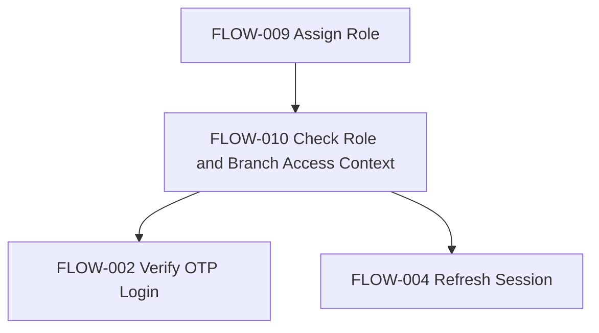

Alternate paths: OWNER maps to `owner`; branch-scoped roles map to lower-case role plus branch id.

Failure / exception boundaries: duplicate role rows are possible because FLOW-009 uses create despite upsert comment; FLOW-010 role/context endpoints are unauthenticated in Phase 4 evidence.

Journey exit / outcome: flattened role strings become JWT claims and admin UI scope inputs.

Rule traceability: FLOW-009-RULE-*, FLOW-010-RULE-*.

Uncertainty traceability: FLOW-009-UNCERTAINTY-*, FLOW-010-UNCERTAINTY-*.

## Resource Configuration

Journey purpose: reconstructs bookable resource pool and physical resource setup.

Primary actors: Admin, Guest, Member.

Participating capabilities: CAP-005, CAP-003.

Participating flows: FLOW-019, FLOW-020, FLOW-021, FLOW-022.

Entry conditions: pool/branch inputs exist; branch pool browse is public in current executable evidence.

Main journey:

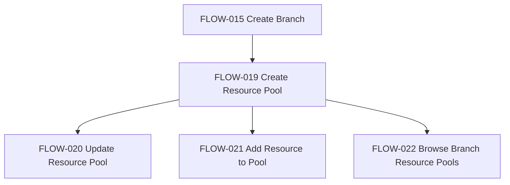

Alternate paths: fixed-instance pools can have named resources; pooled resources depend on capacity.

Failure / exception boundaries: FLOW-019 and FLOW-021 had auth uncertainty in Phase 4; capacity/min-occupancy validation lives in FLOW-020.

Journey exit / outcome: current resource pool/resource state feeds availability, booking, occupancy, and admin UI.

Rule traceability: FLOW-019-RULE-*, FLOW-020-RULE-*, FLOW-021-RULE-*, FLOW-022-RULE-*.

Uncertainty traceability: FLOW-019-UNCERTAINTY-*, FLOW-020-UNCERTAINTY-*, FLOW-021-UNCERTAINTY-*, FLOW-022-UNCERTAINTY-*.

## Availability Management

Journey purpose: reconstructs manually created windows, recurring patterns, overrides, blocks, generation, and availability browsing.

Primary actors: Admin, Platform, Guest, Member.

Participating capabilities: CAP-006, CAP-005, CAP-007, CAP-014.

Participating flows: FLOW-023, FLOW-024, FLOW-025, FLOW-026, FLOW-027, FLOW-028.

Entry conditions: resource pool exists; patterns/overrides/manual windows may define concrete availability.

Main journey:

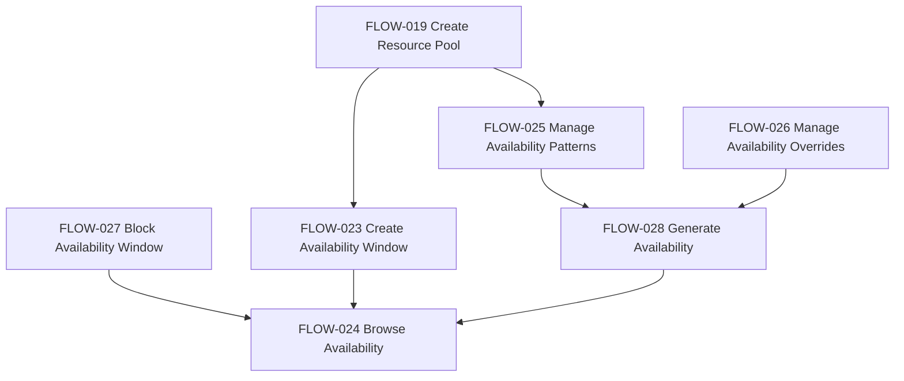

Alternate paths: manual windows bypass generation; CLOSED override suppresses generation candidates; MODIFIED override replaces pattern generation for that date.

Failure / exception boundaries: branch timezone/manual window alignment difference; generated windows are not rewritten after pattern or override changes.

Journey exit / outcome: availability slots are visible for booking and admin flows subject to current executable browse behavior.

Rule traceability: FLOW-023-RULE-*, FLOW-024-RULE-*, FLOW-025-RULE-*, FLOW-026-RULE-*, FLOW-027-RULE-*, FLOW-028-RULE-*.

Uncertainty traceability: FLOW-023-UNCERTAINTY-*, FLOW-024-UNCERTAINTY-*, FLOW-025-UNCERTAINTY-*, FLOW-026-UNCERTAINTY-*, FLOW-027-UNCERTAINTY-*, FLOW-028-UNCERTAINTY-*.

## Guest Booking

Journey purpose: reconstructs current standard booking lifecycle from availability browse to booking visibility, payment, confirmation, check-in, cancellation, and refund boundary.

Primary actors: Guest, Member, Admin, Platform.

Participating capabilities: CAP-007, CAP-006, CAP-011, CAP-012.

Participating flows: FLOW-029, FLOW-031, FLOW-032, FLOW-033, FLOW-034, FLOW-035, FLOW-036, FLOW-037.

Entry conditions: authenticated user, available window, booking rule/horizon constraints, and selected booking inputs.

Main journey:

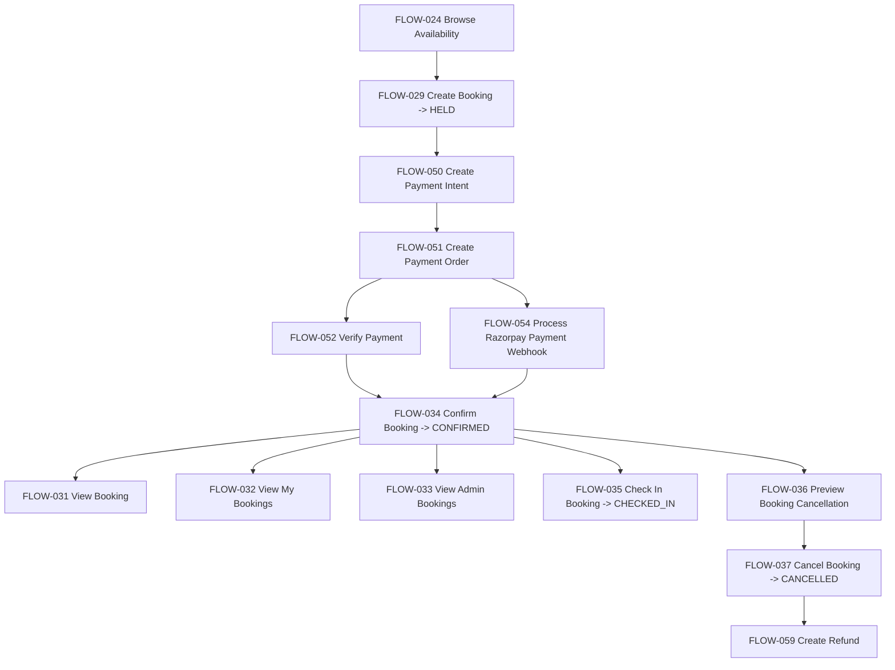

Observed outcomes: HELD appears in FLOW-029; CONFIRMED appears in FLOW-034 and payment webhook boundary FLOW-054; CHECKED_IN appears in FLOW-035; CANCELLED appears in FLOW-037.

Alternate paths: payment verification can confirm via FLOW-052; webhook capture can confirm via FLOW-054; cancellation preview and cancellation have distinct executable effects.

Failure / exception boundaries: booking ownership/access differs across read/admin/member paths; cancellation preview does not persist refund; cancellation stores local refund amount but does not itself create provider refund.

Journey exit / outcome: booking is held, confirmed, checked in, cancelled, or associated with refund intent depending on path.

Rule traceability: FLOW-029-RULE-*, FLOW-031-RULE-*, FLOW-032-RULE-*, FLOW-033-RULE-*, FLOW-034-RULE-*, FLOW-035-RULE-*, FLOW-036-RULE-*, FLOW-037-RULE-*, plus payment/refund boundary rule IDs where referenced.

Uncertainty traceability: FLOW-029-UNCERTAINTY-*, FLOW-031-UNCERTAINTY-*, FLOW-032-UNCERTAINTY-*, FLOW-033-UNCERTAINTY-*, FLOW-034-UNCERTAINTY-*, FLOW-035-UNCERTAINTY-*, FLOW-036-UNCERTAINTY-*, FLOW-037-UNCERTAINTY-*.

## Negotiated Booking

Journey purpose: reconstructs admin-negotiated booking and payment-link orchestration while preserving distinct FLOW-030 and FLOW-057 identities.

Primary actors: Admin, Payment service, Slot Engine.

Participating capabilities: CAP-007, CAP-011, CAP-004.

Participating flows: FLOW-030, FLOW-056, FLOW-057.

Entry conditions: admin JWT/internal key, selected branch/resource/window/user, negotiated price, idempotency key.

Main journey:

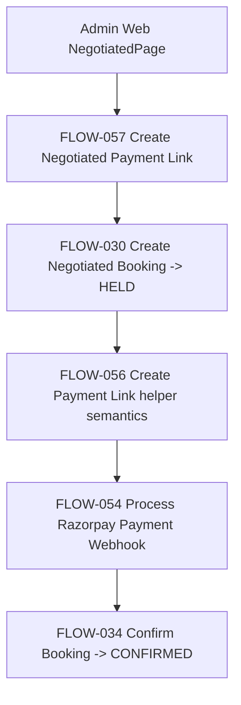

Alternate paths: FLOW-057 may reuse an existing pending link; FLOW-030 may return existing booking by idempotency key.

Failure / exception boundaries: no distributed transaction spans Slot Engine booking creation and PaymentIntent creation; FLOW-030 keeps capacity/block checks but waives standard group-size/pricing constraints.

Journey exit / outcome: negotiated held booking and payment link are created or reused, later confirmed by payment capture path.

Rule traceability: FLOW-030-RULE-*, FLOW-056-RULE-*, FLOW-057-RULE-*.

Uncertainty traceability: FLOW-030-UNCERTAINTY-*, FLOW-056-UNCERTAINTY-*, FLOW-057-UNCERTAINTY-*.

## Member Assignment & Attendance

Journey purpose: reconstructs recurring member assignment, member-visible current assignment, self-confirmation, attendance visibility, check-in boundary, and no-show/release boundary.

Primary actors: Admin, Member, Platform/Scheduler.

Participating capabilities: CAP-009, CAP-010, CAP-003, CAP-007.

Participating flows: FLOW-040, FLOW-041, FLOW-042, FLOW-043, FLOW-044, FLOW-046.

Entry conditions: resource pool/branch exists; admin creates assignment; member has JWT user type/member context.

Main journey:

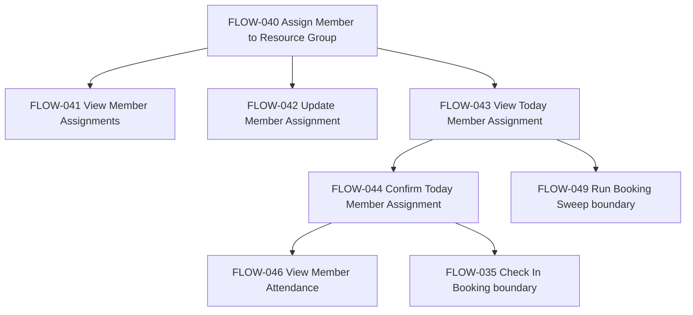

Alternate paths: inactive assignment update prevents current visibility; sweep can create released no-show member booking after grace cutoff.

Failure / exception boundaries: assignment and booking/capacity effects are distinct; no-show/release is not created by assignment itself.

Journey exit / outcome: member assignment is visible, confirmed, attended, or released/no-show through downstream booking/capacity paths.

Rule traceability: FLOW-040-RULE-*, FLOW-041-RULE-*, FLOW-042-RULE-*, FLOW-043-RULE-*, FLOW-044-RULE-*, FLOW-046-RULE-*.

Uncertainty traceability: FLOW-040-UNCERTAINTY-*, FLOW-041-UNCERTAINTY-*, FLOW-042-UNCERTAINTY-*, FLOW-043-UNCERTAINTY-*, FLOW-044-UNCERTAINTY-*, FLOW-046-UNCERTAINTY-*.

## Capacity & Occupancy

Journey purpose: reconstructs direct and indirect capacity effects across resource capacity, availability windows, bookings, occupancy, manual release, and sweep.

Primary actors: Admin, Platform/Scheduler.

Participating capabilities: CAP-010, CAP-006, CAP-007, CAP-009, CAP-013, CAP-014.

Participating flows: FLOW-045, FLOW-047, FLOW-048, FLOW-049.

Entry conditions: resource pool, windows, and bookings exist; occupancy date may trigger availability generation.

Main journey:

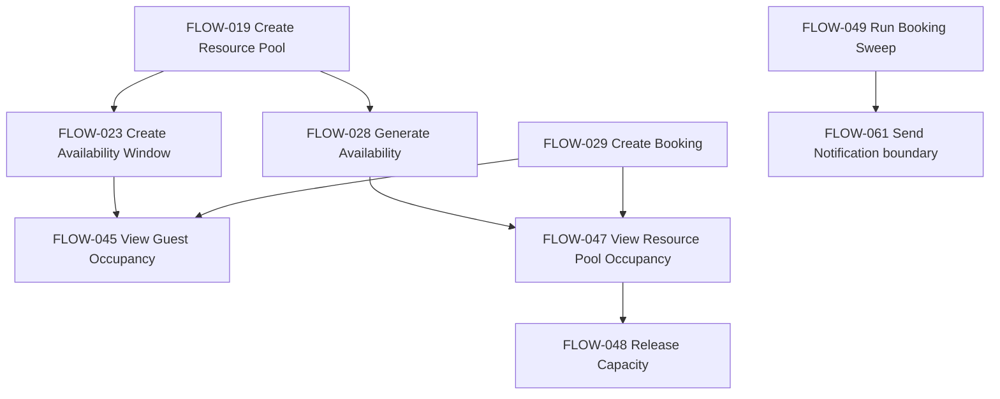

Direct capacity effects: resource/pool/window capacity from FLOW-019/FLOW-023/FLOW-028; booking consumption from FLOW-029; manual release marker in FLOW-048.

Indirect capacity effects: member no-show release and low occupancy alert in FLOW-049.

Failure / exception boundaries: guest occupancy excludes member bookings; FLOW-048 release state uses pricing fields; FLOW-049 alert notification is best-effort.

Journey exit / outcome: current executable behavior exposes occupancy metrics, release markers, and operational alerts without creating an authoritative capacity formula.

Rule traceability: FLOW-045-RULE-*, FLOW-047-RULE-*, FLOW-048-RULE-*, FLOW-049-RULE-*.

Uncertainty traceability: FLOW-045-UNCERTAINTY-*, FLOW-047-UNCERTAINTY-*, FLOW-048-UNCERTAINTY-*, FLOW-049-UNCERTAINTY-*.

## Payment

Journey purpose: reconstructs payment intent/order/verification/webhook and non-production simulated capture paths.

Primary actors: Guest, Member, Admin, Platform, External Payment Provider.

Participating capabilities: CAP-011, CAP-007, CAP-013.

Participating flows: FLOW-050, FLOW-051, FLOW-052, FLOW-054, FLOW-058.

Entry conditions: booking/payment reference exists; caller owns booking for user-facing payment paths; Razorpay webhook carries signed payload for provider path.

Main journey:

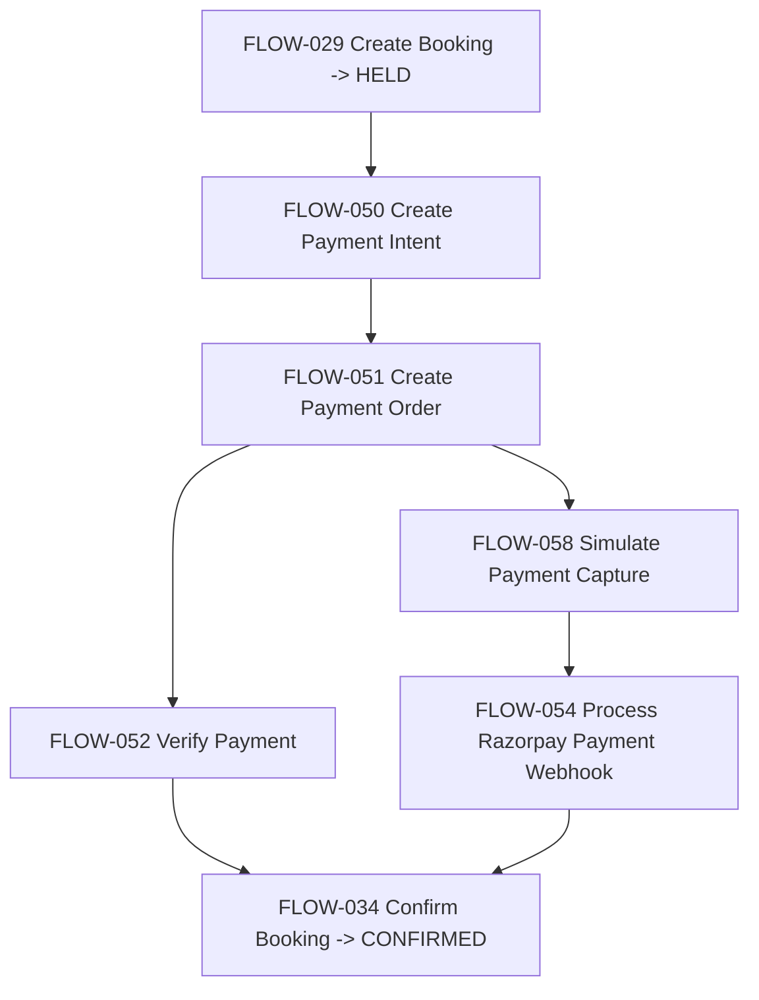

Alternate paths: direct verification can confirm; webhook capture can confirm; non-production simulation delegates to webhook path.

Failure / exception boundaries: FLOW-058 is technical/test-only; FLOW-054 has refinement status in prior Phase 4 artifact.

Journey exit / outcome: `PaymentIntent` progresses through observed payment paths and may confirm the booking.

Rule traceability: FLOW-050-RULE-*, FLOW-051-RULE-*, FLOW-052-RULE-*, FLOW-054-RULE-*, FLOW-058-RULE-*.

Uncertainty traceability: FLOW-050-UNCERTAINTY-*, FLOW-051-UNCERTAINTY-*, FLOW-052-UNCERTAINTY-*, FLOW-054-UNCERTAINTY-*, FLOW-058-UNCERTAINTY-*.

## Subscription / Autopay

Journey purpose: reconstructs subscription creation and Razorpay autopay webhook handling, including notification boundary.

Primary actors: Member, Admin, Platform, External Payment Provider.

Participating capabilities: CAP-011, CAP-013.

Participating flows: FLOW-053, FLOW-055.

Entry conditions: subscription input or Razorpay autopay webhook payload exists.

Main journey:

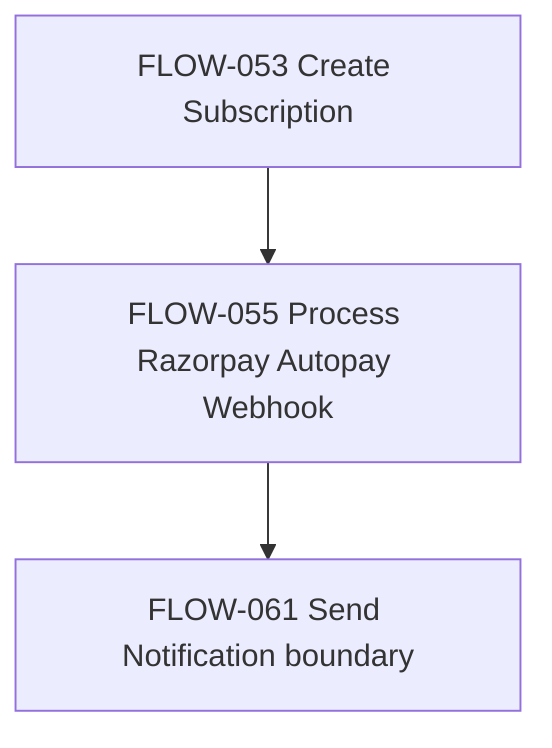

Alternate paths: charge failed path suspends subscription and sends notification best-effort.

Failure / exception boundaries: FLOW-055 notification failure does not undo subscription state change; FLOW-053 carries prior refinement.

Journey exit / outcome: `Subscription` exists and may become suspended/cancelled/active based on webhook path as reconstructed in Phase 4.

Rule traceability: FLOW-053-RULE-*, FLOW-055-RULE-*.

Uncertainty traceability: FLOW-053-UNCERTAINTY-*, FLOW-055-UNCERTAINTY-*.

## Cancellation & Refund

Journey purpose: reconstructs refund-oriented paths and preserves distinction between cancellation preview, cancellation, refund creation, and override.

Primary actors: Guest, Member, Admin, Platform.

Participating capabilities: CAP-012, CAP-011, CAP-007, CAP-004.

Participating flows: FLOW-059, FLOW-060, with boundaries to FLOW-036 and FLOW-037.

Entry conditions: booking or payment intent exists; admin authorization for override path.

Main journey:

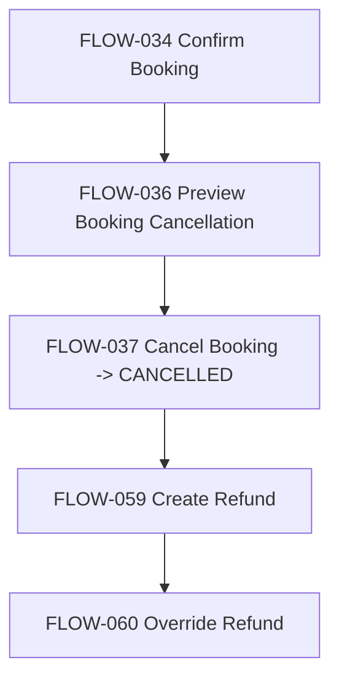

Alternate paths: override refund path can record a different amount/audit trail than normal refund path.

Failure / exception boundaries: preview and actual cancellation are distinct; local refund persistence differs from provider refund interaction; Phase 4 retained refinements on refund/cancellation boundaries.

Journey exit / outcome: booking cancellation and/or refund records are persisted according to reconstructed executable path.

Rule traceability: FLOW-036-RULE-*, FLOW-037-RULE-*, FLOW-059-RULE-*, FLOW-060-RULE-*.

Uncertainty traceability: FLOW-036-UNCERTAINTY-*, FLOW-037-UNCERTAINTY-*, FLOW-059-UNCERTAINTY-*, FLOW-060-UNCERTAINTY-*.

## Notification

Journey purpose: reconstructs notification send, template upsert, device token registration, history, and queue processing.

Primary actors: Platform, Admin, Guest, Member, Scheduler as Phase 3 actor label.

Participating capabilities: CAP-013, CAP-001, CAP-014.

Participating flows: FLOW-061, FLOW-062, FLOW-063, FLOW-064, FLOW-065.

Entry conditions: send request, template request, device token registration, history request, or queued due request exists.

Main journey:

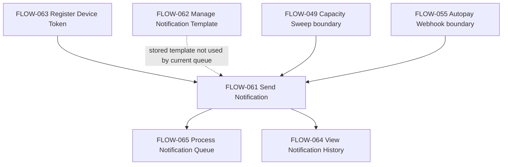

Alternate paths: unknown event type defaults to `push_or_sms`; UUID recipient can resolve user/device tokens; email/phone literals route directly.

Failure / exception boundaries: Notification queue is not job-scheduler dispatch infrastructure; FLOW-065 has no claim/lease guard; FLOW-062 templates are stored but not used by observed delivery.

Journey exit / outcome: NotificationRequest rows are queued, sent, retried, dead-lettered, or read as history.

Rule traceability: FLOW-061-RULE-*, FLOW-062-RULE-*, FLOW-063-RULE-*, FLOW-064-RULE-*, FLOW-065-RULE-*.

Uncertainty traceability: FLOW-061-UNCERTAINTY-*, FLOW-062-UNCERTAINTY-*, FLOW-063-UNCERTAINTY-*, FLOW-064-UNCERTAINTY-*, FLOW-065-UNCERTAINTY-*.

## Scheduled Operations & Platform Health

Journey purpose: reconstructs scheduler library operations, scheduled dispatch dedupe/outcome recording, and technical platform health/deploy verification.

Primary actors: Scheduler, Platform, Operator.

Participating capabilities: CAP-014, CAP-001, CAP-002, CAP-005, CAP-011, CAP-013, CAP-016.

Participating flows: FLOW-066, FLOW-067, FLOW-068, FLOW-069, FLOW-070.

Entry conditions: scheduler library is instantiated with job definitions/store; health verifier is called with base URL and expected SHA.

Main journey:

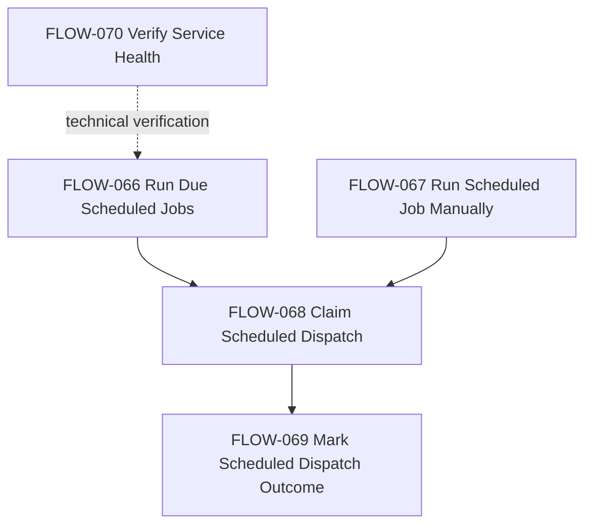

Alternate paths: manual job execution bypasses due-row claiming; dispatch claim can deny live duplicates or reclaim stale/failed dispatches.

Failure / exception boundaries: scheduler package is distinct from Notification queue; no production job runner was found in Phase 4; health does not prove dependency readiness.

Journey exit / outcome: job summaries, dispatch dedupe/outcome records, or deployment health/version result.

Rule traceability: FLOW-066-RULE-*, FLOW-067-RULE-*, FLOW-068-RULE-*, FLOW-069-RULE-*, FLOW-070-RULE-*.

Uncertainty traceability: FLOW-066-UNCERTAINTY-*, FLOW-067-UNCERTAINTY-*, FLOW-068-UNCERTAINTY-*, FLOW-069-UNCERTAINTY-*, FLOW-070-UNCERTAINTY-*.

## Cross-Capability Flow Map

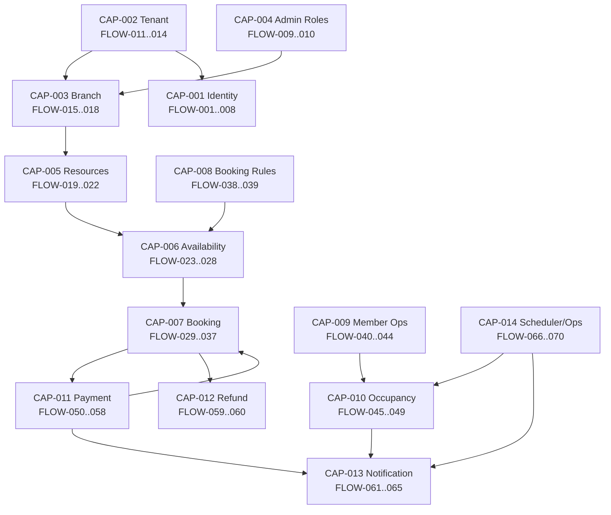

## Cross-Journey Boundaries

| From Journey | Flow | To Journey | Flow | Boundary Meaning |
|---|---|---|---|---|
| Tenant & Branch Administration | FLOW-013 | Identity & Session | FLOW-001 | Tenant context supplies tenant id for auth requests. |
| Tenant & Branch Administration | FLOW-015/FLOW-016 | Availability Management | FLOW-023/FLOW-028 | Branch timezone/config is consumed downstream. |
| Role & Admin Access Context | FLOW-010 | Identity & Session | FLOW-002/FLOW-004 | Role strings are embedded in login/refresh JWTs. |
| Resource Configuration | FLOW-019/FLOW-022 | Availability Management | FLOW-023/FLOW-024 | Pools/resources define availability scope. |
| Availability Management | FLOW-024 | Guest Booking | FLOW-029 | Browse availability precedes standard booking creation. |
| Guest Booking | FLOW-029 | Payment | FLOW-050/FLOW-051 | HELD booking enters payment path. |
| Payment | FLOW-052/FLOW-054 | Guest Booking | FLOW-034 | Payment verification/webhook confirms booking. |
| Guest Booking | FLOW-037 | Cancellation & Refund | FLOW-059 | Cancellation can lead to refund creation. |
| Negotiated Booking | FLOW-057 | Negotiated Booking | FLOW-030 | Payment service orchestrates internal Slot Engine negotiated booking. |
| Negotiated Booking | FLOW-056/FLOW-057 | Payment | FLOW-054 | Payment link gateway ref is later matched by webhook. |
| Member Assignment & Attendance | FLOW-044 | Guest Booking | FLOW-035 | Confirmed member booking can be checked in. |
| Member Assignment & Attendance | FLOW-043 | Capacity & Occupancy | FLOW-049 | Sweep can release unconfirmed member assignment capacity. |
| Capacity & Occupancy | FLOW-049 | Notification | FLOW-061 | Low occupancy alert is best-effort notification send boundary. |
| Subscription / Autopay | FLOW-055 | Notification | FLOW-061 | Autopay failure sends notification best-effort. |
| Notification | FLOW-061 | Notification | FLOW-065 | Notification send queues rows processed asynchronously. |
| Scheduled Operations & Platform Health | FLOW-068 | Scheduled Operations & Platform Health | FLOW-069 | Claimed scheduled dispatch is marked sent/failed. |

## Journey-Level Behavioural Differences

1. FLOW-036 preview cancellation computes without persisting refund state, while FLOW-037 actual cancellation persists booking cancellation/refund amount boundary.
2. FLOW-031, FLOW-032, and FLOW-033 expose different booking access models for single booking, user bookings, and admin bookings.
3. FLOW-023 manual window validation uses branch timezone while FLOW-028 generation uses UTC date/time behavior as reconstructed.
4. FLOW-061/FLOW-065 notification queue is separate from FLOW-066/FLOW-068 job scheduler dispatch infrastructure.
5. FLOW-030 negotiated booking is internal-service-only and mediated by FLOW-057 for browser/admin orchestration, unlike FLOW-029 self-service booking.
6. FLOW-059/FLOW-060 local refund persistence and override audit differ from provider refund interaction expectations preserved as Phase 3 refinements.
7. FLOW-044 member confirmation and FLOW-029 guest booking are distinct executable concerns despite both producing booking-related effects.
8. FLOW-048 manual release uses window pricing fields as release state, while FLOW-049 sweep uses booking statuses and dispatch dedupe.
9. FLOW-053 subscription creation and FLOW-055 autopay webhook operate on Subscription, not PaymentIntent.
10. FLOW-058 simulated capture is non-production and delegates to FLOW-054 rather than being a production capture path.

## Flow Coverage Matrix

| Flow ID | Flow Name | Capability | Primary Journey | Secondary Boundary |
|---|---|---|---|---|
| FLOW-001 | Request OTP Login | CAP-001 | Identity & Session | Tenant context from FLOW-013 |
| FLOW-002 | Verify OTP Login | CAP-001 | Identity & Session | Role context from FLOW-010; invite boundary FLOW-007 |
| FLOW-003 | Verify Google Login | CAP-001 | Identity & Session | User type boundary FLOW-008 |
| FLOW-004 | Refresh Session | CAP-001 | Identity & Session | Role context from FLOW-010 |
| FLOW-005 | Logout Session | CAP-001 | Identity & Session | None |
| FLOW-006 | Lookup User Identity | CAP-001 | Identity & Session | Member assignment/admin lookup boundary |
| FLOW-007 | Resolve User Invite | CAP-001 | Identity & Session | Booking invite boundary |
| FLOW-008 | Update User Type | CAP-001 | Identity & Session | Google login eligibility |
| FLOW-009 | Assign Role | CAP-004 | Role & Admin Access Context | Tenant/branch admin access |
| FLOW-010 | Check Role and Branch Access Context | CAP-004 | Role & Admin Access Context | JWT role claim source |
| FLOW-011 | Create Tenant | CAP-002 | Tenant & Branch Administration | Enables branch/context |
| FLOW-012 | Update Tenant | CAP-002 | Tenant & Branch Administration | Manifest/about fallback |
| FLOW-013 | Resolve Tenant Context | CAP-002 | Tenant & Branch Administration | Auth and branch browsing |
| FLOW-014 | Serve Tenant Manifest | CAP-002 | Tenant & Branch Administration | PWA shell |
| FLOW-015 | Create Branch | CAP-003 | Tenant & Branch Administration | Resource/timezone lineage |
| FLOW-016 | Update Branch | CAP-003 | Tenant & Branch Administration | Resource/timezone lineage |
| FLOW-017 | Browse Branches | CAP-003 | Tenant & Branch Administration | Resource/booking branch selection |
| FLOW-018 | View Branch About | CAP-003 | Tenant & Branch Administration | PWA dashboard |
| FLOW-019 | Create Resource Pool | CAP-005 | Resource Configuration | Availability/capacity |
| FLOW-020 | Update Resource Pool | CAP-005 | Resource Configuration | Availability/capacity |
| FLOW-021 | Add Resource to Pool | CAP-005 | Resource Configuration | Availability generation |
| FLOW-022 | Browse Branch Resource Pools | CAP-005 | Resource Configuration | Booking/admin UI |
| FLOW-023 | Create Availability Window | CAP-006 | Availability Management | Capacity/booking |
| FLOW-024 | Browse Availability | CAP-006 | Availability Management | Guest/negotiated booking input |
| FLOW-025 | Manage Availability Patterns | CAP-006 | Availability Management | Generation |
| FLOW-026 | Manage Availability Overrides | CAP-006 | Availability Management | Generation |
| FLOW-027 | Block Availability Window | CAP-006 | Availability Management | Booking prevention |
| FLOW-028 | Generate Availability | CAP-006 | Availability Management | Browse/occupancy |
| FLOW-029 | Create Booking | CAP-007 | Guest Booking | Payment |
| FLOW-030 | Create Negotiated Booking | CAP-007 | Negotiated Booking | Payment-link orchestration |
| FLOW-031 | View Booking | CAP-007 | Guest Booking | Payment/refund visibility |
| FLOW-032 | View My Bookings | CAP-007 | Guest Booking | User history |
| FLOW-033 | View Admin Bookings | CAP-007 | Guest Booking | Admin refund/cancellation |
| FLOW-034 | Confirm Booking | CAP-007 | Guest Booking | Payment/webhook |
| FLOW-035 | Check In Booking | CAP-007 | Guest Booking | Member attendance |
| FLOW-036 | Preview Booking Cancellation | CAP-007 | Guest Booking | Refund boundary |
| FLOW-037 | Cancel Booking | CAP-007 | Guest Booking | Refund boundary |
| FLOW-038 | Create Booking Rule | CAP-008 | Availability Management | Browse/payment/cancellation policy |
| FLOW-039 | Update Resource Pool Booking Rule | CAP-008 | Availability Management | Browse/capacity policy |
| FLOW-040 | Assign Member to Resource Group | CAP-009 | Member Assignment & Attendance | Capacity |
| FLOW-041 | View Member Assignments | CAP-009 | Member Assignment & Attendance | Admin visibility |
| FLOW-042 | Update Member Assignment | CAP-009 | Member Assignment & Attendance | Attendance/capacity |
| FLOW-043 | View Today Member Assignment | CAP-009 | Member Assignment & Attendance | Member confirmation |
| FLOW-044 | Confirm Today Member Assignment | CAP-009 | Member Assignment & Attendance | Booking/check-in |
| FLOW-045 | View Guest Occupancy | CAP-010 | Capacity & Occupancy | Availability generation |
| FLOW-046 | View Member Attendance | CAP-010 | Member Assignment & Attendance | Capacity/attendance |
| FLOW-047 | View Resource Pool Occupancy | CAP-010 | Capacity & Occupancy | Release |
| FLOW-048 | Release Capacity | CAP-010 | Capacity & Occupancy | Availability/guest access |
| FLOW-049 | Run Booking Sweep | CAP-010 | Capacity & Occupancy | Notification; scheduler boundary |
| FLOW-050 | Create Payment Intent | CAP-011 | Payment | Guest Booking |
| FLOW-051 | Create Payment Order | CAP-011 | Payment | Guest Booking |
| FLOW-052 | Verify Payment | CAP-011 | Payment | Booking confirmation |
| FLOW-053 | Create Subscription | CAP-011 | Subscription / Autopay | Autopay |
| FLOW-054 | Process Razorpay Payment Webhook | CAP-011 | Payment | Booking confirmation |
| FLOW-055 | Process Razorpay Autopay Webhook | CAP-011 | Subscription / Autopay | Notification |
| FLOW-056 | Create Payment Link | CAP-011 | Negotiated Booking | Payment webhook |
| FLOW-057 | Create Negotiated Payment Link | CAP-011 | Negotiated Booking | FLOW-030 orchestration |
| FLOW-058 | Simulate Payment Capture | CAP-011 | Payment | FLOW-054 test boundary |
| FLOW-059 | Create Refund | CAP-012 | Cancellation & Refund | Booking cancellation |
| FLOW-060 | Override Refund | CAP-012 | Cancellation & Refund | Admin audit |
| FLOW-061 | Send Notification | CAP-013 | Notification | FLOW-049/FLOW-055 upstream |
| FLOW-062 | Manage Notification Template | CAP-013 | Notification | Potential template boundary |
| FLOW-063 | Register Device Token | CAP-013 | Notification | Push routing |
| FLOW-064 | View Notification History | CAP-013 | Notification | User/admin history |
| FLOW-065 | Process Notification Queue | CAP-013 | Notification | Provider delivery |
| FLOW-066 | Run Due Scheduled Jobs | CAP-014 | Scheduled Operations & Platform Health | Job handlers |
| FLOW-067 | Run Scheduled Job Manually | CAP-014 | Scheduled Operations & Platform Health | Job handlers |
| FLOW-068 | Claim Scheduled Dispatch | CAP-014 | Scheduled Operations & Platform Health | Dispatch outcome |
| FLOW-069 | Mark Scheduled Dispatch Outcome | CAP-014 | Scheduled Operations & Platform Health | Dispatch claim |
| FLOW-070 | Verify Service Health | CAP-014 | Scheduled Operations & Platform Health | Deploy/operator gate |

Flow coverage validation:
- Total flows: 70
- Primary journey assignments: 70
- Missing primary assignments: 0
- Duplicate primary flows: 0

## Phase 3 Refinement Traceability

| Flow | Phase 3 Status | Journey Impact |
|---|---|---|
| FLOW-028 | REFINEMENT REQUIRED | Availability generation is support/lazy-generation, not a standalone user-facing operation. |
| FLOW-030 | REFINEMENT REQUIRED | Admin initiates through Payment orchestration; Slot Engine endpoint is internal-service initiated. |
| FLOW-034 | REFINEMENT REQUIRED | Booking confirmation has payment/webhook boundary nuance preserved in Guest Booking. |
| FLOW-035 | REFINEMENT REQUIRED | Check-in actor/access behavior differs from broad Phase 3 framing. |
| FLOW-036 | REFINEMENT REQUIRED | Cancellation preview does not execute CAP-012 persistence/provider behavior. |
| FLOW-037 | REFINEMENT REQUIRED | Cancellation stores local refund amount but does not itself create refund/provider interaction. |
| FLOW-053 | REFINEMENT REQUIRED | Subscription creation boundary has payment/autopay distinctions preserved. |
| FLOW-054 | REFINEMENT REQUIRED | Payment webhook flow has provider/idempotency/confirmation nuance preserved. |
| FLOW-057 | REFINEMENT REQUIRED | Negotiated payment link is also browser-facing orchestrator for FLOW-030. |
| FLOW-058 | REFINEMENT REQUIRED | Non-production technical helper, not production payment capture flow. |
| FLOW-059 | REFINEMENT REQUIRED | Provider refund boundary not substantiated by executable code. |
| FLOW-060 | REFINEMENT REQUIRED | Override refund audit exists, but provider refund interaction not evidenced. |
| FLOW-062 | REFINEMENT REQUIRED | Template management is POST upsert only in current executable code. |
| FLOW-065 | REFINEMENT REQUIRED | Notification queue is direct worker/test function, not job-scheduler integration. |
| FLOW-070 | REFINEMENT REQUIRED | Technical/platform deploy-health flow, not business dispatch flow. |

## Final RE-004 Traceability Check

Flow coverage: 70 / 70

Missing Flow IDs: 0

Duplicate primary flows: 0

Capability lineage: PRESERVED

Rule lineage: PRESERVED

Uncertainty lineage: PRESERVED

Phase 3 refinements: PRESERVED

Uncertainties referenced: 86 unique Phase 4 uncertainty IDs by originating flow patterns.

Cross-journey boundaries: 16

Behavioural differences preserved: 10

## Completion Status

RE-004 — BUSINESS FLOW MODEL

STATUS:
COMPLETE

FLOW COVERAGE:
70 / 70

CAPABILITY LINEAGE:
PRESERVED

FLOW LINEAGE:
PRESERVED

RULE LINEAGE:
PRESERVED

UNCERTAINTY LINEAGE:
PRESERVED

