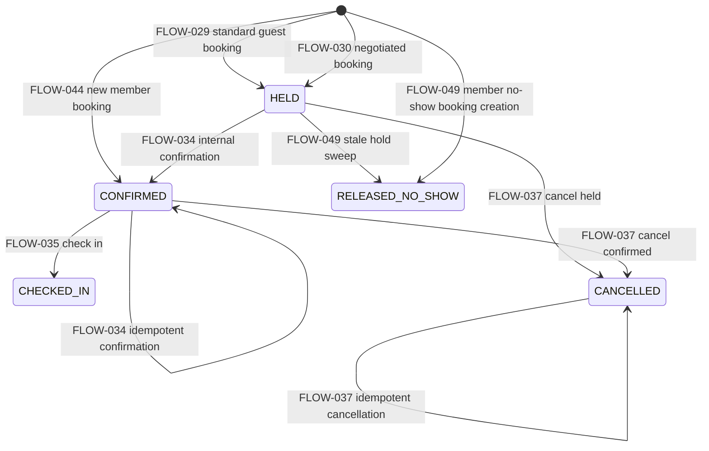

# RE-006 - State Model

Consolidated from RE-001 through RE-005 and Phase 4 reconstruction artifacts. Persisted state is separated from derived business status. Existing CAP, FLOW, FLOW-RULE, FLOW-UNCERTAINTY, and BR identities are preserved.

## State Model Scope

| State Model | Entity | State Representation | Source Flows | Source BRs |
|---|---|---|---|---|
| STATE-MODEL-BRANCH | Branch | ENUM / STRING STATUS | FLOW-015, FLOW-016, FLOW-017 | BR-029, BR-031, BR-033, BR-034 |
| STATE-MODEL-AVAILABILITY-PATTERN | AvailabilityPattern | ENUM / STRING STATUS | FLOW-024, FLOW-025, FLOW-026, FLOW-028 | BR-041 |
| STATE-MODEL-AVAILABILITY-OVERRIDE | AvailabilityOverride | STRING STATUS / PRESENCE | FLOW-024, FLOW-026, FLOW-028 | BR-039, BR-040 |
| STATE-MODEL-AVAILABILITY-WINDOW | AvailabilityWindow | NO EXPLICIT STATE FIELD / PRESENCE / CAPACITY | FLOW-023, FLOW-024, FLOW-028, FLOW-029, FLOW-048 | BR-038, BR-044, BR-045, BR-052 |
| STATE-MODEL-BLOCKED-WINDOW | BlockedWindow | PRESENCE / INTERVAL OVERLAP | FLOW-027, FLOW-024, FLOW-029 | BR-042, BR-056 |
| STATE-MODEL-BOOKING | Booking | ENUM / STRING STATUS plus timestamps | FLOW-024, FLOW-029, FLOW-030, FLOW-031, FLOW-032, FLOW-033, FLOW-034, FLOW-035, FLOW-036, FLOW-037, FLOW-044, FLOW-045, FLOW-046, FLOW-047, FLOW-048, FLOW-049, FLOW-050, FLOW-052, FLOW-054, FLOW-056, FLOW-059 | BR-043, BR-049-BR-064, BR-065-BR-105, BR-121, BR-125, BR-126, BR-129, BR-135, BR-158, BR-178, BR-191, BR-198-BR-200 |
| STATE-MODEL-MEMBER-ASSIGNMENT | MemberAssignment | ENUM / STRING STATUS | FLOW-040, FLOW-041, FLOW-042, FLOW-043, FLOW-044, FLOW-046, FLOW-049 | BR-106-BR-117, BR-120-BR-126, BR-128, BR-129 |
| STATE-MODEL-ATTENDANCE-DERIVED | Attendance | DERIVED STATE | FLOW-043, FLOW-044, FLOW-046, FLOW-049 | BR-121, BR-125, BR-128, BR-129 |
| STATE-MODEL-SUBSCRIPTION | Subscription | STRING STATUS | FLOW-053, FLOW-055, FLOW-043, FLOW-044, FLOW-046 | BR-164, BR-183, BR-185, BR-121, BR-123, BR-129 |
| STATE-MODEL-PAYMENT-INTENT | PaymentIntent | STRING STATUS plus metadata fields | FLOW-050, FLOW-051, FLOW-052, FLOW-054, FLOW-055, FLOW-056, FLOW-058, FLOW-059, FLOW-060 | BR-132, BR-134, BR-135, BR-138, BR-149-BR-159, BR-174-BR-178, BR-184, BR-191, BR-192, BR-196 |
| STATE-MODEL-REFUND | Refund | EFFECTIVE TERMINAL ROW / amount fields | FLOW-037, FLOW-059, FLOW-060 | BR-197-BR-211 |
| STATE-MODEL-NOTIFICATION-REQUEST | NotificationRequest | STRING STATUS | FLOW-061, FLOW-064, FLOW-065, FLOW-055, FLOW-049 | BR-212, BR-213, BR-218, BR-220, BR-221, BR-186 |
| STATE-MODEL-SCHEDULED-JOB | ScheduledJob | COMPOSITE STATE | FLOW-066, FLOW-067 | BR-222-BR-225 |
| STATE-MODEL-SCHEDULED-JOB-DISPATCH | ScheduledJobDispatch | STRING STATUS | FLOW-068, FLOW-069, FLOW-049 | BR-226-BR-229 |
| STATE-MODEL-AUTH-SESSION | AuthSession / OTP / Refresh Session | TIMESTAMP / NULLABILITY / revocation | FLOW-001, FLOW-002, FLOW-003, FLOW-004, FLOW-005 | BR-001-BR-010 |
| STATE-MODEL-PENDING-INVITE | PendingInvite | PRESENCE / UNIQUE ROW | FLOW-007, FLOW-002, FLOW-029 | BR-013, BR-014, BR-061, BR-062 |

## Per-Entity State Models

### STATE-MODEL-BRANCH

Entity: Branch. State representation: persisted `status` with observed values `DRAFT`, `ACTIVE`, `INACTIVE`. Initial state: FLOW-015 creates `DRAFT` (FLOW-015-RULE-001, BR-029). Terminal states: none evidenced. Producing flows: FLOW-015. Reading flows: FLOW-017, FLOW-018, downstream selection flows. Mutating flows: FLOW-016. Guards: BR-031 / FLOW-016-RULE-001 validates status values; BR-033 and BR-034 / FLOW-017-RULE-001/002 control public ACTIVE visibility and draft inclusion. Uncertainties: FLOW-015-UNCERTAINTY-001, FLOW-016-UNCERTAINTY-001, FLOW-017-UNCERTAINTY-001.

### STATE-MODEL-AVAILABILITY-PATTERN

Entity: AvailabilityPattern. State representation: status `ACTIVE` or `SUSPENDED`. Initial state: FLOW-025 creates pattern rows. Terminal states: none evidenced. Producing flows: FLOW-025. Reading flows: FLOW-024, FLOW-028. Mutating flows: FLOW-026. Guards: BR-041 / FLOW-024-RULE-005 states only active matching weekday patterns contribute generated windows when no closed/modified override applies. Uncertainties: FLOW-024-UNCERTAINTY-001/002/003.

### STATE-MODEL-AVAILABILITY-OVERRIDE

Entity: AvailabilityOverride. State representation: row presence and closed/modified semantics. Initial state: FLOW-026 creates/updates branch-local date overrides. Terminal states: none evidenced. Producing/mutating flows: FLOW-026. Reading flows: FLOW-024, FLOW-028. Guards: BR-039 / FLOW-024-RULE-003 closed override suppresses slots; BR-040 / FLOW-024-RULE-004 modified override takes precedence. Uncertainties: FLOW-024-UNCERTAINTY-001/002/003.

### STATE-MODEL-AVAILABILITY-WINDOW

Entity: AvailabilityWindow. State representation: no explicit status; row existence, capacity, resource binding, time, and pricing/release marker fields drive stateful behaviour. Initial state: FLOW-023 manual creation or FLOW-028 generation. Terminal states: none evidenced. Producing flows: FLOW-023, FLOW-028. Reading flows: FLOW-024, FLOW-029, FLOW-030, FLOW-045, FLOW-047, FLOW-048, FLOW-049. Mutating flows: FLOW-048 mutates window pricing fields as manual release state. Guards: BR-038, BR-044, BR-045, BR-052. Uncertainties: FLOW-024-UNCERTAINTY-*, FLOW-029-UNCERTAINTY-*, FLOW-048-UNCERTAINTY-*.

### STATE-MODEL-BLOCKED-WINDOW

Entity: BlockedWindow. State representation: row presence and interval overlap; no status field. Initial state: FLOW-027 creates a blocked interval. Terminal states: none evidenced. Producing flows: FLOW-027. Reading flows: FLOW-024, FLOW-029, FLOW-030. Mutating flows: none beyond creation evidenced. Guards: BR-042 / FLOW-024-RULE-006 removes overlapping availability; BR-056 / FLOW-029-RULE-008 prevents booking creation. Uncertainties: FLOW-024-UNCERTAINTY-*, FLOW-029-UNCERTAINTY-*.

### STATE-MODEL-BOOKING

Entity: Booking. State representation: persisted `Booking.status` values `HELD`, `CONFIRMED`, `CHECKED_IN`, `CANCELLED`, `RELEASED_NO_SHOW`; related lifecycle fields include `heldUntil`, `isMemberBooking`, `memberAttendanceConfirmedAt`, `refundAmount`, and release markers. Initial state: FLOW-029 creates standard guest `HELD`; FLOW-030 creates negotiated non-member `HELD`; FLOW-044 creates a new member booking as `CONFIRMED` when no booking exists; FLOW-049 creates a member no-show `RELEASED_NO_SHOW` booking when no existing non-cancelled booking exists. FLOW-044 can also update `memberAttendanceConfirmedAt` on an existing non-cancelled booking while leaving `Booking.status` unchanged. Terminal states: `CANCELLED` is idempotent in FLOW-037; no transition out of `CHECKED_IN`, `CANCELLED`, or `RELEASED_NO_SHOW` is evidenced. Producing flows: FLOW-029, FLOW-030, FLOW-044, FLOW-049. Reading flows: FLOW-024, FLOW-031, FLOW-032, FLOW-033, FLOW-036, FLOW-045, FLOW-046, FLOW-047, FLOW-050, FLOW-056, FLOW-059. Mutating flows: FLOW-034, FLOW-035, FLOW-037, FLOW-044, FLOW-049. Guards: BR-043, BR-078, BR-081-BR-085, BR-088-BR-092, BR-100-BR-105, BR-121, BR-125, BR-126, BR-135, BR-158, BR-178, BR-191, BR-199. Uncertainties: FLOW-029-UNCERTAINTY-*, FLOW-030-UNCERTAINTY-001, FLOW-034-UNCERTAINTY-*, FLOW-035-UNCERTAINTY-*, FLOW-037-UNCERTAINTY-*, FLOW-044-UNCERTAINTY-002, FLOW-049-UNCERTAINTY-*, FLOW-052-UNCERTAINTY-*, FLOW-054-UNCERTAINTY-*, FLOW-059-UNCERTAINTY-*.



Payment-to-booking orchestration:

```text
FLOW-052 Payment verification --+
                                +--> FLOW-034 -> HELD -> CONFIRMED
FLOW-054 Payment webhook -------+
```

FLOW-044 existing-booking behaviour:

```text
Existing non-cancelled Booking
  FLOW-044
Booking.status unchanged
memberAttendanceConfirmedAt updated
```

This FLOW-044 path is a metadata mutation, not necessarily a Booking status transition.

| Transition ID | From | To | Trigger Flow | Guard | Side Effects | BR IDs | Uncertainties |
|---|---|---|---|---|---|---|---|
| TRANSITION-BOOKING-001 | none | HELD | FLOW-029 | JWT identity, idempotency key, window lock, horizon, block and capacity checks | Booking and optional BookingPlayer rows created | BR-049-BR-062 | FLOW-029-UNCERTAINTY-001/002/003 |
| TRANSITION-BOOKING-002 | none | HELD | FLOW-030 | Internal service, negotiated capacity/block checks, idempotency | Negotiated hold created | BR-063, BR-064 | FLOW-030-UNCERTAINTY-001 |
| TRANSITION-BOOKING-003 | HELD | CONFIRMED | FLOW-034 | Internal key; status HELD | Booking.status set CONFIRMED | BR-078, BR-082, BR-083 | FLOW-034-UNCERTAINTY-* |
| TRANSITION-BOOKING-004 | CONFIRMED | CONFIRMED | FLOW-034 | Already CONFIRMED | Idempotent return | BR-081 | FLOW-034-UNCERTAINTY-* |
| TRANSITION-BOOKING-005 | CONFIRMED | CHECKED_IN | FLOW-035 | Booking exists and status CONFIRMED | Booking.status updated only | BR-086-BR-092 | FLOW-035-UNCERTAINTY-* |
| TRANSITION-BOOKING-006 | HELD | CANCELLED | FLOW-037 | HELD active cancellable | status CANCELLED; refundAmount null | BR-099-BR-105 | FLOW-037-UNCERTAINTY-* |
| TRANSITION-BOOKING-007 | CONFIRMED | CANCELLED | FLOW-037 | CONFIRMED active cancellable | status CANCELLED; refundAmount recomputed | BR-099-BR-105 | FLOW-037-UNCERTAINTY-* |
| TRANSITION-BOOKING-008 | CANCELLED | CANCELLED | FLOW-037 | Already CANCELLED | Idempotent return | BR-100 | FLOW-037-UNCERTAINTY-* |
| TRANSITION-BOOKING-009 | HELD | RELEASED_NO_SHOW | FLOW-049 | Stale held booking | sweep release/no-show status | FLOW-049 lineage | FLOW-049-UNCERTAINTY-* |
| TRANSITION-BOOKING-010 | none | CONFIRMED | FLOW-044 | MEMBER JWT, active subscription, before cutoff, no existing booking, transaction/window checks | member booking created with `memberAttendanceConfirmedAt` | BR-122-BR-126 | FLOW-044-UNCERTAINTY-002 |
| TRANSITION-BOOKING-011 | existing non-cancelled status | same status | FLOW-044 | MEMBER JWT, active subscription, before cutoff, existing non-cancelled booking | `memberAttendanceConfirmedAt` updated; `Booking.status` unchanged | BR-122-BR-126 | FLOW-044-UNCERTAINTY-002 |
| TRANSITION-BOOKING-012 | none | RELEASED_NO_SHOW | FLOW-049 | Member no-show path with no existing non-cancelled booking | no-show member booking created | FLOW-049 lineage | FLOW-049-UNCERTAINTY-* |

Booking anomalies: FLOW-034 performs the HELD -> CONFIRMED mutation (BR-083), confirms without hold-expiry enforcement (BR-084), and confirms without payment proof/state validation (BR-085); FLOW-052 and FLOW-054 are upstream PaymentIntent capture triggers, not independent Booking writers; FLOW-037 differs between HELD and CONFIRMED refund semantics (BR-102, BR-103) and does not invoke refund creation (BR-104); FLOW-037 lacks explicit locking (BR-105); FLOW-035 lacks server auth/timing enforcement (BR-091, BR-092); capacity consumers differ by state set (BR-043 vs resource journey guest occupancy); FLOW-044 separates new member booking creation from existing-booking metadata update while preserving FLOW-044-UNCERTAINTY-002; FLOW-049 stale HELD release and member no-show creation are distinct, and CONFIRMED -> RELEASED_NO_SHOW is not evidenced here.

### STATE-MODEL-MEMBER-ASSIGNMENT

Entity: MemberAssignment. State representation: persisted `ACTIVE`, `SUSPENDED`. Initial state: FLOW-040 creates `ACTIVE` (BR-108). Terminal states: none evidenced. Producing flows: FLOW-040. Reading flows: FLOW-041, FLOW-043, FLOW-044, FLOW-046, FLOW-049. Mutating flows: FLOW-042. Guards: BR-108, BR-109, BR-114, BR-116, BR-117. Uncertainties: FLOW-040-UNCERTAINTY-001, FLOW-041-UNCERTAINTY-001, FLOW-042-UNCERTAINTY-001.

### STATE-MODEL-ATTENDANCE-DERIVED

Entity: Attendance derived status; no persisted Attendance entity. State representation: derived from assignment status, subscription status, booking existence, `memberAttendanceConfirmedAt`, booking release state, and cutoff. Initial state: calculated by FLOW-043/FLOW-046; FLOW-044 and FLOW-049 mutate inputs. Terminal states: none persisted. Producing flows: FLOW-043, FLOW-046. Reading flows: FLOW-043, FLOW-046. Mutating flows: no Attendance entity mutation. Guards: BR-121 and BR-129. Uncertainties: FLOW-043-UNCERTAINTY-*, FLOW-044-UNCERTAINTY-*, FLOW-046-UNCERTAINTY-001.

| Derived Attendance State | Conditions | Source Flow | BR IDs |
|---|---|---|---|
| canConfirm | No booking exists, subscription active, before cutoff | FLOW-043 | BR-121 |
| confirmed/present equivalent | Booking has `memberAttendanceConfirmedAt` | FLOW-046 | BR-125, BR-129 |
| released/no-show equivalent | Booking release/no-show state exists | FLOW-046, FLOW-049 | BR-129 |
| subscription-blocked equivalent | Subscription not active/suspended | FLOW-043, FLOW-046, FLOW-055 | BR-121, BR-129, BR-185 |
| cutoff-blocked equivalent | At/after cutoff without confirmation | FLOW-043, FLOW-046 | BR-121, BR-129 |

### STATE-MODEL-SUBSCRIPTION

Entity: Subscription. State representation: persisted `active`, `suspended`. Initial state: FLOW-053 creates `active` (BR-164). Terminal states: none; FLOW-055 can set found subscription to active on charged. Producing flows: FLOW-053. Reading flows: FLOW-043, FLOW-044, FLOW-046, FLOW-055. Mutating flows: FLOW-055. Guards: BR-183 sets active, BR-185 sets suspended, BR-121/BR-123 require active subscription for member confirmation, BR-129 uses subscription in attendance derivation. Uncertainties: FLOW-053-UNCERTAINTY-*, FLOW-055-UNCERTAINTY-*.

### STATE-MODEL-PAYMENT-INTENT

Entity: PaymentIntent. State representation: persisted `pending`, `captured`, plus metadata `gatewayRef`, `purpose`, `referenceId`, amount, owner/user binding, subscription billing link. Initial state: FLOW-050 creates `pending` `guest_booking`; FLOW-055 creates captured `subscription_billing`; FLOW-056 creates/uses negotiated payment-link metadata. Terminal states: `captured` is terminal for FLOW-050 creation/recreation; no FAILED state is evidenced. Producing flows: FLOW-050, FLOW-055, FLOW-056. Reading flows: FLOW-050, FLOW-051, FLOW-052, FLOW-054, FLOW-056, FLOW-059, FLOW-060. Mutating flows: FLOW-051 metadata only, FLOW-052/FLOW-054 status capture, FLOW-056 metadata, FLOW-055 create captured billing. Guards: BR-132, BR-134, BR-135, BR-149, BR-150, BR-156-BR-159, BR-175-BR-178, BR-184, BR-191, BR-192. Uncertainties: FLOW-050-UNCERTAINTY-*, FLOW-051-UNCERTAINTY-*, FLOW-052-UNCERTAINTY-*, FLOW-054-UNCERTAINTY-*, FLOW-055-UNCERTAINTY-*, FLOW-056-UNCERTAINTY-001.

| PaymentIntent Path | Flow | CREATE | READ | MUTATE STATUS | MUTATE METADATA | TRIGGER BOOKING TRANSITION |
|---|---|---|---|---|---|---|
| Guest payment intent creation | FLOW-050 | Yes, pending guest_booking | Booking, existing intent | No | referenceId, amount, purpose | No |
| Razorpay order creation | FLOW-051 | No | PaymentIntent | No | gatewayRef order id | No |
| Direct verify/capture | FLOW-052 | No | PaymentIntent by gatewayRef | pending -> captured | payment ids | Yes, FLOW-034 |
| Webhook capture | FLOW-054 | No | PaymentIntent by gatewayRef/payment link | pending -> captured | webhook/idempotency | Upstream trigger invokes FLOW-034 |
| Subscription billing | FLOW-055 | Yes, captured subscription_billing | Subscription | captured at creation | subscription metadata | No |
| Negotiated payment link | FLOW-056 | Payment link/intent semantics | HELD booking | No capture evidenced | payment-link gatewayRef | Later webhook may |
| Simulated capture | FLOW-058 | No | delegates | via FLOW-054 | via FLOW-054 | via FLOW-054/FLOW-034 |

### STATE-MODEL-REFUND

Entity: Refund. State representation: effectively terminal local row/override; no provider refund lifecycle. Initial state: FLOW-059 creates/returns refund for cancelled bookings with positive amount; FLOW-060 creates override refund. Terminal states: created local row terminal in observed artifacts. Producing/mutating flows: FLOW-059, FLOW-060. Reading flows: FLOW-036, FLOW-059, FLOW-060. Guards: BR-198-BR-204, BR-206, BR-210. Uncertainties: FLOW-059-UNCERTAINTY-001/002, FLOW-060-UNCERTAINTY-001/002.

### STATE-MODEL-NOTIFICATION-REQUEST

Entity: NotificationRequest. State representation: persisted `queued`, `sent`, `dead_letter`; retry via `attempts`, `retryAfter`, provider ref, error. Initial state: FLOW-061 creates queued rows and returns 202. Terminal states: `sent`, `dead_letter`; queued can persist through attempts 1-3. Producing flows: FLOW-061, FLOW-055, FLOW-049. Reading flows: FLOW-064, FLOW-065. Mutating flows: FLOW-065. Guards: BR-220, BR-221. Uncertainties: FLOW-061-UNCERTAINTY-001, FLOW-064-UNCERTAINTY-001, FLOW-065-UNCERTAINTY-001.

### STATE-MODEL-SCHEDULED-JOB

Entity: ScheduledJob. State representation: composite `enabled`, `nextRunAt`, `lockedUntil`, `lastRunAt`, completion fields; no invented PENDING/RUNNING. Initial state: configured schedule row exists before execution. Terminal states: none. Producing flows: scheduler setup outside Phase 4. Reading/mutating flows: FLOW-066, FLOW-067. Guards: BR-222-BR-225. Uncertainties: FLOW-066-UNCERTAINTY-001, FLOW-067-UNCERTAINTY-001.

### STATE-MODEL-SCHEDULED-JOB-DISPATCH

Entity: ScheduledJobDispatch. State representation: persisted `PENDING`, `SENT`, `FAILED`; attempts, dedupe key, error, dispatch timestamp. Initial state: FLOW-068 claim creates/returns PENDING unless duplicate blocks. Terminal states: SENT and FAILED outcome statuses; retry is attempt-driven. Producing flows: FLOW-068, FLOW-049. Reading flows: FLOW-068, FLOW-069. Mutating flows: FLOW-069. Guards: BR-226-BR-229. Uncertainties: FLOW-068-UNCERTAINTY-001, FLOW-069-UNCERTAINTY-001.

### STATE-MODEL-AUTH-SESSION

Entity: AuthSession / OTP / refresh session. State representation: OTP row existence/expiry/cooldown, refresh session/cookie expiry, revocation/deletion; no single enum. Initial state: FLOW-001 creates OTP; FLOW-002/FLOW-003 create sessions; FLOW-004 renews session TTL. Terminal states: OTP deleted/expires; refresh session revoked/deleted or expires. Producing flows: FLOW-001, FLOW-002, FLOW-003, FLOW-004. Reading flows: FLOW-002, FLOW-004, FLOW-005. Mutating flows: FLOW-002 deletes OTP, FLOW-004 renews TTL, FLOW-005 revokes by refresh token. Guards: BR-001, BR-002, BR-004, BR-007, BR-009, BR-010. Uncertainties: FLOW-001-UNCERTAINTY-001, FLOW-002-UNCERTAINTY-001, FLOW-003-UNCERTAINTY-001, FLOW-004-UNCERTAINTY-001, FLOW-005-UNCERTAINTY-001.

### STATE-MODEL-PENDING-INVITE

Entity: PendingInvite. State representation: row presence and uniqueness `(phone, tenantId)`; no status enum. Initial state: FLOW-007 creates/upserts invite placeholder. Terminal states: consumption/deletion not established. Producing/mutating flows: FLOW-007. Reading flows: FLOW-002 and booking invite boundaries indirectly. Guards: BR-013, BR-014, BR-061, BR-062. Uncertainties: FLOW-007-UNCERTAINTY-001, FLOW-002-UNCERTAINTY-001, FLOW-029-UNCERTAINTY-*.

## Cross-Entity Transition Dependencies

| Source Entity | Source State | Trigger Flow | Dependent Entity | Resulting State/Effect |
|---|---|---|---|---|
| PaymentIntent | pending -> captured | FLOW-052 | Booking | Upstream trigger invokes FLOW-034; Booking-owned transition remains HELD -> CONFIRMED in FLOW-034 |
| PaymentIntent | pending -> captured | FLOW-054 | Booking | Upstream webhook trigger invokes FLOW-034; Booking-owned transition remains HELD -> CONFIRMED in FLOW-034 |
| Booking | CANCELLED with positive refundAmount | FLOW-059 | Refund | Local refund row created or existing returned |
| Subscription | active | FLOW-044 | Booking | New member Booking(CONFIRMED) created when absent, or existing non-cancelled Booking metadata updated with status unchanged |
| Subscription | suspended | FLOW-043/FLOW-046 | Attendance derived state | canConfirm/attendance output changes |
| Subscription | suspended | FLOW-055 | NotificationRequest | Notification boundary attempted |
| MemberAssignment | ACTIVE | FLOW-043/FLOW-044/FLOW-046/FLOW-049 | Booking/Attendance | eligibility, roster inclusion, sweep effects |
| AvailabilityWindow | row/capacity | FLOW-029 | Booking | HELD booking if guards pass |
| BlockedWindow | overlapping row | FLOW-024/FLOW-029 | Availability/Booking | slots removed or booking denied |
| ScheduledJob | due + enabled + unlocked | FLOW-066 | Handler/Dispatch | job handler may claim dispatch or trigger sweep |
| Booking | low occupancy/no-show | FLOW-049 | ScheduledJobDispatch/NotificationRequest | dedupe dispatch and best-effort notification |

## Atomicity / Partial Failure Boundaries

| Boundary | Flows | Boundary Type | Atomicity / Partial-Failure Note |
|---|---|---|---|
| Guest booking creation | FLOW-029 | IN SAME DB TRANSACTION | Window lock, capacity checks, booking create, players in transaction |
| Negotiated booking + payment orchestration | FLOW-030/FLOW-056/FLOW-057 | SERVICE BOUNDARY / SEPARATE DB OPERATION | no distributed transaction spans Slot Engine booking and PaymentIntent |
| Payment order creation | FLOW-051 | SEPARATE DB OPERATION / EXTERNAL PROVIDER | provider failure leaves no local update; success mutates gatewayRef |
| Direct capture -> FLOW-034 confirmation | FLOW-052 -> FLOW-034 | HTTP CALL / SERVICE BOUNDARY | PaymentIntent capture is upstream; FLOW-034 owns Booking HELD -> CONFIRMED; cross-service atomicity not evidenced |
| Webhook capture -> FLOW-034 confirmation | FLOW-054 -> FLOW-034 | HTTP CALL / SERVICE BOUNDARY | PaymentIntent update is upstream; FLOW-034 owns Booking HELD -> CONFIRMED |
| Autopay failure -> suspension -> notification | FLOW-055 -> FLOW-061 | SERVICE BOUNDARY / BEST EFFORT | suspension then notification attempt; no atomic notification coupling evidenced |
| Booking cancellation -> refund | FLOW-037 -> FLOW-059 | SEPARATE DB OPERATION / SERVICE BOUNDARY | cancellation does not invoke refund creation |
| Member confirmation -> booking creation | FLOW-044 | IN SAME DB TRANSACTION | transaction/window-lock/double-check protected |
| Notification queue -> delivery | FLOW-061 -> FLOW-065 | BEST EFFORT / ASYNC | 202 after queueing; worker later mutates delivery status |
| Scheduler due job -> handler | FLOW-066/FLOW-067 | LEASE / BEST EFFORT | timeout can keep lease; completion failures may be logged |
| Scheduled dispatch claim -> outcome | FLOW-068/FLOW-069 | SEPARATE DB OPERATION | claim PENDING, later SENT/FAILED update |
| Refund local creation -> provider refund | FLOW-059/FLOW-060 | PROVIDER CALL ABSENT | no Razorpay refund provider call occurs |

## Transition Guard Index

| Transition | Guard BR IDs | Source Candidate Rules | Source Flows |
|---|---|---|---|
| TRANSITION-BRANCH-001 none -> Branch DRAFT | BR-029 | FLOW-015-RULE-001 | FLOW-015 |
| TRANSITION-BRANCH-002 Branch status update | BR-031 | FLOW-016-RULE-001 | FLOW-016 |
| TRANSITION-BOOKING-001 none -> Booking HELD standard | BR-049-BR-062 | FLOW-029-RULE-001 through FLOW-029-RULE-014 | FLOW-029 |
| TRANSITION-BOOKING-002 none -> Booking HELD negotiated | BR-063, BR-064 | FLOW-030-RULE-001, FLOW-030-RULE-002 | FLOW-030 |
| TRANSITION-BOOKING-003 HELD -> CONFIRMED | BR-078, BR-082, BR-083 | FLOW-034-RULE-001/005/006 | FLOW-034 |
| TRANSITION-BOOKING-005 CONFIRMED -> CHECKED_IN | BR-088-BR-092 | FLOW-035-RULE-003 through FLOW-035-RULE-007 | FLOW-035 |
| TRANSITION-BOOKING-006/007 HELD/CONFIRMED -> CANCELLED | BR-100-BR-105 | FLOW-037-RULE-002 through FLOW-037-RULE-007 | FLOW-037 |
| TRANSITION-BOOKING-010 none -> CONFIRMED member booking | BR-122-BR-126 | FLOW-044-RULE-001 through FLOW-044-RULE-005 | FLOW-044 |
| TRANSITION-BOOKING-011 existing non-cancelled booking metadata update | BR-122-BR-126 | FLOW-044-RULE-001 through FLOW-044-RULE-005 | FLOW-044 |
| TRANSITION-BOOKING-012 none -> RELEASED_NO_SHOW member no-show booking | FLOW-049 lineage | FLOW-049 lineage | FLOW-049 |
| TRANSITION-PAYMENT-INTENT-001 pending -> captured direct verify | BR-157, BR-158 | FLOW-052-RULE-006, FLOW-052-RULE-007 | FLOW-052 |
| TRANSITION-PAYMENT-INTENT-002 pending -> captured webhook | BR-177, BR-178 | FLOW-054-RULE-008, FLOW-054-RULE-009 | FLOW-054 |
| TRANSITION-PAYMENT-INTENT-003 order metadata mutation | BR-149, BR-150 | FLOW-051-RULE-009, FLOW-051-RULE-010 | FLOW-051 |
| TRANSITION-PAYMENT-INTENT-004 payment-link metadata mutation | BR-191, BR-192 | FLOW-056-RULE-001, FLOW-056-RULE-002 | FLOW-056 |
| TRANSITION-SUBSCRIPTION-001 active -> suspended | BR-185, BR-186 | FLOW-055-RULE-006, FLOW-055-RULE-007 | FLOW-055 |
| TRANSITION-SUBSCRIPTION-002 suspended/active -> active | BR-183, BR-184 | FLOW-055-RULE-004, FLOW-055-RULE-005 | FLOW-055 |
| TRANSITION-MEMBER-ASSIGNMENT-001 none -> ACTIVE | BR-108, BR-109 | FLOW-040-RULE-003/004 | FLOW-040 |
| TRANSITION-MEMBER-ASSIGNMENT-002 ACTIVE/SUSPENDED status update | BR-114-BR-117 | FLOW-042-RULE-001 through FLOW-042-RULE-004 | FLOW-042 |
| TRANSITION-NOTIFICATION-001 none -> queued | BR-212, BR-213 | FLOW-061-RULE-001/002 | FLOW-061 |
| TRANSITION-NOTIFICATION-002 queued -> sent | BR-220, BR-221 | FLOW-065-RULE-001/002 | FLOW-065 |
| TRANSITION-NOTIFICATION-003 queued -> dead_letter | BR-221 | FLOW-065-RULE-002 | FLOW-065 |
| TRANSITION-SCHEDULED-JOB-001 claimable -> leased/run | BR-222, BR-223 | FLOW-066-RULE-001/002 | FLOW-066 |
| TRANSITION-SCHEDULED-JOB-DISPATCH-001 none -> PENDING | BR-226, BR-227 | FLOW-068-RULE-001/002 | FLOW-068 |
| TRANSITION-SCHEDULED-JOB-DISPATCH-002 PENDING -> SENT | BR-228 | FLOW-069-RULE-001 | FLOW-069 |
| TRANSITION-SCHEDULED-JOB-DISPATCH-003 PENDING -> FAILED | BR-229 | FLOW-069-RULE-002 | FLOW-069 |
| TRANSITION-REFUND-001 Cancelled booking -> Refund row | BR-198-BR-203 | FLOW-059-RULE-* | FLOW-059 |
| TRANSITION-AUTH-SESSION-001 session -> revoked/deleted | BR-009, BR-010 | FLOW-005-RULE-001/002 | FLOW-005 |

## Mechanical Consolidated Transition Index

| Transition ID | Owning Flow | State Model | Evidence Trace | Orphan |
|---|---|---|---|---|
| TRANSITION-AUTH-SESSION-001 | FLOW-005 | STATE-MODEL-AUTH-SESSION | BR-009, BR-010; FLOW-005-RULE-001/002 | No |
| TRANSITION-BOOKING-001 | FLOW-029 | STATE-MODEL-BOOKING | BR-049-BR-062; FLOW-029-RULE-* | No |
| TRANSITION-BOOKING-002 | FLOW-030 | STATE-MODEL-BOOKING | BR-063, BR-064; FLOW-030-RULE-001/002 | No |
| TRANSITION-BOOKING-003 | FLOW-034 | STATE-MODEL-BOOKING | BR-078, BR-082, BR-083; FLOW-034-RULE-001/005/006 | No |
| TRANSITION-BOOKING-004 | FLOW-034 | STATE-MODEL-BOOKING | BR-081; FLOW-034-RULE-004 | No |
| TRANSITION-BOOKING-005 | FLOW-035 | STATE-MODEL-BOOKING | BR-086-BR-092; FLOW-035-RULE-* | No |
| TRANSITION-BOOKING-006 | FLOW-037 | STATE-MODEL-BOOKING | BR-099-BR-105; FLOW-037-RULE-* | No |
| TRANSITION-BOOKING-007 | FLOW-037 | STATE-MODEL-BOOKING | BR-099-BR-105; FLOW-037-RULE-* | No |
| TRANSITION-BOOKING-008 | FLOW-037 | STATE-MODEL-BOOKING | BR-100; FLOW-037-RULE-002 | No |
| TRANSITION-BOOKING-009 | FLOW-049 | STATE-MODEL-BOOKING | FLOW-049 lineage; resource journey sweep evidence | No |
| TRANSITION-BOOKING-010 | FLOW-044 | STATE-MODEL-BOOKING | BR-122-BR-126; FLOW-044-RULE-* | No |
| TRANSITION-BOOKING-011 | FLOW-044 | STATE-MODEL-BOOKING | BR-122-BR-126; FLOW-044-RULE-*; FLOW-044-UNCERTAINTY-002 | No |
| TRANSITION-BOOKING-012 | FLOW-049 | STATE-MODEL-BOOKING | FLOW-049 lineage; member no-show creation evidence | No |
| TRANSITION-BRANCH-001 | FLOW-015 | STATE-MODEL-BRANCH | BR-029; FLOW-015-RULE-001 | No |
| TRANSITION-BRANCH-002 | FLOW-016 | STATE-MODEL-BRANCH | BR-031; FLOW-016-RULE-001 | No |
| TRANSITION-MEMBER-ASSIGNMENT-001 | FLOW-040 | STATE-MODEL-MEMBER-ASSIGNMENT | BR-108, BR-109; FLOW-040-RULE-003/004 | No |
| TRANSITION-MEMBER-ASSIGNMENT-002 | FLOW-042 | STATE-MODEL-MEMBER-ASSIGNMENT | BR-114-BR-117; FLOW-042-RULE-* | No |
| TRANSITION-NOTIFICATION-001 | FLOW-061 | STATE-MODEL-NOTIFICATION-REQUEST | BR-212, BR-213; FLOW-061-RULE-001/002 | No |
| TRANSITION-NOTIFICATION-002 | FLOW-065 | STATE-MODEL-NOTIFICATION-REQUEST | BR-220, BR-221; FLOW-065-RULE-001/002 | No |
| TRANSITION-NOTIFICATION-003 | FLOW-065 | STATE-MODEL-NOTIFICATION-REQUEST | BR-221; FLOW-065-RULE-002 | No |
| TRANSITION-PAYMENT-INTENT-001 | FLOW-052 | STATE-MODEL-PAYMENT-INTENT | BR-157, BR-158; FLOW-052-RULE-006/007 | No |
| TRANSITION-PAYMENT-INTENT-002 | FLOW-054 | STATE-MODEL-PAYMENT-INTENT | BR-177, BR-178; FLOW-054-RULE-008/009 | No |
| TRANSITION-PAYMENT-INTENT-003 | FLOW-051 | STATE-MODEL-PAYMENT-INTENT | BR-149, BR-150; FLOW-051-RULE-009/010 | No |
| TRANSITION-PAYMENT-INTENT-004 | FLOW-056 | STATE-MODEL-PAYMENT-INTENT | BR-191, BR-192; FLOW-056-RULE-001/002 | No |
| TRANSITION-REFUND-001 | FLOW-059 | STATE-MODEL-REFUND | BR-198-BR-203; FLOW-059-RULE-* | No |
| TRANSITION-SCHEDULED-JOB-001 | FLOW-066 | STATE-MODEL-SCHEDULED-JOB | BR-222, BR-223; FLOW-066-RULE-001/002 | No |
| TRANSITION-SCHEDULED-JOB-DISPATCH-001 | FLOW-068 | STATE-MODEL-SCHEDULED-JOB-DISPATCH | BR-226, BR-227; FLOW-068-RULE-001/002 | No |
| TRANSITION-SCHEDULED-JOB-DISPATCH-002 | FLOW-069 | STATE-MODEL-SCHEDULED-JOB-DISPATCH | BR-228; FLOW-069-RULE-001 | No |
| TRANSITION-SCHEDULED-JOB-DISPATCH-003 | FLOW-069 | STATE-MODEL-SCHEDULED-JOB-DISPATCH | BR-229; FLOW-069-RULE-002 | No |
| TRANSITION-SUBSCRIPTION-001 | FLOW-055 | STATE-MODEL-SUBSCRIPTION | BR-185, BR-186; FLOW-055-RULE-006/007 | No |
| TRANSITION-SUBSCRIPTION-002 | FLOW-055 | STATE-MODEL-SUBSCRIPTION | BR-183, BR-184; FLOW-055-RULE-004/005 | No |

Transition IDs: 31

Duplicate transition IDs: 0

Orphan transition IDs: 0

Transitions without owning FLOW: 0

Transitions without traceable evidence: 0

## State-Read Semantics

| Consumer Flow | Entity | State(s) Read | Behavioural Effect |
|---|---|---|---|
| FLOW-024 | Booking | HELD, CONFIRMED | Reduces browse capacity |
| FLOW-024 | AvailabilityPattern/Override/BlockedWindow | ACTIVE, closed/modified, block overlap | Produces/suppresses/modifies/removes browsable windows |
| FLOW-029 | AvailabilityWindow/BlockedWindow/Booking | capacity/resource, block overlap, HELD/CONFIRMED | Allows/rejects booking creation |
| FLOW-031/FLOW-032/FLOW-033 | Booking | all statuses / optional status filter | Booking visibility/listing |
| FLOW-036 | Booking | HELD, CONFIRMED, CANCELLED | Preview refund behaviour |
| FLOW-043 | MemberAssignment/Subscription/Booking | ACTIVE assignment, active subscription, booking existence | Calculates canConfirm |
| FLOW-046 | Assignment/Subscription/Booking | assignment, subscription, attendance/release state | Calculates attendance status |
| FLOW-050 | Booking/PaymentIntent | HELD booking, captured/non-captured intent | Creates or rejects/returns intent |
| FLOW-051 | PaymentIntent | local intent and ownership | Creates provider order and gatewayRef |
| FLOW-052/FLOW-054 | PaymentIntent | pending + gatewayRef match | Captures and triggers booking confirm |
| FLOW-056 | Booking | HELD | Creates payment link metadata |
| FLOW-059 | Booking/Refund | CANCELLED, refundAmount | Creates/skips/returns refund |
| FLOW-061/FLOW-065 | NotificationRequest | queued, retryAfter, attempts | Delivery/retry/dead_letter |
| FLOW-066/FLOW-067 | ScheduledJob | enabled, nextRunAt, lockedUntil | Claims or rejects execution |
| FLOW-068/FLOW-069 | ScheduledJobDispatch | PENDING/SENT/FAILED, dedupe, attempts | Dedupe and outcome |

## State vs Derived Behaviour

| Behaviour | Classification | Persisted Inputs |
|---|---|---|
| Booking.status | PERSISTED STATE | Booking.status |
| PaymentIntent.status | PERSISTED STATE | PaymentIntent.status |
| Subscription.status | PERSISTED STATE | Subscription.status |
| MemberAssignment.status | PERSISTED STATE | MemberAssignment.status |
| Branch.status | PERSISTED STATE | Branch.status |
| NotificationRequest.status | PERSISTED STATE | NotificationRequest.status |
| ScheduledJob claimability | DERIVED BUSINESS STATUS | enabled, nextRunAt, lockedUntil |
| Attendance status | DERIVED BUSINESS STATUS | assignment, subscription, booking, attendance timestamp, release state, cutoff |
| canConfirm | DERIVED BUSINESS STATUS | booking existence, subscription active, cutoff |
| Availability remaining capacity | DERIVED BUSINESS STATUS | windows, bookings, blocks, allocation mode |
| Refund eligibility | DERIVED BUSINESS STATUS | booking CANCELLED, refundAmount, existing refund |
| Public branch visibility | DERIVED BUSINESS STATUS | branch ACTIVE plus caller context |

## Context Variants

| Variant | Flows | Lifecycle Behaviour |
|---|---|---|
| Standard vs negotiated booking | FLOW-029 vs FLOW-030/FLOW-056/FLOW-057 | SAME STATE MODEL / DIFFERENT ENTRY PATH / DIFFERENT GUARD |
| Member vs guest booking | FLOW-044 vs FLOW-029 | SAME Booking model / DIFFERENT ENTRY PATH / DIFFERENT SIDE EFFECT |
| Preview vs cancellation | FLOW-036 vs FLOW-037 | DIFFERENT TRANSITION |
| Direct verify vs webhook | FLOW-052 vs FLOW-054 | SAME PaymentIntent transition / DIFFERENT ENTRY PATH |
| Manual vs sweep release | FLOW-048 vs FLOW-049 | DIFFERENT TRANSITION |
| Notification send vs queue worker | FLOW-061 vs FLOW-065 | DIFFERENT TRANSITION |
| Scheduler vs dispatch store | FLOW-066/FLOW-067 vs FLOW-068/FLOW-069 | DIFFERENT STATE MODEL |

## State Conflicts / Inconsistencies

| State Conflict ID | Description | Evidence | Impact |
|---|---|---|---|
| STATE-CONFLICT-001 | Capacity consumers use different active-state sets: browse counts HELD/CONFIRMED; guest occupancy counts non-member CONFIRMED/CHECKED_IN. | BR-043; resource journey rule 17 | Availability and occupancy can disagree; validation required |
| STATE-CONFLICT-002 | FLOW-034 performs HELD -> CONFIRMED while omitting hold-expiry and payment proof/state validation; payment capture paths treat capture as the upstream precondition before invoking booking confirmation. | BR-083 HELD -> CONFIRMED mutation; BR-084 no hold-expiry validation; BR-085 no payment proof/state validation; BR-158 FLOW-052 capture invokes booking-confirm boundary; BR-177 FLOW-054 pending intent becomes captured; BR-178 FLOW-054 triggers booking confirmation only after capture | Internal confirm can bypass payment/expiry assumptions |
| STATE-CONFLICT-003 | FLOW-035 server check-in lacks auth/timing enforcement while UI/timing semantics imply constraints. | BR-091, BR-092 | Server transition broader than UI workflow |

## State Uncertainty Register

| State Model | Uncertainty IDs | Impact |
|---|---|---|
| STATE-MODEL-BOOKING | FLOW-029-UNCERTAINTY-*, FLOW-030-UNCERTAINTY-001, FLOW-034-UNCERTAINTY-*, FLOW-035-UNCERTAINTY-*, FLOW-037-UNCERTAINTY-*, FLOW-044-UNCERTAINTY-*, FLOW-049-UNCERTAINTY-*, FLOW-052-UNCERTAINTY-*, FLOW-054-UNCERTAINTY-*, FLOW-059-UNCERTAINTY-* | Booking guards, release/no-show, auth/timing, and capture coupling require validation |
| STATE-MODEL-PAYMENT-INTENT | FLOW-050-UNCERTAINTY-*, FLOW-051-UNCERTAINTY-*, FLOW-052-UNCERTAINTY-*, FLOW-054-UNCERTAINTY-*, FLOW-055-UNCERTAINTY-*, FLOW-056-UNCERTAINTY-001 | Provider and metadata/capture boundaries require validation |
| STATE-MODEL-SUBSCRIPTION | FLOW-053-UNCERTAINTY-*, FLOW-055-UNCERTAINTY-* | Autopay charge/failure semantics require validation |
| STATE-MODEL-MEMBER-ASSIGNMENT | FLOW-040-UNCERTAINTY-001, FLOW-042-UNCERTAINTY-001, FLOW-043-UNCERTAINTY-*, FLOW-044-UNCERTAINTY-*, FLOW-046-UNCERTAINTY-001 | Assignment and attendance consequences require validation |
| STATE-MODEL-AVAILABILITY-WINDOW | FLOW-024-UNCERTAINTY-*, FLOW-048-UNCERTAINTY-* | Window generation/release semantics require validation |
| STATE-MODEL-NOTIFICATION-REQUEST | FLOW-061-UNCERTAINTY-001, FLOW-065-UNCERTAINTY-001 | Queue concurrency and terminality require validation |
| STATE-MODEL-SCHEDULED-JOB | FLOW-066-UNCERTAINTY-001, FLOW-067-UNCERTAINTY-001 | Lease/manual execution boundaries require validation |
| STATE-MODEL-SCHEDULED-JOB-DISPATCH | FLOW-068-UNCERTAINTY-001, FLOW-069-UNCERTAINTY-001 | Dispatch dedupe/retry requires validation |
| STATE-MODEL-REFUND | FLOW-059-UNCERTAINTY-001/002, FLOW-060-UNCERTAINTY-001/002 | Local refund vs provider expectations unresolved |

New RE006 uncertainties: none.

## State Model Traceability Matrix

| State Model | State/Transition | Flow IDs | BR IDs | Candidate Rule IDs | Uncertainty IDs |
|---|---|---|---|---|---|
| STATE-MODEL-BRANCH | DRAFT/status visibility | FLOW-015, FLOW-016, FLOW-017 | BR-029, BR-031, BR-033, BR-034 | FLOW-015-RULE-001, FLOW-016-RULE-001, FLOW-017-RULE-001/002 | FLOW-015/016/017-UNCERTAINTY-* |
| STATE-MODEL-AVAILABILITY-PATTERN | ACTIVE/SUSPENDED contribution | FLOW-024, FLOW-025, FLOW-026, FLOW-028 | BR-041 | FLOW-024-RULE-005 | FLOW-024-UNCERTAINTY-* |
| STATE-MODEL-AVAILABILITY-OVERRIDE | closed/modified override | FLOW-024, FLOW-026, FLOW-028 | BR-039, BR-040 | FLOW-024-RULE-003/004 | FLOW-024-UNCERTAINTY-* |
| STATE-MODEL-AVAILABILITY-WINDOW | row/capacity/release marker | FLOW-023, FLOW-024, FLOW-028, FLOW-029, FLOW-048 | BR-038, BR-044, BR-045, BR-052 | FLOW-024-RULE-002/008/009, FLOW-029-RULE-004 | FLOW-024/029/048-UNCERTAINTY-* |
| STATE-MODEL-BLOCKED-WINDOW | block presence | FLOW-027, FLOW-024, FLOW-029 | BR-042, BR-056 | FLOW-024-RULE-006, FLOW-029-RULE-008 | FLOW-024/029-UNCERTAINTY-* |
| STATE-MODEL-BOOKING | HELD/CONFIRMED/CHECKED_IN/CANCELLED/RELEASED_NO_SHOW | FLOW-029, FLOW-030, FLOW-034, FLOW-035, FLOW-037, FLOW-044, FLOW-049 | BR-049-BR-064, BR-078-BR-105, BR-122-BR-126 | FLOW-029-RULE-*, FLOW-030-RULE-*, FLOW-034-RULE-*, FLOW-035-RULE-*, FLOW-037-RULE-*, FLOW-044-RULE-* | FLOW-029/030/034/035/037/044/049-UNCERTAINTY-* |
| STATE-MODEL-MEMBER-ASSIGNMENT | ACTIVE/SUSPENDED | FLOW-040, FLOW-041, FLOW-042, FLOW-043, FLOW-044, FLOW-046 | BR-106-BR-117, BR-121-BR-129 | FLOW-040-RULE-*, FLOW-042-RULE-*, FLOW-043-RULE-*, FLOW-044-RULE-*, FLOW-046-RULE-* | FLOW-040/041/042/043/044/046-UNCERTAINTY-* |
| STATE-MODEL-ATTENDANCE-DERIVED | canConfirm and attendance status | FLOW-043, FLOW-044, FLOW-046, FLOW-049 | BR-121, BR-125, BR-129 | FLOW-043-RULE-004, FLOW-044-RULE-004, FLOW-046-RULE-003 | FLOW-043/044/046/049-UNCERTAINTY-* |
| STATE-MODEL-SUBSCRIPTION | active/suspended | FLOW-053, FLOW-055, FLOW-043, FLOW-044, FLOW-046 | BR-164, BR-183, BR-185, BR-121, BR-123, BR-129 | FLOW-053-RULE-003, FLOW-055-RULE-004/006, FLOW-043-RULE-004, FLOW-044-RULE-002, FLOW-046-RULE-003 | FLOW-053/055/043/044/046-UNCERTAINTY-* |
| STATE-MODEL-PAYMENT-INTENT | pending/captured/gatewayRef and upstream booking-confirm trigger | FLOW-050, FLOW-051, FLOW-052, FLOW-054, FLOW-055, FLOW-056, FLOW-058 | BR-132, BR-134, BR-135, BR-138, BR-149-BR-159, BR-175-BR-178, BR-184, BR-191, BR-192, BR-196 | FLOW-050-RULE-002/004/005/008, FLOW-051-RULE-009/010, FLOW-052-RULE-005/006/007/008, FLOW-054-RULE-006/007/008/009, FLOW-055-RULE-005, FLOW-056-RULE-001/002, FLOW-058-RULE-002 | FLOW-050/051/052/054/055/056/058-UNCERTAINTY-* |
| STATE-MODEL-REFUND | local refund/override row | FLOW-037, FLOW-059, FLOW-060 | BR-197-BR-211 | FLOW-059-RULE-*, FLOW-060-RULE-* | FLOW-059/060-UNCERTAINTY-* |
| STATE-MODEL-NOTIFICATION-REQUEST | queued/sent/dead_letter | FLOW-061, FLOW-064, FLOW-065, FLOW-055, FLOW-049 | BR-212, BR-213, BR-218, BR-220, BR-221, BR-186 | FLOW-061-RULE-001/002, FLOW-064-RULE-*, FLOW-065-RULE-001/002, FLOW-055-RULE-007 | FLOW-061/064/065/055/049-UNCERTAINTY-* |
| STATE-MODEL-SCHEDULED-JOB | enabled/due/locked lease | FLOW-066, FLOW-067 | BR-222-BR-225 | FLOW-066-RULE-001/002, FLOW-067-RULE-001/002 | FLOW-066/067-UNCERTAINTY-* |
| STATE-MODEL-SCHEDULED-JOB-DISPATCH | PENDING/SENT/FAILED | FLOW-068, FLOW-069, FLOW-049 | BR-226-BR-229 | FLOW-068-RULE-001/002, FLOW-069-RULE-001/002 | FLOW-068/069/049-UNCERTAINTY-* |
| STATE-MODEL-AUTH-SESSION | OTP/session/refresh/logout | FLOW-001, FLOW-002, FLOW-003, FLOW-004, FLOW-005 | BR-001-BR-010 | FLOW-001-RULE-*, FLOW-002-RULE-*, FLOW-003-RULE-*, FLOW-004-RULE-*, FLOW-005-RULE-* | FLOW-001/002/003/004/005-UNCERTAINTY-* |
| STATE-MODEL-PENDING-INVITE | presence/upsert | FLOW-007, FLOW-002, FLOW-029 | BR-013, BR-014, BR-061, BR-062 | FLOW-007-RULE-001/002, FLOW-029-RULE-013/014 | FLOW-007/002/029-UNCERTAINTY-* |

## Coverage Check

State-relevant flows inventoried: FLOW-001, FLOW-002, FLOW-003, FLOW-004, FLOW-005, FLOW-007, FLOW-015, FLOW-016, FLOW-017, FLOW-019, FLOW-020, FLOW-021, FLOW-022, FLOW-023, FLOW-024, FLOW-025, FLOW-026, FLOW-027, FLOW-028, FLOW-029, FLOW-030, FLOW-031, FLOW-032, FLOW-033, FLOW-034, FLOW-035, FLOW-036, FLOW-037, FLOW-040, FLOW-041, FLOW-042, FLOW-043, FLOW-044, FLOW-045, FLOW-046, FLOW-047, FLOW-048, FLOW-049, FLOW-050, FLOW-051, FLOW-052, FLOW-053, FLOW-054, FLOW-055, FLOW-056, FLOW-058, FLOW-059, FLOW-060, FLOW-061, FLOW-064, FLOW-065, FLOW-066, FLOW-067, FLOW-068, FLOW-069.

State-mutating flows: 35

State-reading flows: 43

Cross-entity transition flows: 14

Unmapped state-relevant flows: 0

## State Questions Requiring Business Validation

Transition Intent: Should FLOW-034 mutate HELD -> CONFIRMED while confirming without expiry/payment-state validation (STATE-MODEL-BOOKING, TRANSITION-BOOKING-003, BR-083, BR-084, BR-085, FLOW-034)? Should FLOW-049 release/no-show be terminal (TRANSITION-BOOKING-009)?

Terminality: Are `CHECKED_IN`, `CANCELLED`, `RELEASED_NO_SHOW`, `sent`, and `dead_letter` intended terminal states?

Missing Transition: Is Subscription cancellation/expiry absent by design? Is PendingInvite consumption/deletion absent by design?

Context Variant: Should negotiated and standard bookings share the same post-HELD lifecycle? Should member booking confirmation remain a separate entry path?

Timing Guard: Should server-side check-in enforce timing instead of only PWA display conditions (BR-092, FLOW-035)?

Cross-Entity Coupling: Should PaymentIntent capture and Booking confirmation be atomic? Should subscription suspension and notification delivery be atomic or best-effort?

Derived vs Persisted State: Should attendance labels, canConfirm, availability remaining capacity, and refund eligibility remain derived?

Provider/External State: Should Refund have provider lifecycle states? Should PaymentIntent have failed/expired provider states?

## Source Recheck

No SOURCE RECHECK REQUIRED. Existing RE and Phase 4 artifacts were sufficient.

## Completion Status

RE-006 - STATE MODEL

RE-006 STATUS:
COMPLETE

STATE MODELS: 16

TRANSITIONS: 31

STATE-RELEVANT FLOWS: 55

UNMAPPED STATE-RELEVANT FLOWS:
0

STATE CONFLICTS: 3

NEW STATE UNCERTAINTIES: 0

FLOW LINEAGE:
PRESERVED

RULE LINEAGE:
PRESERVED

BR LINEAGE:
PRESERVED

UNCERTAINTY LINEAGE:
PRESERVED

BUSINESS VALIDATION:
REQUIRED
