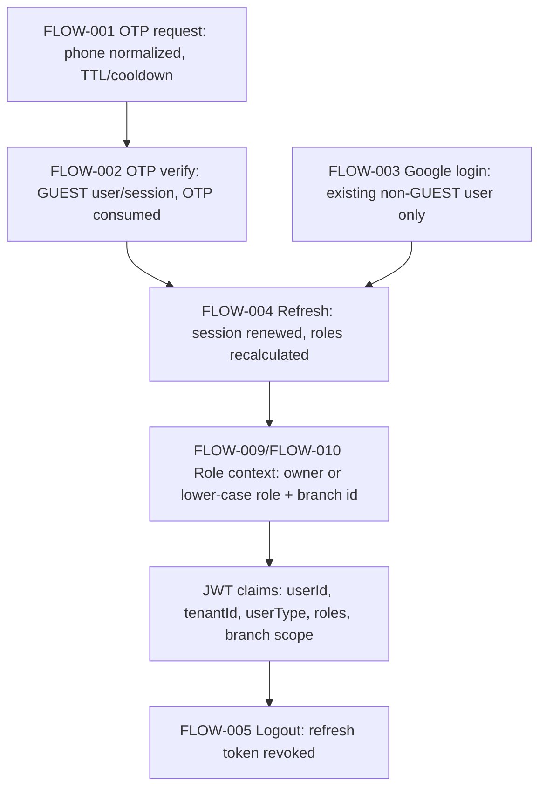
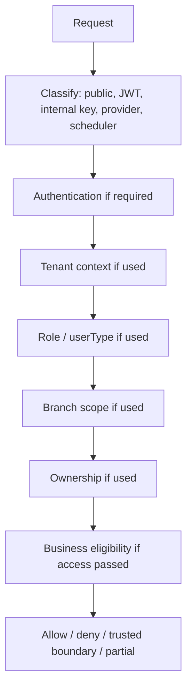

# RE-008 - Authorization Model

Consolidated from RE-001 through RE-007 and applicable Phase 4 artifacts. This model records current executable authorization behaviour only. It does not create desired security policy, redesign roles, or remediate weak enforcement.

Authorization layers are separated as:

```text
Authentication
  verifies caller/session/provider identity
Authorization
  decides whether the authenticated/trusted caller may perform an operation
Business Eligibility
  checks domain state/policy after access is accepted
```

## Mechanical Access Rule Extraction

BRs inspected: 231

Access-relevant BRs: 94

Not-applicable BRs: 137

| BR ID | Flow | Classification | Actor/Trust Source | Scope | Related Policy/Invariant |
|---|---|---|---|---|---|
| BR-003-BR-010 | FLOW-002/FLOW-003/FLOW-004/FLOW-005 | AUTHENTICATION | Public OTP/Google/refresh/logout caller | User/session | POLICY-001, POLICY-002, INVARIANT-002, INVARIANT-003 |
| BR-017-BR-020 | FLOW-009/FLOW-010 | AUTHORIZATION | Role resolver/JWT claims | Tenant and branch role scope | INVARIANT-005 |
| BR-021-BR-023 | FLOW-011/FLOW-012 | AUTHORIZATION | Platform/internal key or OWNER | Tenant | POLICY-003, INVARIANT-006, INVARIANT-007 |
| BR-025-BR-026 | FLOW-013 | AUTHENTICATION | Hostname/query tenant context | Tenant resolution before auth | POLICY-003 |
| BR-032-BR-034 | FLOW-016/FLOW-017 | AUTHORIZATION | Stored branch tenant, owner/internal/public caller | Tenant/branch visibility | POLICY-004, INVARIANT-009 |
| BR-047-BR-049 | FLOW-024/FLOW-029 | AUTHORIZATION | Public caller or JWT | Public availability; booking creator identity | POLICY-008, INVARIANT-013 |
| BR-063 | FLOW-030 | TRUST_BOUNDARY | Internal service | Negotiated booking creation | INVARIANT-019 |
| BR-065-BR-077 | FLOW-031/FLOW-032/FLOW-033 | AUTHORIZATION | Internal key or JWT owner/admin | Booking tenant/owner/admin/branch | INVARIANT-021 |
| BR-078, BR-085 | FLOW-034 | TRUST_BOUNDARY | Internal service key | Booking confirmation trust boundary | POLICY-012, INVARIANT-022, INVARIANT-023 |
| BR-091-BR-092 | FLOW-035 | NOT_ENFORCED | Server endpoint / PWA display context | Check-in auth/timing absent server-side | POLICY-013, INVARIANT-FINDING-002 |
| BR-093-BR-105 | FLOW-036/FLOW-037 | AUTHORIZATION / BUSINESS_ELIGIBILITY | Internal key or JWT booking access | Booking preview/cancel access plus state/refund rules | POLICY-014, POLICY-015, INVARIANT-025, INVARIANT-026 |
| BR-106, BR-110-BR-115 | FLOW-040/FLOW-041/FLOW-042 | AUTHORIZATION | Internal/admin caller | Resource-pool/branch scoped member assignment | INVARIANT-028 |
| BR-118-BR-119 | FLOW-043 | AUTHENTICATION / AUTHORIZATION | MEMBER JWT | JWT user/tenant assignment scope | POLICY-016, INVARIANT-030 |
| BR-122-BR-126 | FLOW-044 | AUTHENTICATION / BUSINESS_ELIGIBILITY | MEMBER JWT | Member attendance confirmation | POLICY-016, POLICY-017, INVARIANT-029 |
| BR-127-BR-129 | FLOW-046 | AUTHORIZATION / BUSINESS_ELIGIBILITY | Internal/admin branch authorization | Attendance roster branch scope | INVARIANT-030 |
| BR-131-BR-138 | FLOW-050 | AUTHENTICATION / AUTHORIZATION / BUSINESS_ELIGIBILITY | JWT caller | Booking/PaymentIntent ownership and HELD guard | INVARIANT-031, INVARIANT-032, INVARIANT-033, INVARIANT-034 |
| BR-141-BR-159 | FLOW-051/FLOW-052 | AUTHENTICATION / AUTHORIZATION / TRUST_BOUNDARY | JWT caller plus Razorpay signature | Payment order ownership and direct verification boundary | POLICY-018, POLICY-019, INVARIANT-032, INVARIANT-035 |
| BR-160-BR-161 | FLOW-052 | AUTHORIZATION | Authenticated caller | Ownership not explicitly checked | INVARIANT-FINDING-005 |
| BR-162-BR-169 | FLOW-053 | AUTHENTICATION / AUTHORIZATION | Request body | Subscription body tenant/user; authentication absent | INVARIANT-FINDING-007 |
| BR-170-BR-179 | FLOW-054 | TRUST_BOUNDARY | Razorpay webhook signature/event id | Payment webhook provider boundary | POLICY-020, INVARIANT-036 |
| BR-180-BR-190 | FLOW-055 | TRUST_BOUNDARY | Razorpay autopay webhook event/idempotency | Subscription/autopay provider boundary | INVARIANT-038, INVARIANT-039 |
| BR-191-BR-194 | FLOW-056/FLOW-057 | AUTHORIZATION / BUSINESS_ELIGIBILITY | HELD booking, branch manager/owner/internal | Negotiated payment link | INVARIANT-033 |
| BR-195-BR-196 | FLOW-058 | TRUST_BOUNDARY | Environment and signed webhook delegation | Simulated capture boundary | POLICY-021 |
| BR-197-BR-204 | FLOW-059/FLOW-060 | AUTHORIZATION / BUSINESS_ELIGIBILITY | Internal key / admin JWT | Refund creation and override | POLICY-022, POLICY-023, INVARIANT-041 |
| BR-205-BR-211 | FLOW-060 | AUTHORIZATION / BUSINESS_ELIGIBILITY | Admin JWT | Override refund audit/amount guard | POLICY-023, INVARIANT-041 |
| BR-212-BR-221 | FLOW-061/FLOW-062/FLOW-063/FLOW-064/FLOW-065 | AUTHORIZATION / TRUST_BOUNDARY | Queue caller, recipient string, worker | Notification queue/template/device/history/worker | INVARIANT-042, INVARIANT-043 |
| BR-222-BR-231 | FLOW-066/FLOW-067/FLOW-068/FLOW-069/FLOW-070 | TRUST_BOUNDARY | Scheduler/internal worker/technical endpoint | Scheduler, dispatch, health/deploy | POLICY-025, POLICY-026, INVARIANT-044, INVARIANT-045 |

Not-applicable BRs are policy/state/calculation/idempotency rules that do not affect caller identity, trust, tenant/branch scope, role, ownership, or public/provider boundary decisions.

## Actor Catalogue

| Actor ID | Actor | Identity Source | Claims/Context | Scope |
|---|---|---|---|---|
| AUTHZ-CONTEXT-001 | Public unauthenticated caller | No JWT | Request body/query/hostname only | OTP, public branch browse, availability browse, health-like public technical routes |
| AUTHZ-CONTEXT-002 | Authenticated GUEST | JWT/session | userId, tenantId, userType GUEST, roles as resolved | Guest booking/payment/profile-like user flows |
| AUTHZ-CONTEXT-003 | Authenticated MEMBER | JWT/session | userId, tenantId, userType MEMBER, roles as resolved | Member assignment view/attendance confirmation |
| AUTHZ-CONTEXT-004 | OWNER | JWT role claim | owner role, tenant scope, no branch id | Tenant-wide owner/admin operations |
| AUTHZ-CONTEXT-005 | Branch manager / scoped admin | JWT role claim | lower-case role plus branch id | Branch/resource-pool scoped administrative operations |
| AUTHZ-CONTEXT-006 | Internal service | Internal service key | Trusted service caller, may bypass tenant/ownership checks where evidenced | Inter-service booking/payment/refund/assignment operations |
| AUTHZ-CONTEXT-007 | Razorpay payment provider | Webhook/direct signature material | payment ids, order id, event id, webhook signature | Payment capture boundary |
| AUTHZ-CONTEXT-008 | Razorpay autopay provider | Webhook event/signature/idempotency context | event id, subscription/mandate payload | Subscription/autopay boundary |
| AUTHZ-CONTEXT-009 | Scheduler/internal worker | Scheduler invocation / internal process | jobName, dedupKey, lock/lease context | Scheduled job and dispatch operations |
| AUTHZ-CONTEXT-010 | Public technical caller | No business identity | Health/deployment request context | Health/deploy verification semantics |

## Token / Claim Model

| Claim | Produced By | Source Flow | Consumers | Meaning |
|---|---|---|---|---|
| userId | OTP/Google/session issuance and refresh | FLOW-002, FLOW-003, FLOW-004 | FLOW-029, FLOW-032, FLOW-043, FLOW-044, FLOW-050, FLOW-051 | Claim present and interpreted as caller user identity where JWT is required |
| tenantId | Tenant context/auth session/role resolution | FLOW-004, FLOW-009, FLOW-010, FLOW-013 | FLOW-012, FLOW-016, FLOW-029, FLOW-031, FLOW-041, FLOW-043, FLOW-044 | Claim present and enforced where tenant-scoped checks are evidenced |
| roles | Role resolution/recalculation | FLOW-004, FLOW-009, FLOW-010 | Admin/owner/branch operations | Claim interpreted as owner or lower-case role plus branch id |
| userType | Signup/login/session model | FLOW-002, FLOW-003, FLOW-008 | FLOW-043, FLOW-044 | MEMBER/GUEST eligibility where evidenced |
| branch id | Role claim construction | FLOW-009, FLOW-010 | Branch manager/resource-pool scoped flows | Enforced only in branch-scoped admin contexts |
| sub | Token/session subject | FLOW-004 | Authentication/session consumers | Authentication identity carrier; not always separately mentioned as authorization input |

Claim present does not imply claim enforced. FLOW-052, for example, authenticates the caller but does not check PaymentIntent or booking ownership (BR-160, BR-161).

## Role Model

| Role/User Type | Scope | Claim Representation | Enforcement Consumers | Source |
|---|---|---|---|---|
| OWNER | Tenant | owner role; must not carry branch id | Tenant update, branch draft inclusion, branch manager bypass contexts | BR-017, BR-020; FLOW-009/FLOW-010 |
| Non-owner admin / branch manager | Branch within tenant | lower-case enum plus branch id | Branch/resource-pool scoped admin operations and negotiated payment-link branch scope | BR-018, BR-019, BR-194; FLOW-009/FLOW-010/FLOW-057 |
| GUEST | User | UserType.GUEST | Guest/self-service booking/payment | BR-003, BR-006, BR-049; FLOW-002/FLOW-003/FLOW-029 |
| MEMBER | User | UserType.MEMBER | Today assignment and attendance confirmation | BR-118, BR-122; FLOW-043/FLOW-044 |
| Internal service | Service | Internal key, not JWT role | Internal booking confirmation/negotiated booking/refund trust | BR-063, BR-078, BR-093, BR-099, BR-198; FLOW-030/FLOW-034/FLOW-036/FLOW-037/FLOW-059 |

## Authorization Decision Dimensions

Values used: YES, NO, CONDITIONAL, NOT_APPLICABLE, NOT_ENFORCED, UNKNOWN.

| Flow | Operation | JWT | Internal Key | User Type | Tenant | Role | Branch | Ownership | Public/Provider | Result |
|---|---|---|---|---|---|---|---|---|---|---|
| FLOW-001 | Request OTP | NO | NO | NOT_APPLICABLE | CONDITIONAL | NO | NO | NO | PUBLIC_USER | PUBLIC |
| FLOW-002 | Verify OTP/signup | NO | NO | GUEST created | CONDITIONAL | NO | NO | NO | PUBLIC_USER | PUBLIC |
| FLOW-003 | Google login | YES/Provider identity | NO | GUEST denied | CONDITIONAL | NO | NO | User exists | Provider auth | CONTEXT_DEPENDENT |
| FLOW-004 | Refresh session | YES refresh/session | NO | CONDITIONAL | YES | Roles recalculated | CONDITIONAL | Session token | NO | ALLOWED |
| FLOW-005 | Logout | CONDITIONAL | NO | NOT_APPLICABLE | NO | NO | NO | Refresh token | NO | ALLOWED |
| FLOW-007 | Pending invite | CONDITIONAL | CONDITIONAL | NOT_APPLICABLE | YES | Admin/internal implied | CONDITIONAL | NO | NO | CONTEXT_DEPENDENT |
| FLOW-011 | Tenant create | NO | YES | NOT_APPLICABLE | NO | NO | NO | NO | Internal/platform | TRUSTED_BOUNDARY |
| FLOW-012 | Tenant update | CONDITIONAL | YES | NOT_APPLICABLE | YES | OWNER same tenant | NO | Tenant owner | Internal alternative | CONTEXT_DEPENDENT |
| FLOW-013 | Tenant context resolve | NO | NO | NOT_APPLICABLE | Host/query | NO | NO | NO | PUBLIC_TECHNICAL | PUBLIC |
| FLOW-015 | Branch create | CONDITIONAL | CONDITIONAL | NOT_APPLICABLE | YES | Admin/internal | CONDITIONAL | NO | NO | CONTEXT_DEPENDENT |
| FLOW-016 | Branch update | YES | CONDITIONAL | NOT_APPLICABLE | Stored branch tenant | Admin/owner | CONDITIONAL | NO | NO | CONTEXT_DEPENDENT |
| FLOW-017 | Public branch browse | CONDITIONAL | CONDITIONAL | NOT_APPLICABLE | CONDITIONAL | Owner/internal for draft | NO | NO | PUBLIC_USER | CONTEXT_DEPENDENT |
| FLOW-024 | Browse availability | NO | NO | NOT_APPLICABLE | Contextual | NO | NO | NO | PUBLIC_USER | PUBLIC |
| FLOW-029 | Create booking | YES | NO | Authenticated user | JWT tenant | NO | NO | Creator from JWT | NO | ALLOWED |
| FLOW-030 | Negotiated booking | NO | YES | NOT_APPLICABLE | Service context | NO | NO | Bypassed | Internal service | TRUSTED_BOUNDARY |
| FLOW-031 | View booking | CONDITIONAL | YES | Authenticated if JWT | Tenant scoped | Scoped admin allowed | CONDITIONAL | Owner or admin | Internal alternative | CONTEXT_DEPENDENT |
| FLOW-032 | My bookings | YES | NO | Authenticated user | JWT tenant implied | NO | NO | JWT userId | NO | ALLOWED |
| FLOW-033 | Admin bookings | CONDITIONAL | YES | NOT_APPLICABLE | Tenant/branch scoped | Admin JWT | Branch filtered | Admin for userId query | Internal alternative | CONTEXT_DEPENDENT |
| FLOW-034 | Confirm booking | NO | YES | NOT_APPLICABLE | Bypassed/trusted | NO | NO | Bypassed | Internal service | TRUSTED_BOUNDARY |
| FLOW-035 | Check in booking | NOT_ENFORCED | NO | NOT_ENFORCED | NOT_ENFORCED | NOT_ENFORCED | NOT_ENFORCED | NOT_ENFORCED | NO | PARTIALLY_ENFORCED |
| FLOW-036 | Preview cancellation | CONDITIONAL | YES | Authenticated if JWT | Tenant/access | Admin or owner | CONDITIONAL | Booking access | Internal alternative | CONTEXT_DEPENDENT |
| FLOW-037 | Cancel booking | CONDITIONAL | YES | Authenticated if JWT | Tenant/access | Admin or owner | CONDITIONAL | Booking access | Internal alternative | CONTEXT_DEPENDENT |
| FLOW-040 | Create assignment | CONDITIONAL | YES | NOT_APPLICABLE | Resource-pool tenant | Admin/internal | Resource-pool scoped | NO | Internal alternative | CONTEXT_DEPENDENT |
| FLOW-041 | List assignments | CONDITIONAL | YES | NOT_APPLICABLE | Tenant/resource pool | Admin/internal | Branch managers restricted | NO | Internal alternative | CONTEXT_DEPENDENT |
| FLOW-042 | Update assignment | CONDITIONAL | YES | NOT_APPLICABLE | Resource-pool tenant | Admin/internal | Pool scoped | NO | Internal alternative | CONTEXT_DEPENDENT |
| FLOW-043 | Today assignment view | YES | NO | MEMBER | JWT tenant | NO | Assignment day/branch context | JWT userId | NO | ALLOWED |
| FLOW-044 | Confirm attendance | YES | NO | MEMBER | JWT tenant | NO | Assignment/resource context | Body identity ignored; JWT user | NO | ALLOWED |
| FLOW-046 | Attendance view | CONDITIONAL | YES | NOT_APPLICABLE | Branch auth | Admin/internal | Branch authorized | NO | Internal alternative | CONTEXT_DEPENDENT |
| FLOW-050 | Create PaymentIntent | YES | NO | Authenticated user | Booking/intent tenant | NO | NO | Booking or intent owner | NO | ALLOWED |
| FLOW-051 | Create payment order | YES | NO | Authenticated user | Intent linkage | NO | NO | PaymentIntent owner | NO | ALLOWED |
| FLOW-052 | Verify payment | YES + signature | NO | Authenticated user | NOT_ENFORCED after signature | NO | NO | NOT_ENFORCED | Razorpay direct signature | PARTIALLY_ENFORCED |
| FLOW-053 | Create subscription | NOT_ENFORCED | NO | NOT_ENFORCED | Body tenantId | NO | NO | Body userId | NO | PARTIALLY_ENFORCED |
| FLOW-054 | Payment webhook | NO | NO | NOT_APPLICABLE | Local intent match | NO | NO | No user ownership; provider signature | PUBLIC_PROVIDER | TRUSTED_BOUNDARY |
| FLOW-055 | Autopay webhook | NO | NO | NOT_APPLICABLE | Local subscription match | NO | NO | No user ownership; provider event | PUBLIC_PROVIDER | TRUSTED_BOUNDARY |
| FLOW-056 | Negotiated payment link | CONDITIONAL | CONDITIONAL | NOT_APPLICABLE | Booking context | Admin/internal implied | CONDITIONAL | HELD booking linkage | Internal/provider later | CONTEXT_DEPENDENT |
| FLOW-057 | Browser payment link | YES or internal/owner | YES alternative | Authenticated admin | Tenant/branch | Owner or branch manager | Branch manager scoped | NO | Internal alternative | CONTEXT_DEPENDENT |
| FLOW-058 | Simulated capture | NO | NO | NOT_APPLICABLE | NO | NO | NO | NO | Public technical/test helper delegates to webhook | TRUSTED_BOUNDARY |
| FLOW-059 | Create refund | NO | YES | NOT_APPLICABLE | Internal Slot Engine read | NO | NO | Trusted booking/payment linkage | Internal service | TRUSTED_BOUNDARY |
| FLOW-060 | Override refund | YES | NO | Admin | Tenant/admin context | Admin JWT | CONDITIONAL | Admin id from token | NO | ALLOWED |
| FLOW-061 | Queue notification | UNKNOWN | UNKNOWN | UNKNOWN | UNKNOWN | UNKNOWN | UNKNOWN | Recipient supplied | Service caller | CONTEXT_DEPENDENT |
| FLOW-062 | Template upsert | UNKNOWN | UNKNOWN | UNKNOWN | Tenant/channel/event tuple | UNKNOWN | NO | NO | UNKNOWN | CONTEXT_DEPENDENT |
| FLOW-063 | Device registration | UNKNOWN | UNKNOWN | UNKNOWN | UNKNOWN | UNKNOWN | NO | Token association | UNKNOWN | CONTEXT_DEPENDENT |
| FLOW-064 | Notification history | UNKNOWN | NO | UNKNOWN | NOT_ENFORCED as tenant+user | NO | NO | Exact recipient only | UNKNOWN | PARTIALLY_ENFORCED |
| FLOW-065 | Queue worker | NO | NO | NOT_APPLICABLE | NO | NO | NO | NO | INTERNAL_OPERATION | TRUSTED_BOUNDARY |
| FLOW-066 | Due-job execution | NO | NO | NOT_APPLICABLE | NO | NO | NO | NO | INTERNAL_OPERATION | TRUSTED_BOUNDARY |
| FLOW-067 | Manual job execution | UNKNOWN | UNKNOWN | NOT_APPLICABLE | NO | NO | NO | NO | INTERNAL_OPERATION | CONTEXT_DEPENDENT |
| FLOW-068 | Dispatch claim | NO | NO | NOT_APPLICABLE | NO | NO | NO | NO | INTERNAL_OPERATION | TRUSTED_BOUNDARY |
| FLOW-069 | Dispatch outcome | NO | NO | NOT_APPLICABLE | NO | NO | NO | NO | INTERNAL_OPERATION | TRUSTED_BOUNDARY |
| FLOW-070 | Health/deployment | NO | NO | NOT_APPLICABLE | NO | NO | NO | NO | PUBLIC_TECHNICAL | PUBLIC |

## Public Access Catalogue

| Flow | Operation | Public Classification | Authorization Note | Source |
|---|---|---|---|---|
| FLOW-001 | OTP request | PUBLIC_USER | Public request, phone normalization/cooldown applies | BR-001, BR-002 |
| FLOW-002 | OTP verification/signup | PUBLIC_USER | Public verification creates GUEST; OTP consumption applies | BR-003, BR-004 |
| FLOW-013 | Tenant context resolution | PUBLIC_TECHNICAL | Host/query context before auth | BR-025, BR-026 |
| FLOW-017 | Public branch browse | PUBLIC_USER | ACTIVE public; draft owner/internal gated | BR-033, BR-034 |
| FLOW-024 | Browse availability | PUBLIC_USER | No user JWT/admin required | BR-047, BR-048 |
| FLOW-054 | Razorpay payment webhook | PUBLIC_PROVIDER | Signature required; provider trust, not user auth | BR-170-BR-179 |
| FLOW-055 | Razorpay autopay webhook | PUBLIC_PROVIDER | Event/idempotency provider boundary | BR-180-BR-190 |
| FLOW-058 | Simulated capture | PUBLIC_TECHNICAL | Unavailable in production; delegates to signed webhook | BR-195, BR-196 |
| FLOW-070 | Health/deployment | PUBLIC_TECHNICAL | Health no dependency auth evidenced; deploy verification compares SHA | BR-230, BR-231 |

Public operations: 9

## Internal Service Key Model

| Flow | Operation | Internal Key Required | JWT Alternative | Tenant/Ownership Bypass | Source |
|---|---|---|---|---|---|
| FLOW-011 | Tenant creation | Yes/platform internal | No | Platform trust boundary | BR-022 |
| FLOW-012 | Tenant update | Conditional | OWNER same tenant | Internal key bypasses owner requirement where evidenced | BR-023 |
| FLOW-030 | Negotiated booking | Yes | No | Waives ordinary self-service user ownership | BR-063 |
| FLOW-031 | View booking | Alternative | JWT booking access | Internal service bypasses non-internal tenant/owner path | BR-065-BR-067 |
| FLOW-033 | Admin booking list | Alternative | Admin JWT | Internal service can use admin listing boundary | BR-073 |
| FLOW-034 | Confirm booking | Yes | No | Payment/expiry/ownership trusted to internal caller | BR-078, BR-085 |
| FLOW-036 | Preview cancellation | Alternative | JWT booking access | Internal key can access preview | BR-093 |
| FLOW-037 | Cancel booking | Alternative | JWT booking access | Internal key can cancel via booking access boundary | BR-099 |
| FLOW-040 | Assignment creation | Alternative | Admin scoped access | Internal can create assignment | BR-106 |
| FLOW-041 | Assignment listing | Alternative | Admin auth | Internal can list | BR-110 |
| FLOW-042 | Assignment update | Alternative | Admin scoped access | Internal can update | BR-115 |
| FLOW-046 | Attendance view | Alternative | Admin branch auth | Internal can view branch attendance | BR-127 |
| FLOW-057 | Browser negotiated payment link | Alternative | Owner/branch manager JWT | Internal bypasses branch-manager scoping where evidenced | BR-194 |
| FLOW-059 | Refund creation | Yes/trusted Slot Engine read | No user JWT | Trusts internal booking status/refundAmount read | BR-198 |

Internal-key operations: 14

## Tenant Authorization Model

| Flow | Tenant Source | Tenant Validation | Failure Behaviour | Source |
|---|---|---|---|---|
| FLOW-012 | JWT tenant or internal | OWNER same tenant or internal key | Unauthorized tenant update denied | BR-023 |
| FLOW-013 | Hostname subdomain or query tenant | Query can override hostname-derived tenant | Context-dependent | BR-025, BR-026 |
| FLOW-016 | Stored branch tenant id | Authorizes against stored tenant, not body tenant | Unauthorized branch update denied | BR-032 |
| FLOW-017 | Branch status and caller | ACTIVE public; draft owner/internal gated | Unauthorized draft attempts do not error | BR-033, BR-034 |
| FLOW-029 | JWT tenant | Persisted from JWT, not body | Body tenant ignored | BR-049 |
| FLOW-031 | Booking tenant for non-internal | Non-internal reads tenant-scoped | Denied when out of scope | BR-066 |
| FLOW-041 | Tenant-matched user/member data | Branch managers restricted to pools in claimed branches | Filter/deny by scope | BR-111-BR-113 |
| FLOW-043 | JWT tenant | Active assignment scoped by JWT user and tenant | No assignment/denied by scope | BR-118, BR-119 |
| FLOW-044 | JWT tenant/user | Body identity ignored; active subscription required | Rejected if member/subscription/cutoff fails | BR-122, BR-123 |
| FLOW-050 | Booking/PaymentIntent tenant linkage | Caller must own intent or booking | Denied if not owner | BR-133 |
| FLOW-051 | Local PaymentIntent | Caller must own local PaymentIntent | Denied if not owner | BR-144 |
| FLOW-052 | PaymentIntent by gatewayRef | Ownership not checked after auth/signature | Partial enforcement | BR-160, BR-161 |
| FLOW-053 | Body tenantId | Not bound to authenticated identity | Weak/body-driven | BR-162, BR-169 |
| FLOW-064 | Recipient string | Not tenant plus user id | History may not equal tenant/user ownership | BR-218 |

## Branch Authorization Model

| Flow | Branch Source | Branch Check | Role Check | Enforcement |
|---|---|---|---|---|
| FLOW-009 | Role assignment input | Non-owner branch id must belong to tenant | OWNER has no branch id; non-owner needs branch id | APPLICATION_ENFORCED |
| FLOW-010 | Role claim construction | OWNER grants all branches in tenant | Role claim strings owner or lower-case enum plus branch id | APPLICATION_ENFORCED |
| FLOW-016 | Stored branch | Branch tenant authorization | Owner/admin context | APPLICATION_ENFORCED |
| FLOW-017 | Branch status | Draft inclusion owner/internal gated | Owner/internal | CONTEXT_DEPENDENT |
| FLOW-033 | Booking window branch | Final results filtered by caller branch authorization | Admin/internal | APPLICATION_ENFORCED |
| FLOW-040 | Resource pool | Internal/admin access scoped to resource pool | Admin/internal | APPLICATION_ENFORCED |
| FLOW-041 | Resource pool/branch | Branch managers restricted to resource pools in claimed branches | Admin/internal | APPLICATION_ENFORCED |
| FLOW-042 | Resource pool | Pool-scoped internal/admin access | Admin/internal | APPLICATION_ENFORCED |
| FLOW-046 | Attendance branch | Internal/admin branch authorization | Admin/internal | APPLICATION_ENFORCED |
| FLOW-057 | Requested branch | Branch manager JWT must be scoped to branch unless owner/internal | Owner/internal/branch manager | APPLICATION_ENFORCED |

## Ownership Model

| Entity | Operation | Ownership Source | Ownership Check | Alternative Admin/Internal Access | Source |
|---|---|---|---|---|---|
| Booking | Create | JWT userId/tenantId | Creator persisted from JWT | None | BR-049; FLOW-029 |
| Booking | Read one | Booking owner / tenant | Owner or scoped admin for non-internal | Internal key | BR-065-BR-067; FLOW-031 |
| Booking | My bookings | JWT userId | Results scoped by JWT user id | None | BR-069, BR-070; FLOW-032 |
| Booking | Admin list | Admin branch authorization | Query userId and branch-filtered result | Internal key | BR-073-BR-077; FLOW-033 |
| Booking | Confirm | Path id | No owner check; internal key only | Internal service | BR-078-BR-085; FLOW-034 |
| Booking | Check-in | Path id | Not enforced server-side | None evidenced | BR-091, BR-092; FLOW-035 |
| Booking | Preview/cancel | Booking access | Internal key or JWT booking access | Internal key | BR-093, BR-099; FLOW-036/FLOW-037 |
| MemberAssignment | Create/list/update | Resource pool/branch scope | Admin/internal branch/resource scope | Internal key | BR-106, BR-110-BR-115; FLOW-040/FLOW-041/FLOW-042 |
| Attendance/member booking | Confirm | JWT member user | Body identity ignored | None | BR-122-BR-126; FLOW-044 |
| PaymentIntent | Create/retrieve | Existing intent or booking | Caller must own existing intent or booking | None | BR-133; FLOW-050 |
| PaymentIntent | Order | Local PaymentIntent | Caller must own local intent | None | BR-144; FLOW-051 |
| PaymentIntent | Verify | GatewayRef/signature | Ownership not checked after auth/signature | Provider signature boundary | BR-160, BR-161; FLOW-052 |
| Subscription | Create | Body userId/tenantId | Not bound to authenticated identity | None evidenced | BR-162, BR-169; FLOW-053 |
| Refund | Create | Internal booking/payment read | Trusts internal Slot Engine read | Internal key | BR-198; FLOW-059 |
| Refund | Override | Admin JWT | Admin id from token, not body | None | BR-204, BR-205; FLOW-060 |
| NotificationRequest | History | recipient string | Exact recipient filter, not tenant plus user id | None evidenced | BR-218; FLOW-064 |

## Booking Authorization

| Operation | Flow | Authentication | Authorization | Business Eligibility | Weak/Variant Evidence |
|---|---|---|---|---|---|
| Create | FLOW-029 | JWT required | userId/tenantId from JWT | idempotency, horizon, block, capacity, HELD creation | BR-049-BR-060 |
| Read one | FLOW-031 | Internal key or JWT | Non-internal tenant-scoped owner/scoped admin | Booking exists | BR-065-BR-068 |
| List mine | FLOW-032 | JWT required | JWT userId scope | None beyond read filters | BR-069-BR-072 |
| Admin list | FLOW-033 | Internal key or admin JWT | Branch authorization filters final results | userId query/status filters | BR-073-BR-077 |
| Confirm | FLOW-034 | Internal key | Trusted internal boundary | HELD guard; no expiry/payment proof validation | BR-078-BR-085; STATE-CONFLICT-002 |
| Check-in | FLOW-035 | Not enforced server-side | Not enforced server-side | CONFIRMED state guard only; timing client-side | BR-091, BR-092; STATE-CONFLICT-003; INVARIANT-FINDING-002 |
| Preview cancellation | FLOW-036 | Internal key or JWT booking access | Booking access | HELD/CONFIRMED/CANCELLED preview rules | BR-093-BR-098 |
| Cancel | FLOW-037 | Internal key or JWT booking access | Booking access | HELD/CONFIRMED cancellable, CANCELLED idempotent | BR-099-BR-105 |
| Member confirmation | FLOW-044 | MEMBER JWT | JWT user, body identity ignored | active subscription, cutoff, create/update member booking | BR-122-BR-126 |
| Negotiated booking | FLOW-030 | Internal service | Internal trusted boundary | availability/block/capacity constraints | BR-063, BR-064 |

## Payment Authorization

| Operation | Flow | Caller Authentication | Ownership | Provider/Internal Trust | Business Eligibility | Source |
|---|---|---|---|---|---|---|
| Create PaymentIntent | FLOW-050 | JWT | Caller owns existing intent or fetched booking | No provider call | bookingId, HELD booking, amount derived | BR-131-BR-138 |
| Create payment order | FLOW-051 | Verified JWT | Caller owns local PaymentIntent | Razorpay order call after local checks | amount finite >= 100 paise, currency default | BR-141-BR-151 |
| Direct verify | FLOW-052 | Authenticated caller plus Razorpay signature | PaymentIntent/booking ownership not checked | Signature validates payment/order ids | pending intent capture, booking confirm boundary | BR-152-BR-161; AUTHZ-FINDING-002 |
| Payment webhook | FLOW-054 | Provider signature | No user ownership check; local pending intent match | Razorpay webhook trust | payment.captured only; event id/idempotency | BR-170-BR-179 |
| Negotiated payment link | FLOW-056/FLOW-057 | Admin/branch manager/internal where browser path evidenced | Branch manager scoped unless owner/internal | Payment link gatewayRef stored | HELD booking | BR-191-BR-194 |
| Simulated capture | FLOW-058 | Environment boundary | None | Delegates to signed webhook | unavailable in production | BR-195, BR-196 |
| Refund creation | FLOW-059 | Internal service | Trusts internal booking/payment linkage | Internal Slot Engine read | cancelled booking, captured PaymentIntent, positive refund | BR-197-BR-203 |
| Refund override | FLOW-060 | Admin JWT | Admin id from token | Local processed Refund only | cancelled booking, captured intent, amount cap | BR-204-BR-211 |

## Subscription / Membership Authorization

| Operation | Flow | Authentication | Authorization | Business Eligibility | Finding |
|---|---|---|---|---|---|
| Subscription creation | FLOW-053 | Not authenticated | body tenantId/userId not identity-bound | mandateId/amount/frequency persistence | INVARIANT-FINDING-007; AUTHZ-FINDING-003 |
| Member assignment create | FLOW-040 | Internal/admin | Resource-pool scoped | required fields, ACTIVE state, uniqueness | BR-106-BR-109 |
| Member assignment list | FLOW-041 | Internal/admin | Branch managers restricted to claimed branch pools | filters and tenant-matched enrichment | BR-110-BR-113 |
| Member assignment update | FLOW-042 | Internal/admin | Pool-scoped | ACTIVE/SUSPENDED and uniqueness | BR-114-BR-117 |
| Today assignment view | FLOW-043 | MEMBER JWT | JWT user and tenant assignment scope | active assignment, branch-local weekday, canConfirm | BR-118-BR-121 |
| Attendance confirm | FLOW-044 | MEMBER JWT | JWT identity; body identity ignored | active subscription, before cutoff, booking create/update | BR-122-BR-126 |
| Attendance roster | FLOW-046 | Internal/admin | Branch authorization | ACTIVE assignments and derived attendance | BR-127-BR-129 |
| Autopay webhook | FLOW-055 | Provider event/idempotency | local subscription match, no user auth | charged/failed semantics | BR-180-BR-190 |

## Notification Authorization

| Operation | Flow | Authorization Behaviour | Source |
|---|---|---|---|
| Queue notification | FLOW-061 | Send queues before delivery; caller auth not established in RE-005/RE-007 | BR-212, BR-213 |
| Template management | FLOW-062 | One template per tenant/channel/event tuple; auth not established in RE-005/RE-007 | BR-214, BR-215 |
| Device registration | FLOW-063 | Device token globally unique; re-registration updates user association; caller auth not established | BR-216, BR-217 |
| History read | FLOW-064 | Filtered by exact recipient, not tenant plus user id | BR-218, BR-219; AUTHZ-FINDING-004 |
| Worker processing | FLOW-065 | Internal worker processing due queued rows; no user auth | BR-220, BR-221 |

## Scheduler / Operational Authorization

| Operation | Flow | Classification | Evidence |
|---|---|---|---|
| Due-job execution | FLOW-066 | INTERNAL_OPERATION | enabled/due/unlocked claim; lease semantics BR-222, BR-223 |
| Manual execution | FLOW-067 | INTERNAL_OPERATION / CONTEXT_DEPENDENT | unknown job throws; does not release claimed lease BR-224, BR-225 |
| Dispatch claim | FLOW-068 | INTERNAL_OPERATION | dedupe key and live PENDING duplicate denial BR-226, BR-227 |
| Dispatch outcome | FLOW-069 | INTERNAL_OPERATION | SENT/FAILED mutations BR-228, BR-229 |
| Health/deployment | FLOW-070 | PUBLIC_TECHNICAL / UNAUTHENTICATED_TECHNICAL | health has no dependency checks; deploy SHA check BR-230, BR-231 |

## Provider Trust Boundaries

| Provider/External Actor | Flow | Authentication Mechanism | Replay/Idempotency | Business Ownership Check | Trust Classification |
|---|---|---|---|---|---|
| Razorpay direct verification | FLOW-052 | HMAC-SHA256 signature over order id + payment id | No webhook event id; matching pending intent guard | Not explicitly checked after auth/signature | PROVIDER_SIGNATURE_ENFORCED / PARTIALLY_ENFORCED |
| Razorpay payment webhook | FLOW-054 | x-razorpay-signature over raw body | WebhookEvent.gatewayEventId insert before processing; duplicate skipped | PaymentIntent matched by gatewayRef/payment link, not user ownership | PROVIDER_SIGNATURE_ENFORCED |
| Razorpay autopay webhook | FLOW-055 | Event/idempotency boundary evidenced; signature details not normalized by RE-008 | WebhookEvent.gatewayEventId insert; duplicate success | Local subscription match; no user ownership | TRUSTED_BOUNDARY |

Provider signature validity is not equivalent to user authorization.

## Authentication Context Lifecycle



## Authorization Decision Flow



Annotations: public flows bypass JWT; internal-key flows may bypass tenant/ownership checks where evidenced; provider flows use signature/event trust rather than user authorization; business eligibility is not authorization.

## Weak / Missing Authorization Findings

| Finding ID | Area | Actual Enforcement | Evidence | Status |
|---|---|---|---|---|
| AUTHZ-FINDING-001 | FLOW-035 check-in | Historical AS-IS: server-side caller auth/ownership/timing absent; only state guard is enforced. Findings register records F-090 fixed for authentication/ownership and F-094 still open for server timing. | BR-091, BR-092; STATE-CONFLICT-003; INVARIANT-FINDING-002; F-090; F-094 | AS-IS finding preserved; business interpretation resolved by DECISION-017; implementation conformance follows findings-register status only. |
| AUTHZ-FINDING-002 | FLOW-052 payment verification | Auth/signature present, but PaymentIntent/booking ownership not explicitly checked. | BR-160, BR-161; INVARIANT-FINDING-005; F-061 | AS-IS finding preserved; business interpretation resolved by DECISION-005; implementation conformance not asserted. |
| AUTHZ-FINDING-003 | FLOW-053 subscription creation | Body tenantId/userId not bound to authenticated identity. | BR-162, BR-169; INVARIANT-FINDING-007 | AS-IS finding preserved; business interpretation resolved by DECISION-010 and DECISION-015; implementation conformance not asserted. |
| AUTHZ-FINDING-004 | FLOW-064 notification history | History filters by exact recipient rather than tenant plus user id. | BR-218 | AS-IS finding preserved; business interpretation resolved by DECISION-018; implementation conformance not asserted. |
| AUTHZ-FINDING-005 | Internal-key operations | Internal key bypasses tenant/ownership checks in several trusted boundaries. | BR-023, BR-063, BR-078, BR-093, BR-099, BR-198; FLOW-012/FLOW-030/FLOW-034/FLOW-036/FLOW-037/FLOW-059 | TRUSTED_BOUNDARY |
| AUTHZ-FINDING-006 | Provider webhooks | Provider signature/event trust substitutes for user auth; local ownership checks are entity-match based. | BR-170-BR-190; FLOW-054/FLOW-055 | AS-IS finding preserved; business interpretation resolved by DECISION-006 and DECISION-015; implementation conformance not asserted. |
| AUTHZ-FINDING-007 | Notification queue/template/device auth | RE-005/RE-007 do not establish user/JWT authorization for all notification operations. | BR-212-BR-221; FLOW-061/FLOW-062/FLOW-063/FLOW-064/FLOW-065 | UNKNOWN |

Weak/missing authorization findings: 7

## Authorization Context Variants

| Variant ID | Context A | Context B | Source | Status |
|---|---|---|---|---|
| AUTHZ-VARIANT-001 | Public branch/availability browse | Admin/internal branch visibility and operations | FLOW-017/FLOW-024 vs FLOW-016/FLOW-033 | CONTEXT_DEPENDENT |
| AUTHZ-VARIANT-002 | OWNER tenant-wide role | Branch manager scoped role | BR-017-BR-020; FLOW-009/FLOW-010 | CONTEXT_DEPENDENT |
| AUTHZ-VARIANT-003 | Internal key | JWT booking access | FLOW-031/FLOW-036/FLOW-037 | CONTEXT_DEPENDENT |
| AUTHZ-VARIANT-004 | GUEST booking/payment | MEMBER attendance confirmation | FLOW-029/FLOW-050 vs FLOW-043/FLOW-044 | CONTEXT_DEPENDENT |
| AUTHZ-VARIANT-005 | Direct user payment verification | Provider webhook capture | FLOW-052 vs FLOW-054 | CONTEXT_DEPENDENT |
| AUTHZ-VARIANT-006 | Standard booking | Negotiated booking | FLOW-029 vs FLOW-030/FLOW-057 | CONTEXT_DEPENDENT |
| AUTHZ-VARIANT-007 | Manual execution | Scheduler/internal due execution | FLOW-067 vs FLOW-066 | FUTURE_SCOPE |
| AUTHZ-VARIANT-008 | Admin refund override | Internal refund creation | FLOW-060 vs FLOW-059 | CONTEXT_DEPENDENT |
| AUTHZ-VARIANT-009 | Notification recipient filter | Tenant/user ownership | FLOW-064 | BUSINESS_INTERPRETATION_RESOLVED_BY_DECISION-018 |

Context variants: 9

## Business Eligibility Separation

| Flow | Authorization Passed | Additional Business Eligibility |
|---|---|---|
| FLOW-029 | JWT creator accepted | idempotency key, horizon, blocked window, capacity, price derivation, HELD creation |
| FLOW-034 | Internal key accepted | booking exists, already confirmed idempotent, only HELD mutates; no hold-expiry/payment validation |
| FLOW-035 | No server auth enforced | booking exists, already checked-in idempotent, only CONFIRMED mutates |
| FLOW-036 | Internal key or booking access | HELD/CONFIRMED/CANCELLED preview and refund computation |
| FLOW-037 | Internal key or booking access | HELD/CONFIRMED cancellable, CANCELLED idempotent |
| FLOW-044 | MEMBER JWT accepted | active subscription, before cutoff, booking create/update transaction |
| FLOW-050 | JWT ownership accepted | booking exists, HELD, amount/purpose rules, captured intent not reused |
| FLOW-051 | JWT PaymentIntent owner accepted | local intent exists, amount finite >= 100 paise |
| FLOW-052 | Auth/signature accepted | matching pending intent captures and invokes FLOW-034 |
| FLOW-054 | Provider signature/event accepted | payment.captured, matching pending intent, idempotency |
| FLOW-059 | Internal trusted read accepted | cancelled booking, positive refund, captured PaymentIntent |
| FLOW-060 | Admin JWT accepted | required fields, cancelled booking, captured PaymentIntent, override cap |
| FLOW-065 | Worker accepted | due queued rows, retry/dead_letter attempt policy |
| FLOW-066 | Scheduler accepted | enabled, due, unlocked/expired job |

## Authorization Enforcement Strength

| AUTHZ-RULE | Enforcement Strength |
|---|---|
| AUTHZ-RULE-001 | APPLICATION_ENFORCED |
| AUTHZ-RULE-002 | APPLICATION_ENFORCED |
| AUTHZ-RULE-003 | SERVICE_BOUNDARY_ENFORCED |
| AUTHZ-RULE-004 | APPLICATION_ENFORCED |
| AUTHZ-RULE-005 | APPLICATION_ENFORCED |
| AUTHZ-RULE-006 | APPLICATION_ENFORCED |
| AUTHZ-RULE-007 | SERVICE_BOUNDARY_ENFORCED |
| AUTHZ-RULE-008 | NOT_ENFORCED |
| AUTHZ-RULE-009 | APPLICATION_ENFORCED |
| AUTHZ-RULE-010 | SERVICE_BOUNDARY_ENFORCED |
| AUTHZ-RULE-011 | APPLICATION_ENFORCED |
| AUTHZ-RULE-012 | APPLICATION_ENFORCED |
| AUTHZ-RULE-013 | APPLICATION_ENFORCED |
| AUTHZ-RULE-014 | APPLICATION_ENFORCED |
| AUTHZ-RULE-015 | APPLICATION_ENFORCED |
| AUTHZ-RULE-016 | PARTIALLY_ENFORCED |
| AUTHZ-RULE-017 | NOT_ENFORCED |
| AUTHZ-RULE-018 | PROVIDER_SIGNATURE_ENFORCED |
| AUTHZ-RULE-019 | PROVIDER_SIGNATURE_ENFORCED |
| AUTHZ-RULE-020 | APPLICATION_ENFORCED |
| AUTHZ-RULE-021 | SERVICE_BOUNDARY_ENFORCED |
| AUTHZ-RULE-022 | SERVICE_BOUNDARY_ENFORCED |
| AUTHZ-RULE-023 | APPLICATION_ENFORCED |
| AUTHZ-RULE-024 | PARTIALLY_ENFORCED |
| AUTHZ-RULE-025 | UNKNOWN |
| AUTHZ-RULE-026 | SERVICE_BOUNDARY_ENFORCED |
| AUTHZ-RULE-027 | SERVICE_BOUNDARY_ENFORCED |
| AUTHZ-RULE-028 | SERVICE_BOUNDARY_ENFORCED |
| AUTHZ-RULE-029 | UNKNOWN |
| AUTHZ-RULE-030 | APPLICATION_ENFORCED |
| AUTHZ-RULE-031 | APPLICATION_ENFORCED |
| AUTHZ-RULE-032 | APPLICATION_ENFORCED |
| AUTHZ-RULE-033 | APPLICATION_ENFORCED |
| AUTHZ-RULE-034 | APPLICATION_ENFORCED |

## Consolidated Authorization Rules

| Authorization Rule ID | Title | Operation | Actor | Authentication | Tenant Scope | Role/UserType | Branch Scope | Ownership | Internal Key | Provider Trust | Business Eligibility | Enforcement Strength | Source BR IDs | Source Candidate Rules | Source FLOW IDs | Related Policies | Related Invariants | Related State Models | Related Uncertainties | Consistency Status |
|---|---|---|---|---|---|---|---|---|---|---|---|---|---|---|---|---|---|---|---|---|
| AUTHZ-RULE-001 | Public auth bootstrap | OTP/signup/session bootstrap | Public caller | Public OTP/verify; refresh/logout session where applicable | Tenant context where resolved | GUEST creation / userType constraints | No | Refresh token/session | No | No | OTP TTL/cooldown/consume | APPLICATION_ENFORCED | BR-001-BR-010 | FLOW-001-RULE-001/002, FLOW-002-RULE-001/002, FLOW-003-RULE-001/002, FLOW-004-RULE-001/002, FLOW-005-RULE-001/002 | FLOW-001-FLOW-005 | POLICY-001, POLICY-002 | INVARIANT-001-INVARIANT-003 | STATE-MODEL-AUTH-SESSION | FLOW-001/002/003/004/005-UNCERTAINTY-* | CONSISTENT |
| AUTHZ-RULE-002 | Role claim authorization context | Role resolution | Authenticated admin context | JWT/session | Tenant scoped | OWNER or lower-case role + branch id | Branch required for non-owner | No | No | No | Role claim construction | APPLICATION_ENFORCED | BR-017-BR-020 | FLOW-009-RULE-001/002, FLOW-010-RULE-001/002 | FLOW-009, FLOW-010 | None | INVARIANT-005 | None | FLOW-009/010-UNCERTAINTY-* | CONSISTENT |
| AUTHZ-RULE-003 | Tenant administration boundary | Tenant create/update | Owner/internal | JWT or internal key | Same tenant owner or platform/internal | OWNER | No | Tenant owner | Yes alternative | No | Subdomain uniqueness | SERVICE_BOUNDARY_ENFORCED | BR-021-BR-023 | FLOW-011-RULE-001/002, FLOW-012-RULE-001 | FLOW-011, FLOW-012 | POLICY-003 | INVARIANT-006, INVARIANT-007 | None | FLOW-011/012-UNCERTAINTY-* | CONSISTENT |
| AUTHZ-RULE-004 | Branch administration/visibility | Branch create/update/browse | Public/admin/internal | JWT for admin, public browse allowed | Stored branch tenant | Owner/internal for draft | Branch entity | No | Conditional | No | Status values/ACTIVE visibility | APPLICATION_ENFORCED | BR-029-BR-034 | FLOW-015-RULE-001/002, FLOW-016-RULE-001/002, FLOW-017-RULE-001/002 | FLOW-015, FLOW-016, FLOW-017 | POLICY-004 | INVARIANT-008, INVARIANT-009 | STATE-MODEL-BRANCH | FLOW-015/016/017-UNCERTAINTY-* | CONTEXT_DEPENDENT |
| AUTHZ-RULE-005 | Public availability browse | Browse resource-pool availability | Public caller | No JWT | Contextual | No | No | No | No | No | Availability policies/capacity only | APPLICATION_ENFORCED | BR-037-BR-048 | FLOW-024-RULE-001 through FLOW-024-RULE-012 | FLOW-024 | POLICY-005-POLICY-008 | INVARIANT-010-INVARIANT-012 | STATE-MODEL-AVAILABILITY-WINDOW | FLOW-024-UNCERTAINTY-* | CONSISTENT |
| AUTHZ-RULE-006 | Standard booking create | Create booking | Authenticated user | JWT | JWT tenant persisted | UserType not client-selected | No | Creator from JWT | No | No | Horizon/block/capacity/price/hold | APPLICATION_ENFORCED | BR-049-BR-062 | FLOW-029-RULE-001 through FLOW-029-RULE-014 | FLOW-029 | POLICY-009-POLICY-011 | INVARIANT-013-INVARIANT-018 | STATE-MODEL-BOOKING | FLOW-029-UNCERTAINTY-* | CONSISTENT |
| AUTHZ-RULE-007 | Negotiated booking create | Create negotiated booking | Internal service | Internal key | Service context | No | No | Bypassed | Required | No | Capacity/block constraints retained | SERVICE_BOUNDARY_ENFORCED | BR-063, BR-064 | FLOW-030-RULE-001/002 | FLOW-030 | None | INVARIANT-019, INVARIANT-020 | STATE-MODEL-BOOKING | FLOW-030-UNCERTAINTY-001 | CONTEXT_DEPENDENT |
| AUTHZ-RULE-008 | Booking check-in weak boundary | Check-in booking | Unauthenticated server caller | Not enforced | Not enforced | Not enforced | Not enforced | Not enforced | No | No | CONFIRMED state guard only | NOT_ENFORCED | BR-086-BR-092 | FLOW-035-RULE-001 through FLOW-035-RULE-007 | FLOW-035 | POLICY-013 | INVARIANT-024 | STATE-MODEL-BOOKING | FLOW-035-UNCERTAINTY-* | AS_IS_GAP_DECISION_RESOLVED |
| AUTHZ-RULE-009 | Booking read boundary | View/list bookings | JWT or internal/admin | JWT/internal | Tenant scoped non-internal | Admin role for admin list | Branch filtered admin list | Owner or scoped admin | Alternative | No | Read filters | APPLICATION_ENFORCED | BR-065-BR-077 | FLOW-031-RULE-001/002/003/004, FLOW-032-RULE-001/002/003/004, FLOW-033-RULE-001/002/003/004/005 | FLOW-031, FLOW-032, FLOW-033 | None | INVARIANT-021 | STATE-MODEL-BOOKING | FLOW-031/032/033-UNCERTAINTY-* | CONTEXT_DEPENDENT |
| AUTHZ-RULE-010 | Internal booking confirmation | Confirm booking | Internal service | Internal key | Bypassed/trusted | No | No | Bypassed | Required | No | HELD guard; no expiry/payment proof | SERVICE_BOUNDARY_ENFORCED | BR-078-BR-085 | FLOW-034-RULE-001 through FLOW-034-RULE-008 | FLOW-034 | POLICY-012 | INVARIANT-022, INVARIANT-023 | STATE-MODEL-BOOKING | FLOW-034-UNCERTAINTY-* | CONTEXT_DEPENDENT |
| AUTHZ-RULE-011 | Booking preview/cancel access | Preview/cancel booking | JWT or internal | JWT booking access or internal | Booking access | Owner/admin | Conditional | Booking access | Alternative | No | Cancellable/refund rules | APPLICATION_ENFORCED | BR-093-BR-105 | FLOW-036-RULE-001 through FLOW-036-RULE-006, FLOW-037-RULE-001 through FLOW-037-RULE-007 | FLOW-036, FLOW-037 | POLICY-014, POLICY-015 | INVARIANT-025, INVARIANT-026 | STATE-MODEL-BOOKING | FLOW-036/037-UNCERTAINTY-* | CONTEXT_DEPENDENT |
| AUTHZ-RULE-012 | Member assignment admin access | Create/list/update assignments | Admin/internal | JWT admin or internal | Resource-pool tenant | Admin/internal | Pool/branch scoped | No | Alternative | No | Assignment uniqueness/status | APPLICATION_ENFORCED | BR-106-BR-117 | FLOW-040-RULE-001/002/003/004, FLOW-041-RULE-001/002/003/004, FLOW-042-RULE-001/002/003/004 | FLOW-040, FLOW-041, FLOW-042 | None | INVARIANT-027, INVARIANT-028 | STATE-MODEL-MEMBER-ASSIGNMENT | FLOW-040/041/042-UNCERTAINTY-* | CONTEXT_DEPENDENT |
| AUTHZ-RULE-013 | Member self-service attendance | Today/confirm attendance | MEMBER JWT | JWT | JWT tenant | MEMBER | Assignment context | JWT user; body ignored | No | No | Active subscription/cutoff | APPLICATION_ENFORCED | BR-118-BR-126 | FLOW-043-RULE-001/002/003/004, FLOW-044-RULE-001/002/003/004/005 | FLOW-043, FLOW-044 | POLICY-016, POLICY-017 | INVARIANT-029, INVARIANT-030 | STATE-MODEL-ATTENDANCE-DERIVED | FLOW-043/044-UNCERTAINTY-* | CONSISTENT |
| AUTHZ-RULE-014 | Attendance roster admin access | Attendance view | Admin/internal | JWT admin or internal | Branch authorized | Admin/internal | Branch scoped | No | Alternative | No | Derived attendance only | APPLICATION_ENFORCED | BR-127-BR-129 | FLOW-046-RULE-001/002/003 | FLOW-046 | None | INVARIANT-030 | STATE-MODEL-ATTENDANCE-DERIVED | FLOW-046-UNCERTAINTY-001 | CONTEXT_DEPENDENT |
| AUTHZ-RULE-015 | PaymentIntent create/order ownership | Create intent/order | Authenticated user | JWT | Booking/intent context | No | No | Booking/intent owner | No | No | HELD booking, amount constraints | APPLICATION_ENFORCED | BR-131-BR-151 | FLOW-050-RULE-001 through FLOW-050-RULE-010, FLOW-051-RULE-001 through FLOW-051-RULE-011 | FLOW-050, FLOW-051 | POLICY-018 | INVARIANT-031-INVARIANT-034 | STATE-MODEL-PAYMENT-INTENT | FLOW-050/051-UNCERTAINTY-* | CONSISTENT |
| AUTHZ-RULE-016 | Direct payment verification | Verify payment | Authenticated caller + signature | JWT plus Razorpay signature | Not enforced after signature | No | No | Not checked | No | Direct signature | Pending intent capture | PARTIALLY_ENFORCED | BR-152-BR-161 | FLOW-052-RULE-001 through FLOW-052-RULE-010 | FLOW-052 | POLICY-019 | INVARIANT-035 | STATE-MODEL-PAYMENT-INTENT | FLOW-052-UNCERTAINTY-* | CONTEXT_DEPENDENT |
| AUTHZ-RULE-017 | Subscription creation weak boundary | Create subscription | Not authenticated | Not enforced | Body tenantId | No | No | Body userId | No | No | Required fields/mandate | NOT_ENFORCED | BR-162-BR-169 | FLOW-053-RULE-001 through FLOW-053-RULE-008 | FLOW-053 | None | INVARIANT-037 | STATE-MODEL-SUBSCRIPTION | FLOW-053-UNCERTAINTY-* | AS_IS_GAP_DECISION_RESOLVED |
| AUTHZ-RULE-018 | Payment webhook boundary | Payment webhook | Provider | Razorpay signature | Local intent match | No | No | No user ownership | No | Webhook signature/event id | pending intent capture | PROVIDER_SIGNATURE_ENFORCED | BR-170-BR-179 | FLOW-054-RULE-001 through FLOW-054-RULE-010 | FLOW-054 | POLICY-020 | INVARIANT-036 | STATE-MODEL-PAYMENT-INTENT | FLOW-054-UNCERTAINTY-* | CONTEXT_DEPENDENT |
| AUTHZ-RULE-019 | Autopay webhook boundary | Autopay webhook | Provider | Event/idempotency boundary | Local subscription match | No | No | No user ownership | No | Provider webhook | subscription/payment/notification effects | PROVIDER_SIGNATURE_ENFORCED | BR-180-BR-190 | FLOW-055-RULE-001 through FLOW-055-RULE-011 | FLOW-055 | None | INVARIANT-038, INVARIANT-039 | STATE-MODEL-SUBSCRIPTION | FLOW-055-UNCERTAINTY-* | CONTEXT_DEPENDENT |
| AUTHZ-RULE-020 | Negotiated payment link access | Payment link | Admin/internal | JWT or internal | Booking/branch context | Owner/branch manager/internal | Branch manager scoped | HELD booking linkage | Alternative | Provider later | HELD booking | APPLICATION_ENFORCED | BR-191-BR-194 | FLOW-056-RULE-001/002, FLOW-057-RULE-001/002 | FLOW-056, FLOW-057 | None | INVARIANT-033 | STATE-MODEL-PAYMENT-INTENT | FLOW-056/057-UNCERTAINTY-* | CONTEXT_DEPENDENT |
| AUTHZ-RULE-021 | Simulated capture boundary | Simulate capture | Technical caller | Environment boundary | No | No | No | No | No | Delegates to webhook | unavailable in production | SERVICE_BOUNDARY_ENFORCED | BR-195, BR-196 | FLOW-058-RULE-001/002 | FLOW-058 | POLICY-021 | None | STATE-MODEL-PAYMENT-INTENT | FLOW-058-UNCERTAINTY-001 | CONSISTENT |
| AUTHZ-RULE-022 | Refund creation internal trust | Create refund | Internal service | Internal key | Trusted booking read | No | No | Trusted booking/payment linkage | Required | No | cancelled/positive/captured | SERVICE_BOUNDARY_ENFORCED | BR-197-BR-203 | FLOW-059-RULE-001 through FLOW-059-RULE-007 | FLOW-059 | POLICY-022 | INVARIANT-040, INVARIANT-041 | STATE-MODEL-REFUND | FLOW-059-UNCERTAINTY-* | CONTEXT_DEPENDENT |
| AUTHZ-RULE-023 | Refund override admin access | Override refund | Admin | Admin JWT | Admin context | Admin | Conditional | Admin id token | No | No | cancelled/captured/amount cap | APPLICATION_ENFORCED | BR-204-BR-211 | FLOW-060-RULE-001 through FLOW-060-RULE-008 | FLOW-060 | POLICY-023 | INVARIANT-040, INVARIANT-041 | STATE-MODEL-REFUND | FLOW-060-UNCERTAINTY-* | CONTEXT_DEPENDENT |
| AUTHZ-RULE-024 | Notification history recipient filter | History | Unknown | Unknown | Not tenant+user | Unknown | No | Exact recipient | No | No | max 50 newest | PARTIALLY_ENFORCED | BR-218, BR-219 | FLOW-064-RULE-001/002 | FLOW-064 | None | INVARIANT-042 | STATE-MODEL-NOTIFICATION-REQUEST | FLOW-064-UNCERTAINTY-001 | AS_IS_GAP_DECISION_RESOLVED |
| AUTHZ-RULE-025 | Notification queue/template/device boundary | Queue/template/device | Unknown/service | Unknown | Tenant/channel/event or token context | Unknown | No | Recipient/token | No | No | Queue/template/device uniqueness | UNKNOWN | BR-212-BR-217 | FLOW-061-RULE-001/002, FLOW-062-RULE-001/002, FLOW-063-RULE-001/002 | FLOW-061, FLOW-062, FLOW-063 | None | INVARIANT-042, INVARIANT-043 | STATE-MODEL-NOTIFICATION-REQUEST | FLOW-061/062/063-UNCERTAINTY-* | CONTEXT_DEPENDENT |
| AUTHZ-RULE-026 | Notification worker | Queue worker | Internal worker | Internal process | No | No | No | No | No | No | due queued retry/dead_letter | SERVICE_BOUNDARY_ENFORCED | BR-220, BR-221 | FLOW-065-RULE-001/002 | FLOW-065 | POLICY-024 | INVARIANT-042 | STATE-MODEL-NOTIFICATION-REQUEST | FLOW-065-UNCERTAINTY-001 | CONTEXT_DEPENDENT |
| AUTHZ-RULE-027 | Scheduler claim/manual | Due/manual jobs | Scheduler/internal | Internal operation | No | No | No | No | No | No | enabled/due/lease/manual unknown job | SERVICE_BOUNDARY_ENFORCED | BR-222-BR-225 | FLOW-066-RULE-001/002, FLOW-067-RULE-001/002 | FLOW-066, FLOW-067 | POLICY-025 | INVARIANT-044 | STATE-MODEL-SCHEDULED-JOB | FLOW-066/067-UNCERTAINTY-* | CONTEXT_DEPENDENT |
| AUTHZ-RULE-028 | Dispatch dedupe/outcome | Dispatch claim/outcome | Internal worker | Internal operation | No | No | No | No | No | No | PENDING/SENT/FAILED dedupe/outcome | SERVICE_BOUNDARY_ENFORCED | BR-226-BR-229 | FLOW-068-RULE-001/002, FLOW-069-RULE-001/002 | FLOW-068, FLOW-069 | None | INVARIANT-045 | STATE-MODEL-SCHEDULED-JOB-DISPATCH | FLOW-068/069-UNCERTAINTY-* | CONTEXT_DEPENDENT |
| AUTHZ-RULE-029 | Health/deploy technical access | Health/deploy verification | Public technical | No user auth evidenced | No | No | No | No | No | No | SHA comparison | UNKNOWN | BR-230, BR-231 | FLOW-070-RULE-001/002 | FLOW-070 | POLICY-026 | None | None | FLOW-070-UNCERTAINTY-001 | CONSISTENT |
| AUTHZ-RULE-030 | Public technical tenant context | Tenant/manifest context | Public technical | No user auth | Host/query tenant | No | No | No | No | No | App/tenant context | APPLICATION_ENFORCED | BR-025-BR-028 | FLOW-013-RULE-001/002, FLOW-014-RULE-001/002 | FLOW-013, FLOW-014 | POLICY-003 | None | None | FLOW-013/014-UNCERTAINTY-* | CONTEXT_DEPENDENT |
| AUTHZ-RULE-031 | Branch detail inheritance | Branch public/default data | Public/admin context | Contextual | Tenant/branch context | No | No | No | No | No | Branch overrides tenant defaults | APPLICATION_ENFORCED | BR-035, BR-036 | FLOW-018-RULE-001/002 | FLOW-018 | None | None | None | FLOW-018-UNCERTAINTY-001 | CONSISTENT |
| AUTHZ-RULE-032 | Admin phone lookup | Admin phone lookup | Admin | JWT admin | JWT tenant | Admin | No | No | No | No | phone normalization | APPLICATION_ENFORCED | BR-011, BR-012 | FLOW-006-RULE-001/002 | FLOW-006 | None | None | None | FLOW-006-UNCERTAINTY-001 | CONSISTENT |
| AUTHZ-RULE-033 | Public user type guard | User type update/representation | Public/auth context | Contextual | No | UserType | No | No | No | No | cannot self-promote | APPLICATION_ENFORCED | BR-015, BR-016 | FLOW-008-RULE-001/002 | FLOW-008 | None | None | None | FLOW-008-UNCERTAINTY-001 | CONSISTENT |
| AUTHZ-RULE-034 | Availability public access boundary | Availability browse access | Public caller | No JWT required | Resource-pool availability context | No role | No branch role | No ownership | No | No | availability horizon/override/block/capacity eligibility | APPLICATION_ENFORCED | BR-037-BR-048 | FLOW-024-RULE-001 through FLOW-024-RULE-012 | FLOW-024 | POLICY-005-POLICY-008 | INVARIANT-010-INVARIANT-012 | STATE-MODEL-AVAILABILITY-WINDOW | FLOW-024-UNCERTAINTY-* | CONSISTENT |

## Flow-To-Authorization Traceability

| Flow ID | AUTHZ-RULE IDs | BR IDs | Candidate Rule IDs | POLICY/INVARIANT IDs | Uncertainty IDs |
|---|---|---|---|---|---|
| FLOW-001-FLOW-005 | AUTHZ-RULE-001 | BR-001-BR-010 | FLOW-001-RULE-*, FLOW-002-RULE-*, FLOW-003-RULE-*, FLOW-004-RULE-*, FLOW-005-RULE-* | POLICY-001, POLICY-002, INVARIANT-001-INVARIANT-003 | FLOW-001/002/003/004/005-UNCERTAINTY-* |
| FLOW-006 | AUTHZ-RULE-032 | BR-011, BR-012 | FLOW-006-RULE-001/002 | None | FLOW-006-UNCERTAINTY-001 |
| FLOW-007 | AUTHZ-RULE-001 | BR-013, BR-014 | FLOW-007-RULE-001/002 | INVARIANT-004 | FLOW-007-UNCERTAINTY-001 |
| FLOW-008 | AUTHZ-RULE-033 | BR-015, BR-016 | FLOW-008-RULE-001/002 | None | FLOW-008-UNCERTAINTY-001 |
| FLOW-009-FLOW-010 | AUTHZ-RULE-002 | BR-017-BR-020 | FLOW-009-RULE-*, FLOW-010-RULE-* | INVARIANT-005 | FLOW-009/010-UNCERTAINTY-* |
| FLOW-011-FLOW-012 | AUTHZ-RULE-003 | BR-021-BR-023 | FLOW-011-RULE-*, FLOW-012-RULE-001 | POLICY-003, INVARIANT-006, INVARIANT-007 | FLOW-011/012-UNCERTAINTY-* |
| FLOW-013-FLOW-014 | AUTHZ-RULE-030 | BR-025-BR-028 | FLOW-013-RULE-*, FLOW-014-RULE-* | POLICY-003 | FLOW-013/014-UNCERTAINTY-* |
| FLOW-015-FLOW-018 | AUTHZ-RULE-004, AUTHZ-RULE-031 | BR-029-BR-036 | FLOW-015-RULE-*, FLOW-016-RULE-*, FLOW-017-RULE-*, FLOW-018-RULE-* | POLICY-004, INVARIANT-008, INVARIANT-009 | FLOW-015/016/017/018-UNCERTAINTY-* |
| FLOW-024 | AUTHZ-RULE-005 | BR-037-BR-048 | FLOW-024-RULE-* | POLICY-005-POLICY-008, INVARIANT-010-INVARIANT-012 | FLOW-024-UNCERTAINTY-* |
| FLOW-029-FLOW-030 | AUTHZ-RULE-006, AUTHZ-RULE-007 | BR-049-BR-064 | FLOW-029-RULE-*, FLOW-030-RULE-* | POLICY-009-POLICY-011, INVARIANT-013-INVARIANT-020 | FLOW-029/030-UNCERTAINTY-* |
| FLOW-031-FLOW-037 | AUTHZ-RULE-008-AUTHZ-RULE-011 | BR-065-BR-105 | FLOW-031-RULE-*, FLOW-032-RULE-*, FLOW-033-RULE-*, FLOW-034-RULE-*, FLOW-035-RULE-*, FLOW-036-RULE-*, FLOW-037-RULE-* | POLICY-012-POLICY-015, INVARIANT-021-INVARIANT-026 | FLOW-031/032/033/034/035/036/037-UNCERTAINTY-* |
| FLOW-040-FLOW-046 | AUTHZ-RULE-012-AUTHZ-RULE-014 | BR-106-BR-129 | FLOW-040-RULE-*, FLOW-041-RULE-*, FLOW-042-RULE-*, FLOW-043-RULE-*, FLOW-044-RULE-*, FLOW-046-RULE-* | POLICY-016, POLICY-017, INVARIANT-027-INVARIANT-030 | FLOW-040/041/042/043/044/046-UNCERTAINTY-* |
| FLOW-050-FLOW-058 | AUTHZ-RULE-015-AUTHZ-RULE-021 | BR-131-BR-196 | FLOW-050-RULE-*, FLOW-051-RULE-*, FLOW-052-RULE-*, FLOW-053-RULE-*, FLOW-054-RULE-*, FLOW-055-RULE-*, FLOW-056-RULE-*, FLOW-057-RULE-*, FLOW-058-RULE-* | POLICY-018-POLICY-021, INVARIANT-031-INVARIANT-039 | FLOW-050/051/052/053/054/055/056/057/058-UNCERTAINTY-* |
| FLOW-059-FLOW-060 | AUTHZ-RULE-022, AUTHZ-RULE-023 | BR-197-BR-211 | FLOW-059-RULE-*, FLOW-060-RULE-* | POLICY-022, POLICY-023, INVARIANT-040, INVARIANT-041 | FLOW-059/060-UNCERTAINTY-* |
| FLOW-061-FLOW-065 | AUTHZ-RULE-024-AUTHZ-RULE-026 | BR-212-BR-221 | FLOW-061-RULE-*, FLOW-062-RULE-*, FLOW-063-RULE-*, FLOW-064-RULE-*, FLOW-065-RULE-* | POLICY-024, INVARIANT-042, INVARIANT-043 | FLOW-061/062/063/064/065-UNCERTAINTY-* |
| FLOW-066-FLOW-070 | AUTHZ-RULE-027-AUTHZ-RULE-029 | BR-222-BR-231 | FLOW-066-RULE-*, FLOW-067-RULE-*, FLOW-068-RULE-*, FLOW-069-RULE-*, FLOW-070-RULE-* | POLICY-025, POLICY-026, INVARIANT-044, INVARIANT-045 | FLOW-066/067/068/069/070-UNCERTAINTY-* |

## Actor-To-Operation Matrix

| Actor | Allowed Operations | Context-Dependent Operations | Denied/Unsupported Operations |
|---|---|---|---|
| Public unauthenticated caller | OTP request/verify, tenant context, ACTIVE branch browse, availability browse, health-like technical flows | Provider webhook reachability is public but provider-authenticated | Admin, booking create, member confirmation |
| Authenticated GUEST | Standard booking create, my bookings, payment intent/order if owner | Booking read/cancel by access; payment verify partial ownership | Member attendance confirmation |
| Authenticated MEMBER | Member today view/attendance confirm, user-owned guest operations | Subscription/assignment effects depend on active subscription/cutoff | Admin assignment management |
| OWNER | Tenant-wide/branch draft/admin contexts where evidenced | Branch/resource and negotiated flows with owner/internal alternatives | Provider-only webhooks |
| Branch manager/scoped admin | Branch/resource-pool scoped assignment/admin/payment-link operations | Scope depends on claimed branch | Tenant-wide OWNER-only contexts |
| Internal service | Negotiated booking, booking confirm, refund creation, internal alternatives for reads/admin/member operations | Tenant/ownership bypass is trusted-boundary-specific | Public user session operations |
| Razorpay provider | Payment/autopay webhook capture boundaries | Local entity match/idempotency determines effects | User-owned operations |
| Scheduler/internal worker | Queue worker, scheduler claim, dispatch outcome | Manual execution lease semantics future scope | User/admin flows |

## Tenant / Branch / Ownership Matrix

| Flow | Tenant | Branch | Ownership | Role | Internal Key | Enforcement |
|---|---|---|---|---|---|---|
| FLOW-012 | same tenant owner or internal | N/A | tenant owner | OWNER | Yes alternative | SERVICE_BOUNDARY_ENFORCED |
| FLOW-016 | stored branch tenant | branch entity | N/A | admin/owner | Conditional | APPLICATION_ENFORCED |
| FLOW-029 | JWT tenant | N/A | JWT creator | authenticated user | No | APPLICATION_ENFORCED |
| FLOW-031 | booking tenant | booking branch via scope | owner/scoped admin | admin alternative | Yes alternative | APPLICATION_ENFORCED |
| FLOW-033 | final branch filter | booking branch | admin over userId query | admin | Yes alternative | APPLICATION_ENFORCED |
| FLOW-034 | trusted | bypassed | bypassed | N/A | Required | SERVICE_BOUNDARY_ENFORCED |
| FLOW-035 | not enforced | not enforced | not enforced | not enforced | No | NOT_ENFORCED |
| FLOW-040-FLOW-042 | resource-pool tenant | pool/branch scoped | N/A | admin/internal | Yes alternative | APPLICATION_ENFORCED |
| FLOW-043-FLOW-044 | JWT tenant | assignment branch context | JWT user; body ignored | MEMBER | No | APPLICATION_ENFORCED |
| FLOW-050-FLOW-051 | booking/intent context | N/A | booking/intent owner | authenticated user | No | APPLICATION_ENFORCED |
| FLOW-052 | gatewayRef lookup | N/A | not checked | authenticated caller | No | PARTIALLY_ENFORCED |
| FLOW-053 | body tenant | N/A | body userId | not enforced | No | NOT_ENFORCED |
| FLOW-054-FLOW-055 | local entity match | N/A | provider/entity match | provider | No | PROVIDER_SIGNATURE_ENFORCED |
| FLOW-057 | tenant/branch request | branch manager scoped | N/A | owner/branch manager/internal | Yes alternative | APPLICATION_ENFORCED |
| FLOW-059 | trusted internal read | N/A | booking/payment linkage | N/A | Required | SERVICE_BOUNDARY_ENFORCED |
| FLOW-060 | admin context | conditional | admin id from token | admin | No | APPLICATION_ENFORCED |
| FLOW-064 | not tenant+user | N/A | recipient string | unknown | No | PARTIALLY_ENFORCED |

## RE-012 Decision Propagation Delta

Decision propagation records approved TO-BE authorization semantics from RE-012 without rewriting AS-IS authorization evidence above. No AUTHZ-CONTEXT or AUTHZ-RULE identities are added, deleted, or repurposed by this delta.

| Decision ID | Validation ID | Disposition | Affected Authorization Contexts | Affected Authorization Rules | Affected AUTHZ Findings | Existing Evidence / Lineage | Approved Authorization Semantics |
|---|---|---|---|---|---|---|---|
| DECISION-002 | VALIDATION-002 | PROPAGATE | AUTHZ-CONTEXT-006 | AUTHZ-RULE-010 | AUTHZ-FINDING-005 | FLOW-034 internal key boundary; BR-078-BR-085; STATE-CONFLICT-002; POLICY-012; INVARIANT-022/023 | Internal-service identity may authorize the booking confirmation call boundary, but trusted service identity does not replace validation of booking/payment business state. This remains an internal operation, not customer authorization. |
| DECISION-005 | VALIDATION-005 | PROPAGATE | AUTHZ-CONTEXT-002, AUTHZ-CONTEXT-007 | AUTHZ-RULE-016 | AUTHZ-FINDING-002 | FLOW-052 JWT plus Razorpay signature; PaymentIntent resolved from signed order identity; BR-152-BR-161; F-061 alignment | Provider signature proves payment authenticity, not customer authorization. Customer-initiated verification target semantics require the authenticated caller to be authorized for the corresponding PaymentIntent/booking resolved from the signed provider order identity. |
| DECISION-006 | VALIDATION-006 | PROPAGATE | AUTHZ-CONTEXT-002, AUTHZ-CONTEXT-007 | AUTHZ-RULE-016, AUTHZ-RULE-018, AUTHZ-RULE-021 | AUTHZ-FINDING-006 | AUTHZ-VARIANT-005; FLOW-052 direct verify; FLOW-054 provider webhook; FLOW-058 simulated capture; BR-152-BR-179, BR-195-BR-196 | Direct verify remains an authenticated customer boundary and webhook remains a verified provider boundary. Both may converge on common internal capture semantics, but entry trust conditions stay distinct. |
| DECISION-007 | VALIDATION-007 | ALREADY_REPRESENTED | AUTHZ-CONTEXT-006, AUTHZ-CONTEXT-005 | AUTHZ-RULE-007, AUTHZ-RULE-020 | None | AUTHZ-VARIANT-006; FLOW-030 internal negotiated booking; FLOW-056/FLOW-057 negotiated payment link; BR-063, BR-064, BR-191-BR-194 | RE-008 already represents negotiated booking/payment-link authorization as internal/admin/scoped branch-manager boundaries. ALREADY_REPRESENTED does not assert implementation conformance beyond AS-IS evidence; pricing/group-size variation is not an authorization defect. |
| DECISION-010 | VALIDATION-010 | PROPAGATE | AUTHZ-CONTEXT-003, AUTHZ-CONTEXT-006 | AUTHZ-RULE-017 | AUTHZ-FINDING-003 | FLOW-053 body tenantId/userId; BR-162-BR-169; INVARIANT-FINDING-007 | Authorized subscription creation actors are authenticated member for self or trusted internal/payment service for permitted provisioning/admin paths. Body tenantId/userId alone cannot establish subscription ownership. |
| DECISION-013 | VALIDATION-013 | ALREADY_REPRESENTED | AUTHZ-CONTEXT-009, AUTHZ-CONTEXT-006 | AUTHZ-RULE-025, AUTHZ-RULE-026 | AUTHZ-FINDING-007 | Notification queue/template/device/worker boundaries; FLOW-061-FLOW-065; BR-212-BR-221 | RE-008 already separates notification production/queue/worker trust from user authorization. ALREADY_REPRESENTED does not turn notification delivery reliability into an authorization rule; durable notification semantics remain policy/integration scope. |
| DECISION-015 | VALIDATION-015 | PROPAGATE | AUTHZ-CONTEXT-002, AUTHZ-CONTEXT-003, AUTHZ-CONTEXT-004, AUTHZ-CONTEXT-005, AUTHZ-CONTEXT-006, AUTHZ-CONTEXT-007, AUTHZ-CONTEXT-008 | AUTHZ-RULE-003, AUTHZ-RULE-006, AUTHZ-RULE-008, AUTHZ-RULE-009, AUTHZ-RULE-010, AUTHZ-RULE-015, AUTHZ-RULE-016, AUTHZ-RULE-017, AUTHZ-RULE-018, AUTHZ-RULE-019, AUTHZ-RULE-024 | AUTHZ-FINDING-001, AUTHZ-FINDING-002, AUTHZ-FINDING-003, AUTHZ-FINDING-004, AUTHZ-FINDING-005, AUTHZ-FINDING-006 | Tenant/ownership evidence across JWT, stored entity, internal key, provider signature, body values, payload values, and recipient strings | User operations authorize via authenticated identity -> authoritative tenant membership -> stored entity ownership. Internal operations authorize via trusted internal identity -> explicit tenant context -> stored entity validation. Provider callbacks authorize via verified provider identity/signature -> stored internal reference -> stored tenant/ownership context. Body/query/provider payload/recipient strings alone do not establish authorization. |
| DECISION-017 | VALIDATION-017 | PROPAGATE | AUTHZ-CONTEXT-002, AUTHZ-CONTEXT-005, AUTHZ-CONTEXT-006 | AUTHZ-RULE-008 | AUTHZ-FINDING-001 | FLOW-035; BR-086-BR-092; STATE-CONFLICT-003; F-090 fixed auth/ownership; F-094 open timing guard | Check-in target authorization permits booking customer and authorized branch staff. Required authorization conditions: authenticated caller, same tenant, booking ownership for customer, branch authorization for staff, Booking.status CONFIRMED, and server-side timing prerequisite. Historical AS-IS gap remains preserved. |
| DECISION-018 | VALIDATION-018 | PROPAGATE | AUTHZ-CONTEXT-002, AUTHZ-CONTEXT-003 | AUTHZ-RULE-024 | AUTHZ-FINDING-004 | FLOW-064 exact-recipient history filter; BR-218; AUTHZ-VARIANT-009 | Notification-history access must use stable tenantId + userId. Recipient strings such as phone/email are delivery attributes only and are never sufficient ownership/authorization identities. |

Decision disposition totals:
- PROPAGATE: 7
- ALREADY_REPRESENTED: 2
- NO_AUTHORIZATION_DELTA: 0

Decision propagation validation:
- Mapped RE-012 decisions for RE-008: 9
- Decision lineage complete for propagated decisions: yes
- Mapped decisions not propagated: 2, explicitly ALREADY_REPRESENTED
- Mapped decisions with NO_AUTHORIZATION_DELTA: 0
- New authorization contexts: 0
- New authorization rules: 0
- AS-IS authorization evidence destructively replaced: 0

## Resolved Authorization Decision Questions

Internal Service Trust: Original issue preserved: AUTHZ-RULE-010 and other internal-key operations authorize service boundaries while bypassing tenant/ownership where evidenced. Approved interpretation: DECISION-002 and DECISION-015.

Payment Ownership: Original issue preserved: AUTHZ-RULE-016 authenticates caller and verifies provider signature but does not explicitly check PaymentIntent/booking ownership. Approved interpretation: DECISION-005 and DECISION-015.

Direct Verify vs Webhook Trust: Original issue preserved: AUTHZ-VARIANT-005 separates authenticated direct verification from provider webhook capture. Approved interpretation: DECISION-006.

Negotiated Booking: Original issue preserved: AUTHZ-RULE-007 and AUTHZ-RULE-020 use internal/admin/scoped branch-manager boundaries. Approved interpretation: DECISION-007.

Subscription Identity: Original issue preserved: AUTHZ-RULE-017 and AUTHZ-FINDING-003 show body-bound tenant/user identity. Approved interpretation: DECISION-010 and DECISION-015.

Notification Boundaries: Original issue preserved: AUTHZ-RULE-025/026 represent queue/template/device/worker trust and AUTHZ-RULE-024 represents notification history identity weakness. Approved interpretation: DECISION-013 and DECISION-018.

Canonical Tenant / Ownership Authority: Original issue preserved: RE-008 contains user, internal, provider, body, payload, query, and recipient-string authority variants. Approved interpretation: DECISION-015.

Booking Check-In: Original issue preserved: AUTHZ-RULE-008 and AUTHZ-FINDING-001 captured missing auth/ownership/timing. Approved interpretation: DECISION-017; findings register records F-090 fixed for authentication/ownership and F-094 open for timing.

Public Access: AUTHZ-RULE-005 remains intentionally public for availability browse as AS-IS and is not changed by the mapped RE-012 authorization decisions. AUTHZ-RULE-029 public technical access remains REMAINS MODEL GAP / FUTURE SCOPE.

Technical Operations: AUTHZ-RULE-027 through AUTHZ-RULE-029 operator/internal authentication remains REMAINS MODEL GAP / FUTURE SCOPE except where notification worker trust is already represented for DECISION-013.

Context Variant: AUTHZ-VARIANT rows remain AS-IS authorization variants. RE-012 decisions resolve specific mapped variants above; other product-vs-drift classification remains future requirements scope unless explicitly mapped.

## Source Recheck

No SOURCE RECHECK REQUIRED. RE-005, RE-006, and RE-007 were sufficient for authorization consolidation.

## Mechanical Integrity Checks

BRs inspected: 231

Access-relevant BRs: 94

Authorization contexts: 10

Authorization rules: 34

Access-relevant flows: 54

Mapped access-relevant flows: 54

Unmapped access-relevant flows: 0

AUTHZ-RULE IDs duplicated: 0

AUTHZ-CONTEXT IDs duplicated: 0

Authorization rules without source FLOW: 0

Authorization rules without BR lineage: 0

BR-to-FLOW attribution mismatches: 0

BR-to-candidate-rule attribution mismatches: 0

Weak/missing authorization findings: 7

Context variants: 9

Existing uncertainties referenced: 54

New RE-008 uncertainties: 0

Mapped RE-012 decisions: 9

PROPAGATE: 7

ALREADY_REPRESENTED: 2

NO_AUTHORIZATION_DELTA: 0

New authorization contexts: 0

New authorization rules: 0

Undefined DECISION references: 0

Mapped decisions without disposition: 0

Mapped PROPAGATE decisions without decision lineage: 0

AS-IS authorization evidence destructively replaced: 0

Cross-artifact semantic contradictions: 0

## Completion Status

RE-008 - AUTHORIZATION MODEL

STATUS:
COMPLETE

ACCESS-RELEVANT BRS: 94

AUTHORIZATION CONTEXTS: 10

AUTHORIZATION RULES: 34

ACCESS-RELEVANT FLOWS: 54

MAPPED ACCESS-RELEVANT FLOWS: 54

UNMAPPED ACCESS-RELEVANT FLOWS:
0

WEAK/MISSING AUTHORIZATION FINDINGS: 7

CONTEXT VARIANTS: 9

NEW RE-008 UNCERTAINTIES: 0

FLOW LINEAGE:
PRESERVED

RULE LINEAGE:
PRESERVED

BR LINEAGE:
PRESERVED

POLICY LINEAGE:
PRESERVED

INVARIANT LINEAGE:
PRESERVED

STATE LINEAGE:
PRESERVED

UNCERTAINTY LINEAGE:
PRESERVED

DECISION LINEAGE:
PRESERVED

BUSINESS VALIDATION:
18/18 RESOLVED IN RE-012 AS APPLICABLE
