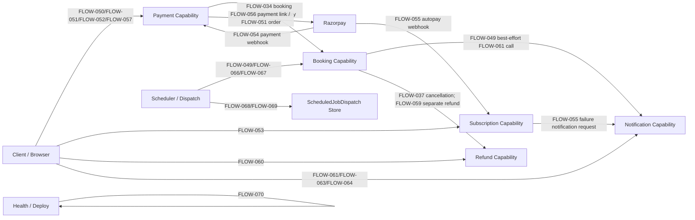
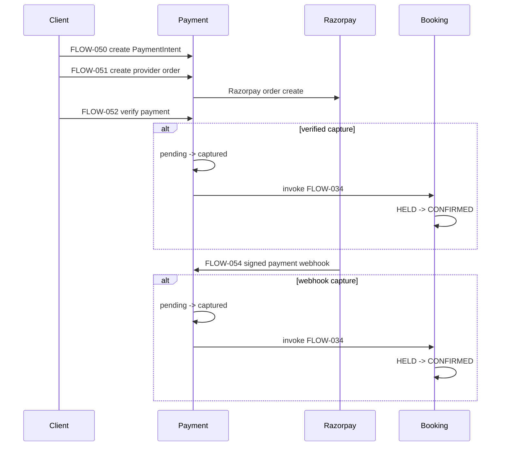
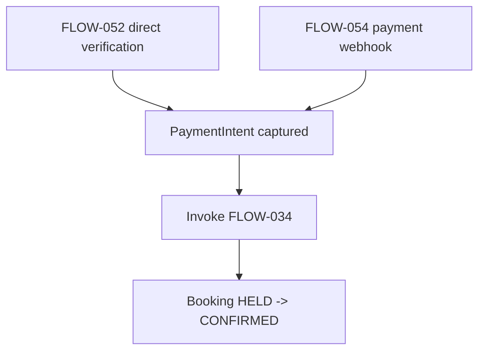

# RE-009 - Event & Integration Model

## Scope

This artifact consolidates integration, event, trigger, provider, webhook, scheduler, dispatch, queue, and cross-capability side-effect behaviour from RE-001 through RE-008 and the Phase 4 reconstruction artifacts. It does not introduce new platform discovery and does not modify upstream identities.

Authoritative upstream inputs: RE-001-SOURCE-BASELINE, RE-002-CAPABILITY-CATALOGUE, RE-003-FLOW-CATALOGUE, RE-004-BUSINESS-FLOW-MODEL, RE-005-BUSINESS-RULE-CATALOGUE, RE-006-STATE-MODEL, RE-007-POLICY-INVARIANT-CATALOGUE, RE-008-AUTHORIZATION-MODEL, and applicable Phase 4 flow/journey artifacts.

## Mechanical Integration Inventory

| Flow | Integration-Relevant | Integration IDs | Event IDs | Primary Classification | Source BRs |
|---|---:|---|---|---|---|
| FLOW-024 | Yes | INTEGRATION-001 | None | SAME_PROCESS_CALL | BR-043 |
| FLOW-029 | Yes | INTEGRATION-002 | None | SAME_PROCESS_CALL | BR-049-BR-062 |
| FLOW-030 | Yes | INTEGRATION-003 | None | SAME_PROCESS_CALL | BR-063, BR-064 |
| FLOW-034 | Yes | INTEGRATION-004 | None | SAME_PROCESS_CALL | BR-078-BR-085 |
| FLOW-037 | Yes | INTEGRATION-005 | None | SAME_PROCESS_CALL | BR-093-BR-099 |
| FLOW-044 | Yes | INTEGRATION-006 | None | SAME_PROCESS_CALL | BR-121-BR-126 |
| FLOW-049 | Yes | INTEGRATION-007, INTEGRATION-008, INTEGRATION-009 | EVENT-005, EVENT-007, EVENT-008 | SCHEDULED_JOB / DISPATCH_STORE / BEST_EFFORT_CALL | FLOW-049 rules, STATE-MODEL references |
| FLOW-050 | Yes | INTEGRATION-010 | None | SAME_PROCESS_CALL | BR-131-BR-140 |
| FLOW-051 | Yes | INTEGRATION-011 | None | EXTERNAL_PROVIDER_CALL | BR-141-BR-151 |
| FLOW-052 | Yes | INTEGRATION-012, INTEGRATION-013 | None | CLIENT_TO_SERVER / INTERNAL_HTTP_CALL | BR-152-BR-161 |
| FLOW-053 | Yes | INTEGRATION-014 | None | CLIENT_TO_SERVER | BR-162-BR-169 |
| FLOW-054 | Yes | INTEGRATION-015, INTEGRATION-016 | EVENT-001, EVENT-002 | PROVIDER_WEBHOOK / INTERNAL_HTTP_CALL | BR-170-BR-179 |
| FLOW-055 | Yes | INTEGRATION-017, INTEGRATION-018, INTEGRATION-019 | EVENT-003, EVENT-004, EVENT-005 | PROVIDER_WEBHOOK / BEST_EFFORT_CALL | BR-180-BR-190 |
| FLOW-056 | Yes | INTEGRATION-020 | None | EXTERNAL_PROVIDER_CALL | BR-191, BR-192 |
| FLOW-057 | Yes | INTEGRATION-021 | None | CLIENT_TO_SERVER | BR-193, BR-194 |
| FLOW-058 | Yes | INTEGRATION-022 | EVENT-001, EVENT-002 | INTERNAL_HTTP_CALL | BR-195, BR-196 |
| FLOW-059 | Yes | INTEGRATION-023 | None | SAME_PROCESS_CALL | BR-197-BR-203 |
| FLOW-060 | Yes | INTEGRATION-024 | None | CLIENT_TO_SERVER | BR-204-BR-211 |
| FLOW-061 | Yes | INTEGRATION-025 | EVENT-005 | DB_QUEUE | BR-212, BR-213 |
| FLOW-062 | Yes | INTEGRATION-026 | None | SAME_PROCESS_CALL | BR-214, BR-215 |
| FLOW-063 | Yes | INTEGRATION-027 | None | SAME_PROCESS_CALL | BR-216, BR-217 |
| FLOW-064 | Yes | INTEGRATION-028 | None | SAME_PROCESS_CALL | BR-218, BR-219 |
| FLOW-065 | Yes | INTEGRATION-029 | EVENT-006 | BEST_EFFORT_CALL | BR-220, BR-221 |
| FLOW-066 | Yes | INTEGRATION-030 | EVENT-007 | SCHEDULED_JOB | BR-222, BR-223 |
| FLOW-067 | Yes | INTEGRATION-031 | EVENT-007 | SCHEDULED_JOB | BR-224, BR-225 |
| FLOW-068 | Yes | INTEGRATION-032 | EVENT-008 | DISPATCH_STORE | BR-226, BR-227 |
| FLOW-069 | Yes | INTEGRATION-033 | EVENT-008 | DISPATCH_STORE | BR-228, BR-229 |
| FLOW-070 | Yes | INTEGRATION-034 | None | UNKNOWN | BR-230, BR-231 |

Non-integration-relevant flows: FLOW-001-FLOW-023, FLOW-025-FLOW-028, FLOW-031-FLOW-033, FLOW-035-FLOW-036, FLOW-038-FLOW-043, FLOW-045-FLOW-048. Count: 42.

## Consolidated Integration Identities

| Integration ID | Name | Classification | Direction | Owner Flow | Lineage |
|---|---|---|---|---|---|
| INTEGRATION-001 | Availability read/write materialization boundary | SAME_PROCESS_CALL | Internal | FLOW-024 | BR-043; STATE-CONFLICT-001 |
| INTEGRATION-002 | Standard guest booking creation and hold side effects | SAME_PROCESS_CALL | Internal | FLOW-029 | BR-049-BR-062; STATE-MODEL-BOOKING |
| INTEGRATION-003 | Negotiated booking creation boundary | SAME_PROCESS_CALL | Internal | FLOW-030 | BR-063, BR-064; RULE-VARIANT-003 |
| INTEGRATION-004 | Internal booking confirmation service boundary | SAME_PROCESS_CALL | Internal | FLOW-034 | BR-078-BR-085; TRANSITION-BOOKING-003; STATE-CONFLICT-002 |
| INTEGRATION-005 | Booking cancellation local state boundary | SAME_PROCESS_CALL | Internal | FLOW-037 | BR-093-BR-099; TRANSITION-BOOKING-006/007/008 |
| INTEGRATION-006 | Member attendance/booking confirmation boundary | SAME_PROCESS_CALL | Internal | FLOW-044 | BR-121-BR-126; FLOW-044-UNCERTAINTY-002 |
| INTEGRATION-007 | Stale hold release sweep | SCHEDULED_JOB | Scheduler to booking state | FLOW-049 | STATE-MODEL-BOOKING; TRANSITION-BOOKING-009 |
| INTEGRATION-008 | Member no-show booking creation sweep | SCHEDULED_JOB | Scheduler to booking creation | FLOW-049 | STATE-MODEL-BOOKING; TRANSITION-BOOKING-012 |
| INTEGRATION-009 | Release/no-show operational notification or dispatch boundary | BEST_EFFORT_CALL | Scheduler to operational side effect | FLOW-049 | STATE-MODEL-NOTIFICATION-REQUEST; STATE-MODEL-SCHEDULED-JOB-DISPATCH |
| INTEGRATION-010 | Local PaymentIntent creation | SAME_PROCESS_CALL | Booking/payment internal | FLOW-050 | BR-131-BR-140; STATE-MODEL-PAYMENT-INTENT |
| INTEGRATION-011 | Razorpay payment order creation | EXTERNAL_PROVIDER_CALL | Application to Razorpay | FLOW-051 | BR-141-BR-151; AUTHZ-RULE payment provider context |
| INTEGRATION-012 | Direct payment verification endpoint | CLIENT_TO_SERVER | Client to application | FLOW-052 | BR-152-BR-161; AUTHZ-RULE-016 |
| INTEGRATION-013 | Payment verification invokes booking confirmation | INTERNAL_HTTP_CALL | Payment to booking | FLOW-052 -> FLOW-034 | BR-157, BR-158; TRANSITION-PAYMENT-INTENT-001; STATE-CONFLICT-002 |
| INTEGRATION-014 | Subscription create request boundary | CLIENT_TO_SERVER | Client to application | FLOW-053 | BR-162-BR-169; AUTHZ-FINDING-003 |
| INTEGRATION-015 | Razorpay payment webhook receiver | PROVIDER_WEBHOOK | Razorpay to application | FLOW-054 | BR-170-BR-179; AUTHZ-RULE-018 |
| INTEGRATION-016 | Payment webhook invokes booking confirmation after capture | INTERNAL_HTTP_CALL | Payment webhook to booking | FLOW-054 -> FLOW-034 | BR-177, BR-178; STATE-CONFLICT-002 |
| INTEGRATION-017 | Razorpay autopay webhook receiver | PROVIDER_WEBHOOK | Razorpay to application | FLOW-055 | BR-180-BR-190; AUTHZ-RULE-019 |
| INTEGRATION-018 | Autopay charged subscription/payment mutation | SAME_PROCESS_CALL | Payment to subscription and payment store | FLOW-055 | BR-183, BR-184; TRANSITION-SUBSCRIPTION-002 |
| INTEGRATION-019 | Autopay failure notification request | BEST_EFFORT_CALL | Subscription to notification queue | FLOW-055 | BR-185-BR-187; INVARIANT-FINDING-008 |
| INTEGRATION-020 | Razorpay payment-link creation/metadata | EXTERNAL_PROVIDER_CALL | Application to Razorpay | FLOW-056 | BR-191, BR-192 |
| INTEGRATION-021 | Browser negotiated payment-link orchestration | CLIENT_TO_SERVER | Browser to application | FLOW-057 | BR-193, BR-194 |
| INTEGRATION-022 | Simulated capture delegates to signed webhook endpoint | INTERNAL_HTTP_CALL | Test/technical to webhook boundary | FLOW-058 -> FLOW-054 | BR-195, BR-196; POLICY-021 |
| INTEGRATION-023 | Refund creation local Slot Engine read boundary | SAME_PROCESS_CALL | Internal to refund store | FLOW-059 | BR-197-BR-203; INVARIANT-FINDING-006 |
| INTEGRATION-024 | Refund override admin boundary | CLIENT_TO_SERVER | Admin to refund store | FLOW-060 | BR-204-BR-211; POLICY-023 |
| INTEGRATION-025 | Notification request queue write | DB_QUEUE | Producer to DB queue | FLOW-061 | BR-212, BR-213; INVARIANT-042 |
| INTEGRATION-026 | Notification template upsert | SAME_PROCESS_CALL | Admin/internal to template store | FLOW-062 | BR-214, BR-215 |
| INTEGRATION-027 | Notification device registration | SAME_PROCESS_CALL | Client to device store | FLOW-063 | BR-216, BR-217 |
| INTEGRATION-028 | Notification history read | SAME_PROCESS_CALL | Client/admin to notification store | FLOW-064 | BR-218, BR-219 |
| INTEGRATION-029 | Notification worker delivery attempt | BEST_EFFORT_CALL | Worker to provider/store | FLOW-065 | BR-220, BR-221; AUTHZ-FINDING-007 |
| INTEGRATION-030 | Due scheduled job claim and lease | SCHEDULED_JOB | Scheduler to job store | FLOW-066 | BR-222, BR-223; INVARIANT-FINDING-009 |
| INTEGRATION-031 | Manual scheduled job execution | SCHEDULED_JOB | Manual actor to job executor | FLOW-067 | BR-224, BR-225; INVARIANT-FINDING-009 |
| INTEGRATION-032 | Scheduled dispatch claim/dedupe | DISPATCH_STORE | Worker to dispatch store | FLOW-068 | BR-226, BR-227 |
| INTEGRATION-033 | Scheduled dispatch outcome recording | DISPATCH_STORE | Worker to dispatch store | FLOW-069 | BR-228, BR-229 |
| INTEGRATION-034 | Health/deploy verification technical boundary | UNKNOWN | External monitor/operator to application | FLOW-070 | BR-230, BR-231 |

## Event Catalogue

| Event ID | Event-Like Behaviour | Event Type | Producing Flow | Consuming Flow | Persisted | Lineage |
|---|---|---|---|---|---:|---|
| EVENT-001 | Razorpay payment capture webhook request | External webhook event | FLOW-054 / FLOW-058 simulation | FLOW-054 | No | BR-170-BR-179; BR-195, BR-196 |
| EVENT-002 | Payment webhook idempotency row | WebhookEvent persistence | FLOW-054 | FLOW-054 duplicate handling | Yes | BR-171, BR-173, BR-174 |
| EVENT-003 | Razorpay autopay webhook request | External webhook event | FLOW-055 | FLOW-055 | No | BR-180-BR-190 |
| EVENT-004 | Autopay webhook idempotency row | WebhookEvent persistence | FLOW-055 | FLOW-055 duplicate handling | Yes | BR-181, BR-182 |
| EVENT-005 | NotificationRequest queued row | Persisted DB queue event | FLOW-061, FLOW-055, FLOW-049 | FLOW-065 | Yes | BR-186, BR-212, BR-213, BR-220, BR-221 |
| EVENT-006 | Notification worker state-change trigger | TECHNICAL_OPERATIONAL_EVENT / STATE_CHANGE_TRIGGER | FLOW-065 | FLOW-064 history/read side | No | BR-220, BR-221; persisted entity: NotificationRequest; separate event row: NONE |
| EVENT-007 | ScheduledJob due/leased execution trigger | Scheduled trigger backed by persisted ScheduledJob state | FLOW-066, FLOW-067 | Scheduled job executor | No separate event row; ScheduledJob state is persisted | BR-222-BR-225 |
| EVENT-008 | ScheduledJobDispatch pending/outcome row | Dispatch/technical operational event row | FLOW-068 | FLOW-069 | Yes | BR-226-BR-229 |

Persisted queue/event types: WebhookEvent, NotificationRequest, ScheduledJob, ScheduledJobDispatch.

## Cross-Capability Integration Diagram

## Booking and Payment Integration Model

PaymentIntent creation and provider order/payment-link creation are payment-owned. Booking confirmation remains booking-owned.

| Boundary | Owner | Trigger | Booking Mutation | Lineage |
|---|---|---|---|---|
| PaymentIntent create for held booking | FLOW-050 | Client request with bookingId | None | BR-131-BR-140 |
| Razorpay order creation | FLOW-051 | Authenticated caller and local PaymentIntent | None | BR-141-BR-151 |
| Direct payment verify | FLOW-052 | Client submits payment proof | PaymentIntent pending -> captured | BR-152-BR-157 |
| Direct payment verify to booking confirm | FLOW-052 invokes FLOW-034 | Capture succeeds | FLOW-034 owns HELD -> CONFIRMED | BR-158; BR-083 |
| Payment webhook | FLOW-054 | Razorpay signed event | PaymentIntent pending -> captured | BR-170-BR-177 |
| Payment webhook to booking confirm | FLOW-054 invokes FLOW-034 | Capture succeeds | FLOW-034 owns HELD -> CONFIRMED | BR-178; BR-083 |

## Provider Integration Model

| Provider Boundary | Integration IDs | Flows | Trust / AuthZ | Idempotency | Failure Semantics |
|---|---|---|---|---|---|
| Razorpay order creation | INTEGRATION-011 | FLOW-051 | Authenticated application call to provider; AUTHZ context from RE-008 | Local gatewayRef stores provider order id | Order creation does not change PaymentIntent status; BR-149, BR-150 |
| Razorpay payment link | INTEGRATION-020, INTEGRATION-021 | FLOW-056, FLOW-057 | Branch manager/owner/internal scoping; BR-194 | FLOW-057 requires idempotency key; BR-193 | Payment-link gatewayRef is metadata; BR-192 |
| Razorpay payment webhook | INTEGRATION-015 | FLOW-054 | PROVIDER_SIGNATURE_ENFORCED; AUTHZ-RULE-018 | WebhookEvent event id insert; BR-171-BR-174 | Duplicate acknowledged; captured path can invoke booking confirm |
| Razorpay autopay webhook | INTEGRATION-017 | FLOW-055 | PROVIDER_SIGNATURE_ENFORCED; AUTHZ-RULE-019 | WebhookEvent idempotency insert; BR-181, BR-182 | Charged and failed variants diverge; BR-183-BR-190 |
| Notification provider/worker | INTEGRATION-029 | FLOW-065 | Worker/provider trust uncertain; AUTHZ-FINDING-007 | Retry/dead-letter fields, not provider idempotency | Best-effort delivery with sent/dead_letter outcome |

## Webhook Model and Idempotency

| Webhook | Event IDs | Signature / Trust | Idempotency | State Mutation | Downstream Calls |
|---|---|---|---|---|---|
| FLOW-054 Razorpay payment webhook | EVENT-001, EVENT-002 | BR-170; AUTHZ-RULE-018 | BR-171, BR-173, BR-174 | BR-177 pending intent becomes captured | BR-178 invokes FLOW-034 only after capture |
| FLOW-055 Razorpay autopay webhook | EVENT-003, EVENT-004 | BR-180; AUTHZ-RULE-019 | BR-181, BR-182 | BR-183 active subscription; BR-184 captured billing intent; BR-185 suspended subscription | BR-186 creates notification boundary request; BR-187 best-effort |

Webhook duplicates return success and do not replay downstream state changes where the stored event-id branch is taken. The artifacts do not establish a provider-level replay contract beyond local idempotency.

## Payment Capture to Booking Confirm Boundary

The booking-owned transition is `HELD -> CONFIRMED` in FLOW-034, traced to BR-083 and TRANSITION-BOOKING-003. FLOW-052 and FLOW-054 are upstream cross-entity triggers that call the FLOW-034 boundary after PaymentIntent capture.

Related consistency conflict: STATE-CONFLICT-002. Evidence distinguishes BR-083 HELD -> CONFIRMED, BR-084 no hold-expiry validation, BR-085 no payment proof/state validation, BR-158 direct verification invokes booking-confirm boundary, BR-177 webhook capture, and BR-178 webhook confirm trigger after capture.

## Cancellation to Refund Integration

FLOW-037 cancels booking state locally. FLOW-059 and FLOW-060 create local refund rows separately. No Razorpay refund provider call is evidenced.

| Boundary | Flow | Integration | Atomic With Cancellation | Lineage |
|---|---|---|---:|---|
| Booking cancellation | FLOW-037 | INTEGRATION-005 | No | BR-093-BR-099 |
| Refund creation for cancelled booking | FLOW-059 | INTEGRATION-023 | No | BR-197-BR-203 |
| Refund override | FLOW-060 | INTEGRATION-024 | No | BR-204-BR-211 |

Referenced invariant findings: INVARIANT-FINDING-004 and INVARIANT-FINDING-006.

## Subscription and Autopay Integration

| Variant | Trigger | Mutations | Side Effects | Lineage |
|---|---|---|---|---|
| Subscription create | FLOW-053 client request | Subscription active row | None evidenced | BR-162-BR-169; AUTHZ-FINDING-003 |
| Autopay charged | FLOW-055 Razorpay autopay webhook | Subscription active; captured subscription_billing PaymentIntent | WebhookEvent idempotency | BR-181-BR-184 |
| Autopay failed | FLOW-055 Razorpay autopay webhook | Subscription suspended | Notification boundary request, best-effort | BR-185-BR-187; INVARIANT-FINDING-008 |
| Autopay no-op cases | FLOW-055 Razorpay autopay webhook | No applicable mutation | Acknowledged no-op | BR-188-BR-190 |

## Notification Integration and Producers

| Producer | Integration | Event | Queue / Consumer | Lineage |
|---|---|---|---|---|
| Explicit notification queue request | INTEGRATION-025 | EVENT-005 | FLOW-065 worker | BR-212, BR-213 |
| Autopay failure | INTEGRATION-019 | EVENT-005 | FLOW-065 worker | BR-186, BR-187 |
| Release/no-show operations | INTEGRATION-009 | EVENT-005 / EVENT-008 | FLOW-061 best-effort notification service call; ScheduledJobDispatch direct marker | STATE-MODEL-NOTIFICATION-REQUEST; STATE-MODEL-SCHEDULED-JOB-DISPATCH |
| Worker delivery | INTEGRATION-029 | EVENT-006 | Provider/store outcome | BR-220, BR-221 |

## Scheduler, Dispatch, and FLOW-049 Operational Integration

| Operational Boundary | Flow | Integration | Event | State / Side Effect |
|---|---|---|---|---|
| Stale held booking release | FLOW-049 | INTEGRATION-007 | EVENT-007 | HELD -> RELEASED_NO_SHOW |
| Member no-show creation | FLOW-049 | INTEGRATION-008 | EVENT-007 | none -> RELEASED_NO_SHOW booking |
| Low-occupancy dispatch marker | FLOW-049 | INTEGRATION-009 | EVENT-008 | Writes ScheduledJobDispatch directly as dedupe marker and marks/creates it as SENT according to observed path |
| Low-occupancy notification call | FLOW-049 | INTEGRATION-009 | EVENT-005 | Calls FLOW-061 notification service best-effort; failed notification call is not retried through scheduler dispatch |
| Due job claim | FLOW-066 | INTEGRATION-030 | EVENT-007 | ScheduledJob lease/run fields |
| Manual job execution | FLOW-067 | INTEGRATION-031 | EVENT-007 | Manual execution path differs from scheduler claim |
| Dispatch claim | FLOW-068 | INTEGRATION-032 | EVENT-008 | ScheduledJobDispatch PENDING |
| Dispatch outcome | FLOW-069 | INTEGRATION-033 | EVENT-008 | ScheduledJobDispatch SENT/FAILED |

## Internal Service Call Catalogue

Internal service integrations: INTEGRATION-004, INTEGRATION-006, INTEGRATION-013, INTEGRATION-016, INTEGRATION-018, INTEGRATION-023, INTEGRATION-030.

| Integration | Caller | Callee | Guard / Trust |
|---|---|---|---|
| INTEGRATION-004 | Internal service | Booking confirmation | Internal key and HELD guard; BR-078-BR-085 |
| INTEGRATION-006 | Member attendance flow | Booking/attendance store | Existing non-cancelled booking may update metadata only; FLOW-044-UNCERTAINTY-002 |
| INTEGRATION-013 | FLOW-052 | FLOW-034 | INTERNAL_HTTP_CALL / SERVICE BOUNDARY; payment capture precondition; BR-158 |
| INTEGRATION-016 | FLOW-054 | FLOW-034 | INTERNAL_HTTP_CALL / SERVICE BOUNDARY; webhook capture precondition; BR-178 |
| INTEGRATION-018 | FLOW-055 | Subscription/payment stores | Autopay charged mutation; BR-183, BR-184 |
| INTEGRATION-023 | Internal refund flow | Slot Engine/refund store | Internal read; no provider refund call; BR-198, BR-203 |
| INTEGRATION-030 | Scheduler | ScheduledJob store | Due/lease claim; BR-222, BR-223 |

## External Provider Call Catalogue

External provider integrations: INTEGRATION-011, INTEGRATION-020, INTEGRATION-029.

| Integration | Provider | Flow | Evidence |
|---|---|---|---|
| INTEGRATION-011 | Razorpay orders | FLOW-051 | BR-145-BR-150 |
| INTEGRATION-020 | Razorpay payment links | FLOW-056 | BR-191, BR-192 |
| INTEGRATION-029 | Notification delivery provider or worker boundary | FLOW-065 | BR-220, BR-221; AUTHZ-FINDING-007 |

## Persisted Queue / Event Catalogue

| Persisted Type | Event IDs | Producers | Consumers | Lineage |
|---|---|---|---|---|
| WebhookEvent | EVENT-002, EVENT-004 | FLOW-054, FLOW-055 | Duplicate webhook handling in same flows | BR-171-BR-174, BR-181-BR-182 |
| NotificationRequest | EVENT-005 | FLOW-061, FLOW-055, FLOW-049 | FLOW-065, FLOW-064 | BR-186, BR-212, BR-213, BR-218, BR-220, BR-221 |
| NotificationRequest worker state change | EVENT-006 | FLOW-065 | FLOW-064/history semantics | BR-220, BR-221; persists on NotificationRequest, not a separate event row |
| ScheduledJob | EVENT-007 | Schedule configuration / manual execution path | FLOW-066, FLOW-067 | BR-222-BR-225; supports EVENT-007 without a separate event row |
| ScheduledJobDispatch | EVENT-008 | FLOW-068, FLOW-049 | FLOW-069 | BR-226-BR-229 |

## State-Change Trigger Catalogue

| Trigger | Event / Integration | State Change | Owner Transition |
|---|---|---|---|
| FLOW-034 internal confirmation call | INTEGRATION-004 | Booking HELD -> CONFIRMED | TRANSITION-BOOKING-003 |
| FLOW-052 payment verification capture | INTEGRATION-013 | PaymentIntent pending -> captured, then FLOW-034 | TRANSITION-PAYMENT-INTENT-001; TRANSITION-BOOKING-003 |
| FLOW-054 payment webhook capture | EVENT-001 / INTEGRATION-016 | PaymentIntent pending -> captured, then FLOW-034 | TRANSITION-PAYMENT-INTENT-002; TRANSITION-BOOKING-003 |
| FLOW-055 autopay charged | EVENT-003 / INTEGRATION-018 | Subscription active; new captured subscription_billing PaymentIntent created | TRANSITION-SUBSCRIPTION-002 |
| FLOW-055 autopay failed | EVENT-003 / INTEGRATION-019 | Subscription active -> suspended; notification request | TRANSITION-SUBSCRIPTION-001; TRANSITION-NOTIFICATION-001 |
| FLOW-049 stale hold sweep | INTEGRATION-007 | Booking HELD -> RELEASED_NO_SHOW | TRANSITION-BOOKING-009 |
| FLOW-049 member no-show creation | INTEGRATION-008 | none -> RELEASED_NO_SHOW booking | TRANSITION-BOOKING-012 |
| FLOW-065 notification worker | EVENT-006 | Notification queued -> sent/dead_letter | TRANSITION-NOTIFICATION-002/003 |
| FLOW-068 dispatch claim | EVENT-008 | none -> ScheduledJobDispatch PENDING | TRANSITION-SCHEDULED-JOB-DISPATCH-001 |
| FLOW-069 dispatch outcome | EVENT-008 | PENDING -> SENT/FAILED | TRANSITION-SCHEDULED-JOB-DISPATCH-002/003 |

## Atomicity Matrix

| Boundary | Atomic | Non-Atomic Risk | Evidence |
|---|---:|---|---|
| FLOW-052 capture then FLOW-034 confirmation | No | Payment captured but booking confirmation can fail separately | BR-157, BR-158; INVARIANT-FINDING-005 |
| FLOW-054 webhook capture then FLOW-034 confirmation | No | Webhook capture and downstream booking confirmation are separate effects | BR-177, BR-178; STATE-CONFLICT-002 |
| FLOW-037 cancellation and FLOW-059 refund creation | No | Cancellation does not create refund atomically | INVARIANT-FINDING-004 |
| FLOW-059/FLOW-060 local refund and Razorpay refund | No | Local refund row has no provider refund call | BR-203, BR-211; INVARIANT-FINDING-006 |
| FLOW-055 subscription suspend and notification request | No | Notification boundary is best-effort and fetch exceptions do not fail webhook | BR-185-BR-187 |

## Failure and Side-Effect Matrix

| Integration | Failure Handling | User / System Effect |
|---|---|---|
| INTEGRATION-011 | Provider order failure prevents gatewayRef update | PaymentIntent remains non-captured; BR-150 |
| INTEGRATION-013 | Booking confirmation failure after capture is not proved atomic | Captured payment can diverge from booking status |
| INTEGRATION-016 | Webhook capture and confirm sequencing relies on downstream call success | Duplicate idempotency may prevent replay depending on failure point |
| INTEGRATION-019 | Notification fetch exceptions do not fail webhook | Subscription failure processing can succeed without notification |
| INTEGRATION-023 | No provider refund call | Local refund status can overstate provider refund completion |
| INTEGRATION-029 | Worker attempts/retries/dead-letter | Notification delivery is eventual/best-effort |
| INTEGRATION-030/031 | Scheduler manual and automatic paths diverge | Lease/claim invariant is context dependent |
| INTEGRATION-034 | Health/deploy technical boundary | Monitoring semantics are operational, not domain lifecycle |

## Trust and Idempotency Matrix

| Integration | Trust Boundary | Enforcement | Idempotency |
|---|---|---|---|
| INTEGRATION-011 | Application to Razorpay | Authenticated caller; stored PaymentIntent amount | Provider order id stored as gatewayRef |
| INTEGRATION-012 | Client to server | APPLICATION_ENFORCED / PARTIALLY_ENFORCED per AUTHZ-RULE-016 | PaymentIntent status guard prevents captured recreation |
| INTEGRATION-015 | Razorpay to application | PROVIDER_SIGNATURE_ENFORCED; AUTHZ-RULE-018 | WebhookEvent event id |
| INTEGRATION-017 | Razorpay to application | PROVIDER_SIGNATURE_ENFORCED; AUTHZ-RULE-019 | WebhookEvent event id |
| INTEGRATION-021 | Browser to application | Branch manager/owner/internal scoping | Browser negotiated link requires idempotency key |
| INTEGRATION-022 | Technical simulation to webhook | Production disabled; signed webhook delegation | Delegates to webhook idempotency |
| INTEGRATION-025 | Queue producer to DB | Caller/auth context unresolved by RE-008 finding | DB queue row |
| INTEGRATION-032 | Dispatcher to dispatch store | Worker/internal trust | Dispatch dedupe key |

## Context Variants

| Variant ID | Context | Integration Impact | Lineage |
|---|---|---|---|
| INTEGRATION-VARIANT-001 | Direct payment verification vs provider webhook | Both can capture PaymentIntent and invoke FLOW-034 | BR-158, BR-177, BR-178; STATE-CONFLICT-002 |
| INTEGRATION-VARIANT-002 | Standard order vs negotiated payment link | Razorpay order and payment-link metadata differ | BR-149, BR-192, BR-193 |
| INTEGRATION-VARIANT-003 | Internal confirm vs payment-triggered confirm | FLOW-034 can be called directly without payment proof validation | BR-083-BR-085; INVARIANT-FINDING-001 |
| INTEGRATION-VARIANT-004 | New member booking vs existing attendance update | FLOW-044 may create CONFIRMED booking or update metadata only | BR-121-BR-126; FLOW-044-UNCERTAINTY-002 |
| INTEGRATION-VARIANT-005 | Autopay charged vs failed | Charged activates/captures; failed suspends/notifies | BR-183-BR-187 |
| INTEGRATION-VARIANT-006 | Automatic scheduler vs manual scheduled execution | Lease and execution semantics diverge | BR-222-BR-225; INVARIANT-FINDING-009 |
| INTEGRATION-VARIANT-007 | Cancellation vs refund creation | Separate flows and non-atomic lifecycle | BR-093-BR-099, BR-197-BR-211 |
| INTEGRATION-VARIANT-008 | Notification queue vs worker delivery | Queue persistence and provider delivery are separate | BR-212, BR-213, BR-220, BR-221 |

## Integration Findings

| Finding ID | Finding | Evidence | Impact |
|---|---|---|---|
| INTEGRATION-FINDING-001 | Payment capture and booking confirmation are not evidenced as atomic. | BR-157, BR-158, BR-177, BR-178; INVARIANT-FINDING-005 | Captured PaymentIntent can diverge from Booking status after partial failure. |
| INTEGRATION-FINDING-002 | FLOW-034 can confirm without hold-expiry or payment proof/state validation. | BR-083, BR-084, BR-085; STATE-CONFLICT-002 | Internal service boundary can bypass payment-trigger assumptions. |
| INTEGRATION-FINDING-003 | Booking cancellation and refund creation are separate journeys. | FLOW-037, FLOW-059, FLOW-060; INVARIANT-FINDING-004 | Refund may be omitted after cancellation unless separately triggered. |
| INTEGRATION-FINDING-004 | Refund artifacts are local and do not evidence Razorpay refund execution. | BR-203, BR-211; INVARIANT-FINDING-006 | Provider settlement state can differ from local refund state. |
| INTEGRATION-FINDING-005 | Autopay failure notification is best-effort. | BR-186, BR-187; INVARIANT-FINDING-008 | User/platform notification may fail without failing webhook processing. |
| INTEGRATION-FINDING-006 | Notification provider/worker authorization and provider identity remain uncertain. | AUTHZ-FINDING-007; BR-220, BR-221 | Queue and delivery security require business/implementation validation. |
| INTEGRATION-FINDING-007 | Scheduler automatic and manual execution paths have different lease assumptions. | BR-222-BR-225; INVARIANT-FINDING-009 | Duplicate or out-of-band execution must be governed operationally. |
| INTEGRATION-FINDING-008 | Webhook idempotency is local and event-id based. | BR-171-BR-174, BR-181-BR-182 | Failure after idempotency insertion can suppress replay unless compensated. |

## Flow-to-Integration Traceability

| Flow Set | Integration IDs | Event IDs | Notes |
|---|---|---|---|
| FLOW-024, FLOW-029, FLOW-030, FLOW-034, FLOW-037, FLOW-044, FLOW-049 | INTEGRATION-001-INTEGRATION-009 | EVENT-005, EVENT-007, EVENT-008 | Booking, availability, member attendance, release/no-show |
| FLOW-050-FLOW-052, FLOW-054, FLOW-056-FLOW-058 | INTEGRATION-010-INTEGRATION-013, INTEGRATION-015, INTEGRATION-016, INTEGRATION-020-INTEGRATION-022 | EVENT-001, EVENT-002 | Payment intent/order/link/capture and booking-confirm trigger |
| FLOW-053, FLOW-055 | INTEGRATION-014, INTEGRATION-017-INTEGRATION-019 | EVENT-003, EVENT-004, EVENT-005 | Subscription and autopay |
| FLOW-059, FLOW-060 | INTEGRATION-023, INTEGRATION-024 | None | Refund and override |
| FLOW-061-FLOW-065 | INTEGRATION-025-INTEGRATION-029 | EVENT-005, EVENT-006 | Notification queue, templates, devices, history, worker |
| FLOW-066-FLOW-070 | INTEGRATION-030-INTEGRATION-034 | EVENT-007, EVENT-008 | Scheduler, dispatch, health/deploy |

## Capability Integration Matrix

| Capability | Source Flows | Integration IDs | Related State / Policy / AuthZ |
|---|---|---|---|
| Booking / Availability | FLOW-024, FLOW-029, FLOW-030, FLOW-034, FLOW-037, FLOW-044, FLOW-049 | INTEGRATION-001-INTEGRATION-009 | STATE-MODEL-BOOKING; STATE-CONFLICT-001/002; POLICY booking invariants |
| Payment | FLOW-050-FLOW-052, FLOW-054, FLOW-056-FLOW-058 | INTEGRATION-010-INTEGRATION-013, INTEGRATION-015, INTEGRATION-016, INTEGRATION-020-INTEGRATION-022 | STATE-MODEL-PAYMENT-INTENT; AUTHZ-RULE-016/018 |
| Subscription / Autopay | FLOW-053, FLOW-055 | INTEGRATION-014, INTEGRATION-017-INTEGRATION-019 | STATE-MODEL-SUBSCRIPTION; AUTHZ-RULE-019 |
| Refund | FLOW-059, FLOW-060 | INTEGRATION-023, INTEGRATION-024 | STATE-MODEL-REFUND; POLICY-022/POLICY-023 |
| Notification | FLOW-061-FLOW-065 | INTEGRATION-025-INTEGRATION-029 | STATE-MODEL-NOTIFICATION-REQUEST; AUTHZ-FINDING-007 |
| Scheduler / Dispatch / Platform | FLOW-066-FLOW-070 | INTEGRATION-030-INTEGRATION-034 | STATE-MODEL-SCHEDULED-JOB; STATE-MODEL-SCHEDULED-JOB-DISPATCH |

## Existing Uncertainties Referenced

Existing uncertainty lineage is preserved from RE-005 through RE-008. RE-009 does not introduce new uncertainty IDs. Referenced uncertainty families include FLOW-024-UNCERTAINTY-*, FLOW-029-UNCERTAINTY-*, FLOW-030-UNCERTAINTY-001, FLOW-034-UNCERTAINTY-*, FLOW-037-UNCERTAINTY-*, FLOW-044-UNCERTAINTY-002, FLOW-049-UNCERTAINTY-*, FLOW-050-FLOW-058-UNCERTAINTY-*, FLOW-059-FLOW-070-UNCERTAINTY-*, STATE-CONFLICT-001, STATE-CONFLICT-002, STATE-CONFLICT-003, INVARIANT-FINDING-001, INVARIANT-FINDING-004, INVARIANT-FINDING-005, INVARIANT-FINDING-006, INVARIANT-FINDING-008, and INVARIANT-FINDING-009.

Authorization finding lineage: AUTHZ-FINDING-003 applies to subscription creation body tenantId-userId identity binding; AUTHZ-FINDING-006 applies to provider webhook trust; AUTHZ-FINDING-007 applies to notification queue/template/device auth uncertainty.

## Validation Questions

| Question | Source Evidence | Reason |
|---|---|---|
| Should payment capture and booking confirmation be made transactional or compensating? | INTEGRATION-FINDING-001 | Current evidence shows a cross-entity boundary. |
| Should FLOW-034 require payment proof/state or remain an internal override? | INTEGRATION-FINDING-002 | Current evidence allows direct internal confirmation. |
| Should refund creation trigger a real Razorpay refund provider call? | INTEGRATION-FINDING-004 | Current evidence creates local refunds only. |
| Should webhook idempotency insertion occur after all critical downstream effects? | INTEGRATION-FINDING-008 | Current local idempotency can interact with partial failure. |
| Should notification queue access and worker provider credentials be formalized? | INTEGRATION-FINDING-006 | RE-008 preserved this as an authorization finding. |

## Source Recheck

| Check | Result |
|---|---|
| RE-001 through RE-008 treated as read-only inputs | PASS |
| Phase 4 flow and journey artifacts treated as read-only inputs | PASS |
| Application source, tests, schemas, migrations, and configuration modified | NONE |
| New artifact created | RE-009-EVENT-INTEGRATION-MODEL.md |
| Domain events invented without executable event/message evidence | NONE |
| FLOW-052 and FLOW-054 represented as booking-confirm triggers, not independent booking mutations | PASS |
| FLOW-049 corrected stale-held and member-no-show semantics preserved from RE-006 | PASS |
| FLOW-049 low-occupancy ScheduledJobDispatch marker kept separate from NotificationRequest queue | PASS |
| FLOW-053 subscription creation uses AUTHZ-FINDING-003 body tenantId-userId identity-binding lineage | PASS |

## Mechanical Integrity Checks

| Metric | Count |
|---|---:|
| Flows inspected | 70 |
| Integration-relevant flows | 28 |
| Integrations | 34 |
| Events | 8 |
| Internal service integrations | 7 |
| External provider integrations | 3 |
| Webhook integrations | 2 |
| Persisted queue/event types | 4 |
| Non-atomic integration boundaries | 5 |
| Best-effort integration boundaries | 3 |
| Integration findings | 8 |
| Context variants | 8 |
| Existing uncertainties referenced | 54 |
| New RE-009 uncertainties | 0 |
| Unmapped integration-relevant flows | 0 |
| Integrations without lineage | 0 |
| Events without lineage | 0 |
| BR-to-FLOW attribution mismatches | 0 |
| BR-to-candidate-rule attribution mismatches | 0 |
| Transition-reference mismatches | 0 |
| AUTHZ-FINDING attribution mismatches | 0 |
| Integration-classification mismatches | 0 |
| Mermaid semantic mismatches | 0 |
| Persisted event-type mismatches | 0 |
| Events without executable event semantics | 0 |
| Persisted event types without persistence entities | 0 |
| Duplicate INTEGRATION IDs | 0 |
| Duplicate EVENT IDs | 0 |
| Duplicate INTEGRATION-FINDING IDs | 0 |
| Duplicate INTEGRATION-VARIANT IDs | 0 |

## Completion Status

FLOW LINEAGE: PRESERVED

RULE LINEAGE: PRESERVED

BR LINEAGE: PRESERVED

POLICY LINEAGE: PRESERVED

INVARIANT LINEAGE: PRESERVED

STATE LINEAGE: PRESERVED

AUTHORIZATION LINEAGE: PRESERVED

UNCERTAINTY LINEAGE: PRESERVED

RE-009 STATUS: COMPLETE
